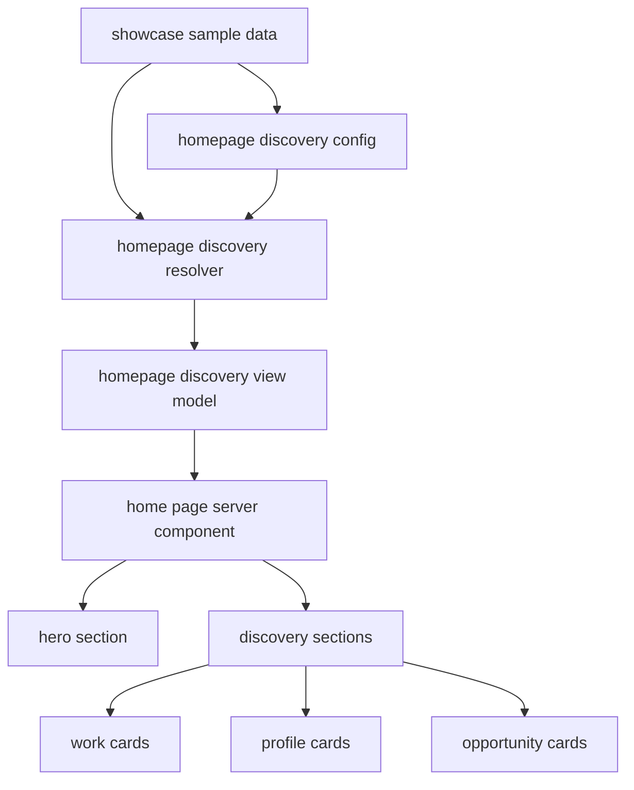
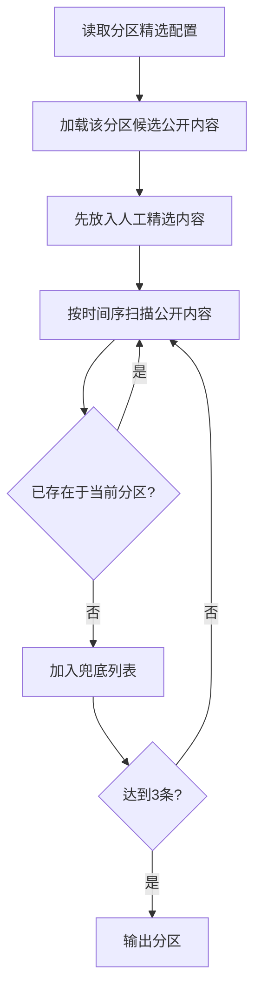

# 首页与发现体验增强实现设计

- 状态: 已批准
- 主题: 首页与发现体验增强
- 输入规格: `docs/specs/2026-04-06-homepage-discovery-enhancement-srs.md`

## 1. 概述

本设计面向第二轮“首页与发现体验增强”增量。目标是在保持现有首页 Hero 视觉焦点不退化的前提下，将首页从“视觉入口页”提升为“视觉入口 + 发现入口”。

当前首页已经具备：

- 全屏 Hero
- 3 个静态 featured pathways
- 3 个品牌 pillar

但还没有真正承载：

- 精选作品流
- 精选主页流
- 精选诉求流
- “人工精选优先 + 最新公开内容兜底”的明确编排流程

本轮设计重点不是引入复杂推荐系统，而是在现有 Next.js 单体应用和样本数据基线上，建立一个可复用、可测试、可继续扩展的首页发现编排层。

## 2. 设计驱动因素

### 2.1 需求驱动

- `FR-001`：首页 Hero 下方必须提供可继续浏览的发现分区，至少覆盖作品、主页、诉求三类内容。
- `FR-002`：采用“人工精选优先，最新公开内容兜底”的编排策略；每个分区目标展示 3 条，去重后不足可少于 3 条。
- `FR-003`：首页发现卡片必须可直接跳转到作品详情、公开主页或诉求详情。
- `FR-004`：发现能力继续对未登录访客开放。
- `FR-005`：Hero 仍保持首页首屏的第一视觉焦点。

### 2.2 约束与非功能驱动

- 本轮不引入个性化推荐、AI 推荐或独立运营后台。
- 本轮允许通过代码内静态配置、种子数据或等价受控方式维护人工精选内容。
- 本轮必须复用现有公开内容类型与现有公开路由。
- 新增发现分区应与现有 Lens Archive 首页视觉基线一致。

### 2.3 当前技术上下文

- 当前首页实现集中在 `web/src/app/page.tsx`，主要消费 `sample-data.ts` 中的 `homeHeroContent`、`homePageFeaturedPaths` 和 `homePagePillars`。
- 当前公开内容样本数据已存在于 `web/src/features/showcase/sample-data.ts`，包括：
  - `photographerProfiles`
  - `modelProfiles`
  - `works`
  - `opportunityPosts`
- 当前首页还没有“首页发现分区”的类型系统、编排器或卡片映射层。

## 3. 需求覆盖与追溯

| 需求 | 设计承接 |
|---|---|
| `FR-001` 首页发现分区 | 新增首页发现编排模块，产出作品/主页/诉求三个分区数据，并由首页按分区组件渲染 |
| `FR-002` 编排优先级与兜底规则 | 新增“人工精选配置 + 兜底解析器”，统一完成优先级、去重、补足与少于 3 条时的输出 |
| `FR-003` 首页到公开详情入口 | 为发现卡片统一映射公开路由 href |
| `FR-004` 公开可访问性 | 首页发现数据继续来自公开样本数据，不接入登录保护或私有路由 |
| `FR-005` 首屏视觉不退化 | 维持 Hero 在页面首屏，发现分区布局位于 Hero 之后，沿用现有视觉体系 |
| `NFR-001/NFR-002/NFR-003` | 通过公开只读编排、静态/服务端可读数据源、一致卡片布局与编排器保证 |

## 4. 候选方案

### 方案 A：继续把首页增强逻辑内联到 `page.tsx` + `sample-data.ts`

#### 如何工作

- 在 `sample-data.ts` 中直接增加更多首页数组
- 在 `page.tsx` 中继续串行拼接三个发现分区
- 由页面本身处理“人工精选优先 + 最新兜底”

#### 优点

- 改动路径最短
- 首次落地速度快
- 无需新增模块抽象

#### 缺点

- 首页页面会继续膨胀，展示与编排耦合在一起
- 去重、补足和卡片映射逻辑难以单测
- 后续引入更多分区或排序规则时可维护性差

#### 适配度

- 可做，但不利于第二轮之后继续扩展

### 方案 B：新增独立“首页发现编排模块”，由首页消费结构化分区数据

#### 如何工作

- 新增首页发现类型、精选配置和编排解析器
- 编排器从现有公开样本数据中生成结构化分区输出
- `page.tsx` 只负责消费 Hero 和发现分区视图模型
- 首页分区组件统一处理卡片展示和导航入口

#### 优点

- 展示层与编排规则分离，便于测试与演进
- 可以用最小改动复用现有作品、主页和诉求样本数据
- 后续若加入“热门”“分组主题”或运营位，不需要重写首页主页面

#### 缺点

- 比方案 A 多一层抽象
- 需要先定义类型与解析契约

#### 适配度

- 最符合本轮“增强发现体验，但不直接上复杂推荐”的目标

### 方案 C：提前引入运营配置层或轻量 CMS

#### 如何工作

- 首页精选完全从配置表或外部 CMS 读取
- 编排器更多承担配置消费角色，而不是以代码/种子数据为基线

#### 优点

- 运营灵活度高
- 后续人工精选维护成本低

#### 缺点

- 超出本轮规格范围
- 需要额外解决配置后台、数据同步和发布机制

#### 适配度

- 作为后续增量候选合适，但不适合本轮

## 5. 选定方案与关键决策

### 5.1 选定方案

推荐采用 **方案 B：独立首页发现编排模块**。

### 5.2 决策背景

本轮首页增强已不再是单纯增加一段静态文案，而是第一次引入“内容编排规则”：

- 有三类内容源
- 有精选优先级
- 有最新兜底
- 有同分区去重
- 有统一的卡片导航出口

如果继续把这些规则写死在 `page.tsx`，后续首页发现能力会迅速变成“页面组件里夹杂业务编排”的难维护状态。

### 5.3 主要收益

- 规则可测试：编排器可单测“精选优先、补足、去重、少于 3 条”逻辑
- 页面可维护：首页只渲染结构化发现分区，不负责业务规则
- 易扩展：后续新增热门区、主题区、更多排序规则时可复用同一框架

### 5.4 主要代价

- 需要新增首页发现类型、配置与解析器
- 首页数据路径会从“直接读取静态数组”升级为“读取编排视图模型”

### 5.5 风险与缓解

- 风险：抽象过度，设计比需求重
  - 缓解：本轮只支持三类发现分区和当前已批准的规则，不预埋复杂推荐引擎接口
- 风险：现有首页视觉被分区挤压
  - 缓解：保持 Hero 独立首屏，发现分区位于后续滚动区域
- 风险：数据重复与链接映射散落
  - 缓解：由统一 card adapter 层输出标题、副文案、href 与 badge

## 6. 架构视图

### 6.1 逻辑结构图



### 6.2 页面结构图

```mermaid
flowchart TD
    A[/] --> B[Hero block]
    A --> C[Featured works section]
    A --> D[Featured profiles section]
    A --> E[Featured opportunities section]
    A --> F[Brand pillars/footer copy]
```

## 7. 模块职责与边界

### 7.1 `features/showcase/sample-data.ts`

- 继续作为当前轮次公开样本数据源
- 提供作品、主页、诉求原始内容
- 不直接承载首页最终渲染顺序决策

### 7.2 新增 `features/home-discovery/types.ts`

- 定义首页发现分区类型
- 定义卡片视图模型
- 定义人工精选配置结构

建议核心类型：

- `DiscoverySectionKind = "works" | "profiles" | "opportunities"`
- `HomeDiscoveryCard`
- `HomeDiscoverySection`
- `HomeDiscoverySlotConfig`

建议本轮将 `HomeDiscoverySlotConfig` 收敛为：

```ts
type HomeDiscoverySlotConfig =
  | { kind: "works"; featuredIds: string[] }
  | {
      kind: "profiles";
      featuredProfiles: Array<{
        role: "photographer" | "model";
        slug: string;
      }>;
    }
  | { kind: "opportunities"; featuredIds: string[] };
```

说明：

- `works` 与 `opportunities` 分区以各自唯一 id 定位
- `profiles` 分区必须使用 `role + slug` 的联合定位，而不是只用 `slug`
- 若精选配置中的目标对象在当前样本数据中不存在，resolver 应跳过该条配置，并继续执行后续兜底补足

### 7.3 新增 `features/home-discovery/config.ts`

- 保存本轮允许的人工精选配置
- 配置形式保持代码内静态结构
- 不承担兜底、排序和去重逻辑

### 7.4 新增 `features/home-discovery/resolver.ts`

- 核心编排模块
- 输入：公开样本数据 + 精选配置
- 输出：结构化分区视图模型
- 负责：
  - 精选优先
  - 单分区内去重
  - 最新内容兜底
  - 最多/目标 3 条
  - 去重后不足 3 条时少量输出

### 7.5 新增 `features/home-discovery/adapters.ts`

- 把 `PublicWork`、`PublicProfile`、`PublicOpportunityPost` 统一映射为首页卡片视图模型
- 负责不同内容类型的：
  - 标题
  - 辅助标签
  - 文案摘要
  - 导航 href

### 7.6 新增 `features/home-discovery/home-discovery-section.tsx`

- 渲染单个发现分区
- 不内含业务编排逻辑
- 只消费结构化 section view model

### 7.7 更新 `app/page.tsx`

- 保留 Hero 首屏主导地位
- 继续渲染品牌 pillar
- 新增发现分区渲染
- 不自行处理精选/兜底规则

## 8. 数据流、控制流与关键交互

### 8.1 首页数据流

1. 首页 server component 读取 Hero 内容与首页发现分区数据
2. 首页发现解析器读取：
   - 人工精选配置
   - 公开样本数据
3. 解析器按分区类型输出三类 section：
   - works
   - profiles
   - opportunities
4. 页面按顺序渲染 Hero、发现分区和品牌 pillar

当前轮次统一排序口径：

- “最新内容”统一按单一时间键倒序
- 若公开内容同时具备发布时间与更新时间，resolver 统一优先采用“最新可用更新时间”
- 若某条内容没有更新时间，则回退到发布时间
- 该规则在 works / profiles / opportunities 三类发现分区保持一致

### 8.2 单分区编排流程



### 8.3 导航交互

- 作品卡片跳转 `/works/[workId]`
- 主页卡片跳转 `/photographers/[slug]` 或 `/models/[slug]`
- 诉求卡片跳转 `/opportunities/[postId]`

## 9. 接口与契约

### 9.1 编排器输入契约

- 精选配置必须声明分区类型和目标对象 id/slug
- 公开内容源必须能提供：
  - 唯一 id
  - 可排序时间键
  - 标题/名称
  - 跳转目标
  - 最低限度展示摘要

其中：

- `profiles` 分区的唯一定位键为 `role + slug`
- `works` 与 `opportunities` 分区的唯一定位键为各自 `id`
- 任一精选对象若在当前公开样本中不存在，视为无效精选位，解析器跳过并继续兜底补足

### 9.2 编排器输出契约

建议 section view model 至少包含：

```ts
type HomeDiscoverySection = {
  kind: "works" | "profiles" | "opportunities";
  title: string;
  description: string;
  items: HomeDiscoveryCard[];
};

type HomeDiscoveryCard = {
  id: string;
  href: string;
  badge: string;
  title: string;
  description: string;
  meta?: string;
};
```

### 9.3 排序与去重契约

- 当前分区目标输出 3 条
- 已被人工精选命中的内容，不允许在同一分区被兜底重复加入
- 兜底排序统一使用单一时间键倒序
- 若同一内容同时具备发布时间与更新时间，统一优先取更新时间；否则使用发布时间
- 同作者多条内容当前允许存在，不额外限制

### 9.4 空态契约

- 当前分区若去重后不足 3 条，则允许输出少于 3 条真实内容
- 本轮不要求伪造空卡片
- 即使某类内容全量为空，该分区容器仍应保留并展示明确的空态文案，以保持 Hero 之后三个发现分区始终可见且可识别类型
- 空态分区不展示内容卡片，但展示分区标题、分区说明和空态提示
- 该行为应在实现测试中显式覆盖，以满足 `FR-001` 对“三个独立发现分区可见”的验收要求

## 10. 非功能需求与约束落地

### 10.1 公共可访问性

- 首页发现数据全部来自公开内容，不引入登录态依赖
- 首页仍保持公共可访问页面

### 10.2 视觉一致性

- 发现分区使用与当前首页一致的深色高对比基调
- 保持现有卡片化、留白与大字号标题节奏
- 发现分区不进入首屏，避免 Hero 被压缩

### 10.3 可维护性

- 编排逻辑集中到 resolver，不散落在页面 JSX
- 类型层明确区分“原始公开内容”和“首页卡片视图模型”

### 10.4 可扩展性

- 后续如引入热门规则、主题分组或个性化排序，可在 resolver 之前增加更高层策略，但不要求本轮实现
- 当前结构允许未来把静态配置替换为数据库配置或 CMS 输出

## 11. 测试策略

### 11.1 单元测试

- 编排器在“精选不足时补足到 3 条”的规则测试
- 编排器在“精选与兜底去重”规则测试
- 编排器在“去重后不足 3 条可少量输出”的规则测试
- adapter 将不同公开内容映射为首页卡片的测试

### 11.2 渲染测试

- 首页渲染 Hero + 三个发现分区
- 发现分区中的卡片存在正确跳转链接
- 当某类内容为空时，对应分区仍保留分区壳并展示空态提示，而不是直接隐藏整个分区

### 11.3 回归验证

- 首页 Hero 仍在首屏保留核心视觉位置
- 原有公开详情页路由不变
- 未登录访客访问首页与点击公开内容仍不受阻断

## 12. 风险、待定问题与任务规划准备度

### 12.1 风险

- 当前样本数据没有显式时间字段时，需要在实现阶段补一个稳定时间键，避免“最新”规则落空
- 若后续首页分区增长过快，需要进一步抽象视觉 section 模板
- 若未来引入人工维护后台，config 层需要替换为可持久化来源

### 12.2 待定问题

- 后续若引入真实数据源，时间字段命名是否需要统一为单一规范字段
- 后续是否需要为空态分区加入更强的 CTA，而不仅是提示文案

### 12.3 任务规划准备度

本设计已经足以支撑后续任务拆解，预计任务会自然分成：

- 首页发现类型与配置层
- 编排 resolver 与 adapter
- 首页 UI 结构更新
- 首页发现测试与回归验证

设计文档草稿已起草完成，下一步应派发独立 reviewer subagent 执行 `ahe-design-review`。

推荐下一步 skill: `ahe-design-review`
