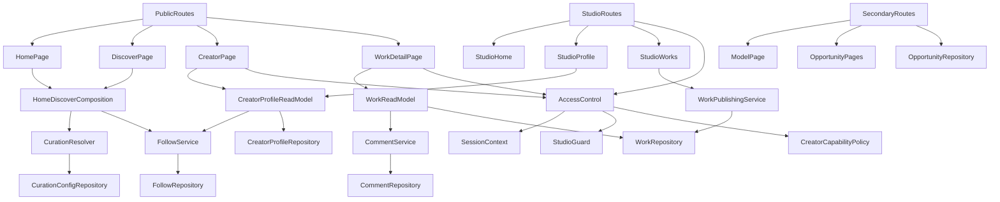
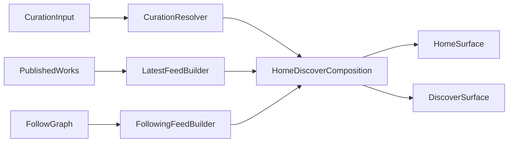
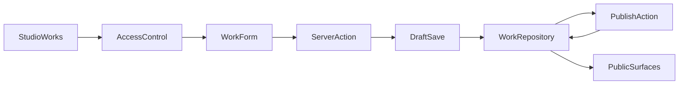

# 摄影社区平台实现设计

- 状态: 已批准
- 主题: 摄影社区平台（轻量 MVP）
- 输入规格: `docs/specs/2026-04-08-photography-community-platform-srs.md`
- 评审结论: 通过（已完成人类确认）
- 关联评审: `docs/reviews/design-review-photography-community-platform.md`

## 1. 概述

本设计面向已批准的“摄影社区平台（轻量 MVP）”规格，目标是在保留现有 `web` 应用可复用资产的前提下，把产品主线从“作品展与约拍平台”平滑收敛为“摄影社区平台”。

当前设计只覆盖已批准范围：

- 首页社区化
- 独立发现页
- 创作者公开主页
- 作品发布、草稿 / 发布状态与作品详情
- 关注创作者
- 文本评论
- 首页 / 发现页人工精选
- 次级保留模特主页与约拍诉求

当前设计明确不覆盖：

- 挑战赛 / 小组 / 学习 / 会员 / 商业化
- EXIF、器材、地区等高级发现维度
- 评论编辑 / 删除 / 举报 UI
- 独立运营后台

## 2. 设计驱动因素

### 2.1 需求驱动

- `FR-001`：继续沿用现有单主身份模型，账号在 `摄影师` / `模特` 之间二选一。
- `FR-002`：首页必须从“展示 / 约拍入口”切换为“社区首页”。
- `FR-003`：新增独立发现页，至少支持 `精选`、`最新` 和 `关注中 / 等价浏览方式`。
- `FR-004`：创作者主页是公开内容沉淀中心，并承接关注关系。
- `FR-005`：作品支持 `草稿` / `已发布` 两种状态，只有已发布作品进入公开面。
- `FR-006`：评论首期仅支持纯文本、1 到 500 字、最新优先、无编辑 / 删除 / 举报 UI。
- `FR-007`：首页与发现页依赖人工精选输入，但首期不要求独立运营后台。
- `FR-008`：模特主页与约拍诉求继续可访问，但降级为次级模块。

### 2.2 非功能驱动

- `NFR-001`：图片必须占据首屏或主内容区。
- `NFR-002`：首页、发现页、创作者主页、作品详情必须未登录可浏览。
- `NFR-003`：设计必须严格收敛到轻量 MVP，不能偷带二期能力。
- `NFR-004`：必须尽量复用现有公开路由。
- `NFR-005`：桌面与移动端都要有可用的主内容区和核心操作入口。

### 2.3 当前技术上下文

- 当前实现位于 `web`，技术栈为 `Next.js 16 + React 19 + TypeScript + Tailwind v4 + Vitest`。
- 现有页面已覆盖：首页、公开主页、作品详情、诉求列表与详情、登录注册、`studio`、`inbox`。
- 当前公开内容主要由 `sample-data.ts` 驱动；互动状态和站内联系主要依赖 cookie，尚不是社区级持久化实现。
- 现有类型模型以 `PublicProfile`、`PublicWork`、`PublicOpportunityPost` 为主，适合做社区 MVP 的基础重构入口。

## 3. 需求覆盖与追溯

| 规格需求 | 设计承接点 |
|---|---|
| `FR-001` 账号与访问控制 | `AccessControl`、`StudioGuard`、`CreatorCapabilityPolicy` |
| `FR-002` 首页社区化 | `HomeDiscoverComposition`、`CurationResolver`、`SecondaryCollaboration` |
| `FR-003` 发现页与公共浏览 | `HomeDiscoverComposition`、`FollowingFeedBuilder`、`LatestFeedBuilder` |
| `FR-004` 创作者主页 | `CreatorProfileReadModel`、`FollowService` |
| `FR-005` 作品发布与详情 | `WorkPublishingService`、`WorkReadModel`、`WorkVisibilityPolicy` |
| `FR-006` 关注与评论 | `FollowService`、`CommentService` |
| `FR-007` 人工精选维护 | `CurationConfigRepository`、`CurationResolver` |
| `FR-008` 次级合作模块保留 | `SecondaryCollaboration`、`OpportunityRepository` |

## 4. 候选方案

### 方案 A：在现有 Next.js 单体中渐进演进为社区 MVP

#### 如何工作

- 继续使用当前 `web` 单体应用。
- 在现有页面与 feature 目录之上引入更清晰的领域模块和 repository 边界。
- 新增 `/discover` 路由。
- 将动态社区状态从 `sample-data + cookie` 逐步迁移到可持久化的读写层。
- 维持模特主页与约拍诉求路由，但把它们从主线编排中降级。

#### 优点

- 最大化复用现有首页、公开页、`studio` 和测试基线。
- 与 `NFR-004` 的路由稳定性高度一致。
- 最适合当前轻量 MVP，不需要额外维护独立前后端工程。
- 便于对旧“展示站”进行可控重构，而不是推倒重来。

#### 缺点

- 需要在旧“作品展”语义和新“社区”语义之间做一轮领域收口。
- 若模块边界控制不好，容易继续累积样本数据与兼容逻辑。

#### 适配度

- 高，且最符合当前规格与代码现实。

### 方案 B：重建一套新的社区前端结构，旧站点能力作为遗留模块旁挂

#### 如何工作

- 重新规划首页、发现页、创作者主页与发布路径。
- 旧的模特 / 约拍路径保留，但与新社区主线并列存在。

#### 优点

- 信息架构和页面语义更纯粹。
- 更容易在视觉和模块命名上一次性切到社区语言。

#### 缺点

- 会显著增加重写成本。
- 与规格中的“继续复用现有路由”和“轻量 MVP”不匹配。
- 容易把设计推向超范围重构。

#### 适配度

- 中低，不适合当前轮次。

### 方案 C：继续以 `sample-data + cookie` 方式完成社区 MVP 原型

#### 如何工作

- 新增发现页、关注和评论 UI。
- 动态状态继续放在 cookie 或页面内样本数据中。

#### 优点

- 实现速度快。
- 可快速看到页面效果。

#### 缺点

- 无法支撑真正的关注关系、评论列表和作品草稿 / 发布状态。
- 会把当前“样本驱动展示站”延续为“样本驱动社区”，技术债更重。
- 不适合作为后续任务规划与实现的稳定基础。

#### 适配度

- 低，只适合短期演示，不适合作为当前设计主方案。

### 推荐方案

推荐采用 **方案 A：在现有 Next.js 单体中渐进演进为社区 MVP**。

## 5. 选定方案与关键决策

### 5.1 决策背景

当前规格要求在不重做全部路由和信息架构的前提下，快速交付社区主线 MVP。现有 `web` 应用已经具备公开浏览壳层、工作台壳层和部分互动入口，因此更适合在原有结构上完成领域重构，而不是新建第二套系统。

### 5.2 关键决策

- **继续使用单体式 Next.js 应用作为唯一运行面。**
  公共页面、工作台页面与服务端读写入口都留在同一应用中，避免为 MVP 引入独立 API 服务。

- **继续沿用单主身份模型。**
  `摄影师` 与 `模特` 仍是账号主身份，统一进入“创作者”抽象；区别主要体现在主页语义、社区主线优先级和次级模块可见度。

- **社区发布入口首期复用 `/studio/works`。**
  当前不新增独立 `/publish` 路由，而是在 `studio` 内完成作品草稿 / 发布能力，减少路径变更。

- **发现页采用“精选 + 最新 + 关注中”组合，而非算法 feed。**
  其中“精选”来自人工精选输入，“最新”来自已发布作品时间排序，“关注中”来自用户已关注创作者的已发布作品。

- **评论采用最小可用策略。**
  只支持纯文本、新增、最新优先展示，不提供评论编辑 / 删除 / 举报 UI；错误处理只覆盖非空、长度和提交失败提示。

- **人工精选首期只做配置型维护。**
  不建设独立运营后台，精选内容通过静态配置文件或受限内部维护方式提供给首页和发现页消费。

- **次级合作模块隔离，不删除。**
  模特主页与约拍诉求仍保留现有路由和站内联系能力，但不再占据社区首页和主导航主叙事。

### 5.3 运行时与持久化策略

- **公共读取统一在 Server Components 中完成。**
  首页、发现页、创作者主页、作品详情页都由服务端读模型装配数据，客户端组件只承接输入、交互状态和必要的乐观反馈。

- **登录后变更统一通过 Server Actions 触发。**
  `studio/works` 的草稿 / 发布、创作者资料维护、关注切换、评论提交都通过服务端动作进入领域服务，而不是继续直接落在 cookie 业务逻辑中。

- **会话上下文统一进入 `AccessControl`。**
  现有登录态读取能力在服务端形成 `SessionContext`，再由 `StudioGuard`、`CreatorCapabilityPolicy` 和互动权限判断消费；其中 `摄影师` 与 `模特` 两类主身份都保留创作者发布和主页维护资格。

- **首期动态数据采用单体内嵌关系型存储。**
  `CreatorProfileRepository`、`WorkRepository`、`FollowRepository`、`CommentRepository` 的首个具体实现选择 `SQLite` 或等价嵌入式 SQL 存储，并只允许通过 repository 访问；这样既能满足 MVP 持久化，又不需要独立后端服务。

- **人工精选继续使用现有配置入口。**
  首期将 `web/src/features/home-discovery/config.ts` 作为 canonical curation artifact；`CurationResolver` 在装配首页 / 发现页前校验目标是否存在且处于公开状态，命不中时跳过并回退到最新公开内容，同时记录轻量日志。

- **样本数据只保留为迁移种子，不再作为社区动态状态真源。**
  `sample-data.ts` 可用于初始化或兼容未迁移的次级只读页面，但关注、评论、草稿 / 发布等动态状态不得再以样本数据或 cookie 作为最终真源。

### 5.4 实现排序约束

1. 先定义 repository 接口、`SQLite` 适配器与 `SessionContext -> AccessControl` 边界。
2. 再把公开读取面切到 repository 读模型，包括首页、发现页、创作者主页和作品详情。
3. 再把 `studio/works` 与创作者资料维护切到 Server Actions + repository 写入。
4. 然后接入关注与评论的登录后写路径，并替换旧 cookie 互动逻辑在社区主线中的职责。
5. 最后验证模特主页、约拍诉求与站内联系仍通过共享读取层正常工作。

### 5.5 主要收益

- 最大程度复用现有应用与测试基线。
- 能把当前范围收敛在可执行的 MVP 内。
- 后续扩展挑战赛、小组、学习内容时，仍可沿当前模块边界继续演进。

### 5.6 主要代价

- 需要在旧 `showcase` 语义之上收口更清晰的社区领域模型。
- 首期会同时存在“社区主线模块”和“次级合作模块”两套产品叙事。

### 5.7 风险与缓解

- **风险：** 样本数据与 cookie 状态继续扩散。  
  **缓解：** 从设计阶段起引入 repository 边界，要求新社区动态状态不再直接写 cookie 业务逻辑。

- **风险：** 次级模块重新挤占首页。  
  **缓解：** 首页和发现页明确使用社区主线编排；模特 / 诉求只允许作为次级 teaser 或独立入口存在。

## 6. 架构视图

## 7. 模块职责与边界

### 7.1 `AccessControl`

- 负责读取服务端 `SessionContext`，统一承接登录态、主身份和权限判断。
- `StudioGuard` 负责保护 `studio` 内的管理与发布入口。
- `CreatorCapabilityPolicy` 明确定义两类主身份都属于当前 MVP 的创作者，可维护主页并发布公开作品。
- 关注、评论等互动能力共享同一套登录态判断，但不与页面编排耦合。

### 7.2 `CreatorProfile`

- 统一承接创作者主页的公开读模型与工作台资料编辑。
- `摄影师` 与 `模特` 共享基础资料结构，但在首页优先级与次级模块归属上不同。
- 不直接负责关注关系写入，由 `SocialGraph` 承接。

### 7.3 `WorkPublishing`

- 承担作品草稿、发布、编辑与公开读取。
- `WorkVisibilityPolicy` 负责 `draft -> published` 的可见性切换。
- 负责把已发布作品提供给主页、详情页、发现页。
- 不承接 EXIF、系列、器材等二期字段。

### 7.4 `HomeDiscover`

- `HomeDiscoverComposition` 统一承接首页社区化编排与发现页内容编排。
- `LatestFeedBuilder` 负责按公开发布时间聚合最新内容。
- `FollowingFeedBuilder` 负责根据关注关系聚合“关注中”内容。
- `CurationResolver` 负责消费 `web/src/features/home-discovery/config.ts` 中的人工精选输入，并在精选不足时回退到最新公开内容。
- 整个模块不实现个性化推荐算法。

### 7.5 `SocialGraph`

- 承担关注关系与评论能力。
- 关注支持关注 / 取消关注。
- 评论支持纯文本新增、校验与最新优先读取。
- 关注与评论的写入都通过 Server Actions 进入服务端领域服务。
- 点赞 / 收藏 / 站内联系继续保留，但作为兼容互动，不进入此模块的核心设计决策。

### 7.6 `SecondaryCollaboration`

- 独立承接模特主页、约拍诉求和站内联系的次级合作能力。
- 与社区主线共享账号、公开主页和图片展示基座。
- 通过边界隔离，避免这组能力重新主导首页编排。

## 8. 数据流、控制流与关键交互

### 8.1 首页 / 发现页编排流

设计要点：

- 首页只消费社区主线内容，并在视觉上保留一个次级合作入口区，而不是把合作内容并列成主板块。
- 发现页至少提供 `精选`、`最新`、`关注中` 三种浏览来源。
- 精选缺失时回退到最新公开内容，但不应抛错或让页面空白。

### 8.2 作品发布流

设计要点：

- 发布入口首期放在 `studio/works`。
- 草稿只在工作台可见。
- 只有已发布作品进入公开主页、作品详情与发现页。
- 已发布作品编辑后仍保持公开可见，只有显式切回草稿时才退出公开面。

### 8.3 关注 / 评论交互流

- 用户在创作者主页触发关注时，先校验登录态，再写入 `FollowRepository`，随后刷新主页与发现页相关状态。
- 用户在作品详情页提交评论时，先执行非空与 1 到 500 字长度校验，成功后写入 `CommentRepository`，并按最新优先返回评论列表。
- 关注与评论表单都由 Server Actions 驱动，客户端只持有表单输入和提交态。
- 由于首期无评论编辑 / 删除 / 举报 UI，评论为 append-only 形态。

## 9. 接口与契约

### 9.1 Next.js 运行时契约

- 首页、发现页、创作者主页和作品详情页使用 Server Components 直接装配读模型。
- `studio/profile`、`studio/works`、关注切换和评论提交使用 Server Actions 触发服务端写路径。
- 服务端会话工具在请求入口生成 `SessionContext`，再交给 `AccessControl` 做页面守卫和能力校验。
- 客户端组件只负责输入、表单提交态和必要的乐观交互，不直接定义业务真源。

### 9.2 核心实体

- `Account`
  - `id`
  - `primaryRole`: `photographer | model`

- `CreatorProfile`
  - `id`
  - `accountId`
  - `role`
  - `slug`
  - `name`
  - `city`
  - `tagline`
  - `bio`

- `Work`
  - `id`
  - `ownerProfileId`
  - `status`: `draft | published`
  - `title`
  - `description`
  - `coverAsset`
  - `publishedAt`
  - `updatedAt`
  - `coverAsset` 由现有或后续补齐的图片上传能力产出，`WorkRepository` 只持久化引用与元数据

- `FollowRelation`
  - `followerAccountId`
  - `creatorProfileId`
  - `createdAt`

- `WorkComment`
  - `id`
  - `workId`
  - `authorAccountId`
  - `body`
  - `createdAt`

- `CuratedSlot`
  - `surface`: `home | discover`
  - `sectionKind`
  - `targetType`
  - `targetKey`
  - `order`

- `OpportunityPost`
  - 维持现有次级合作模型，不纳入社区主线数据裁剪。

### 9.3 页面读取契约

- 首页读取契约：
  - 返回 Hero 内容
  - 返回首页社区精选区
  - 返回次级合作 teaser 区

- 发现页读取契约：
  - 返回 `精选`、`最新`、`关注中`
  - `关注中` 对未登录用户可为空或不展示数据列表，但页面结构仍可稳定渲染

- 创作者主页读取契约：
  - 返回创作者资料
  - 返回已发布作品列表
  - 返回当前登录用户的关注状态

- 作品详情读取契约：
  - 返回作品主体
  - 返回作者摘要
  - 返回最新评论列表
  - 返回兼容互动状态（如点赞）时应与评论能力解耦

### 9.4 写入契约

- 作品保存：
  - 支持 `保存草稿`
  - 支持 `发布`
  - 支持对已发布作品继续编辑，且默认保持公开可见
  - 只有当创作者显式切回 `草稿` 时，作品才退出公开主页、作品详情与发现页

- 关注：
  - 支持 `关注` 与 `取消关注`
  - 要求登录

- 评论：
  - 纯文本
  - 长度 `1..500`
  - 空值或超长必须返回用户可见错误
  - 首期不支持编辑 / 删除 / 举报

- 人工精选：
  - 首期通过 `web/src/features/home-discovery/config.ts` 维护输入
  - 不要求独立后台
  - 解析前需校验目标存在且可公开展示；无效条目跳过并回退到最新公开内容或更少条目

## 10. 非功能需求与约束落地

### 10.1 图片优先体验

- 首页、发现页、主页和详情页都以图片内容作为首个主要信息面。
- 评论、关注和次级合作入口都必须放在图片阅读之后，而不是先展示操作面板。

### 10.2 公开浏览低门槛

- 首页、发现页、主页、作品详情不加登录门槛。
- 登录只在关注、评论、发布和工作台管理操作前触发。

### 10.3 路由稳定性

- 继续保留 `/`、`/photographers/[slug]`、`/models/[slug]`、`/works/[workId]`、`/opportunities`、`/opportunities/[postId]`。
- 本轮新增的核心社区路由只需要 `'/discover'`。
- 发布不新增顶级路由，继续放在 `studio` 内。

### 10.4 无算法与无运营后台约束

- 发现页排序不依赖复杂个性化算法。
- 精选输入通过配置型维护实现，不要求本轮建设运营后台。

### 10.5 次级模块隔离

- 模特主页与约拍诉求保持可用，但它们只通过次级入口与直接路由暴露。
- 社区主线页不以合作模块作为主视觉与主导航中心。

## 11. 测试策略

### 11.1 单元测试

- `CurationResolver`：精选命中、回退最新、无效精选跳过
- `FollowService`：关注 / 取消关注权限与状态切换
- `CommentValidationPolicy`：空值、超长、合法输入
- `WorkVisibilityPolicy`：草稿与已发布的公开可见性

### 11.2 集成测试

- 已登录创作者在 `studio/works` 中保存草稿、发布作品、再次编辑已发布作品
- 已登录用户在创作者主页执行关注 / 取消关注
- 已登录用户在作品详情页发表评论，未登录用户被拦截
- 发现页对 `精选`、`最新`、`关注中` 的聚合渲染

### 11.3 页面 / 渲染测试

- 首页社区化后的关键分区
- 发现页
- 创作者主页
- 作品详情页评论区
- 次级模块仍可访问：模特主页、约拍诉求页

### 11.4 回归验证

- 既有首页、公开主页、作品详情和 `studio` 路由不能因社区主线切换而失效
- 模特与约拍路由应保持未登录可访问和站内联系兼容

## 12. 风险、待定问题与任务规划准备度

### 12.1 主要风险

- **样本数据到持久化状态的迁移风险**  
  当前代码大量依赖 `sample-data` 和 cookie；任务规划阶段应优先拆出 repository 与读写边界。

- **社区主线与次级合作模块互相污染**  
  若不在首页和发现页明确隔离，旧产品叙事会重新占主线。

- **评论缺少治理后台的内容风险**  
  当前仅做最小治理；后续若合规压力上升，需要在增量中补充治理策略。

### 12.2 待定问题

- 最小作品字段集是否直接沿用现有 `showcase` 字段，还是在实现前再轻量扩展
- “关注中”是否只作为发现页一个分区，还是后续扩成独立关注列表页

### 12.3 任务规划准备度

当前设计已经足以支撑后续任务拆解，任务计划可围绕以下主轴展开：

- 社区核心领域模型与 repository 边界
- 首页社区化与发现页
- 作品草稿 / 发布与公开读取
- 关注与评论
- 次级模块保留与回归验证
