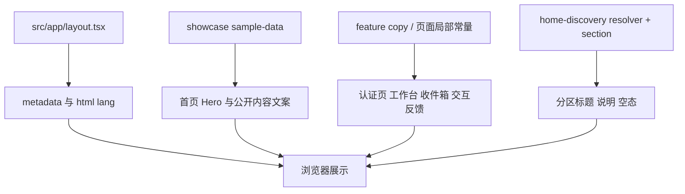
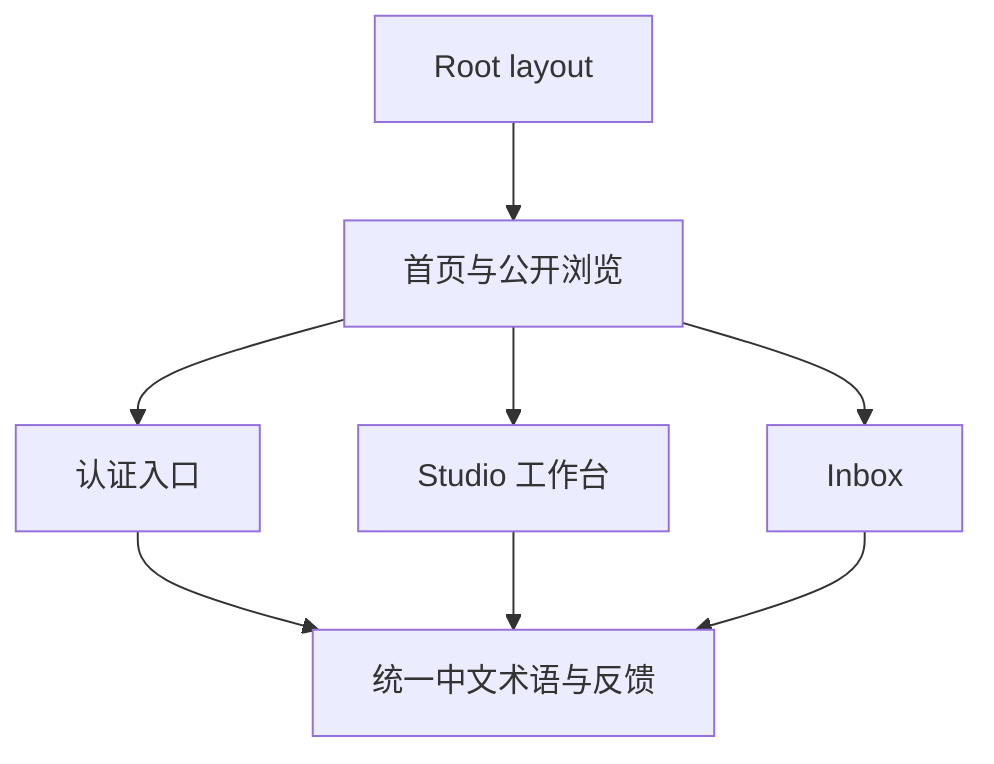
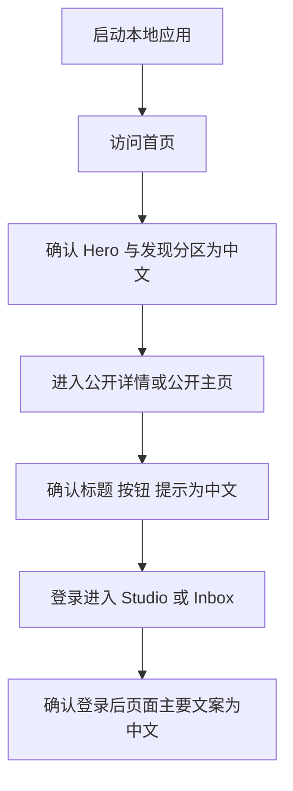

# 网站全站中文化实现设计

- 状态: 已批准
- 主题: 网站全站中文化
- 输入规格: `docs/specs/2026-04-08-site-chinese-localization-srs.md`

## 1. 概述

本设计面向“网站全站中文化”增量。目标是在不改变现有 Next.js 路由结构、页面信息架构和主要交互流程的前提下，把当前站点的主要用户可见界面从英文基线切换为中文基线，并补充浏览器级验证。

当前代码已经具备完整的页面骨架、样本数据、登录态演示和首页发现能力，但用户可见文案分散在多个位置：

- 根布局 metadata 与 `html lang`
- `sample-data.ts` 中的首页与公开内容展示文案
- resolver / 组件中的分区标题、空态、按钮和辅助说明
- 各页面组件中的局部交互文案

因此本轮设计重点不是引入复杂国际化系统，而是在现有结构上建立一套“可集中定位、最小侵入、便于一致性检查”的中文化落地方式。

## 2. 设计驱动因素

### 2.1 需求驱动

- `FR-001`：首页首屏、发现分区和入口卡片需要中文化，同时不破坏 Hero 首屏结构。
- `FR-002`：公开浏览链路中的主要用户可见文案需要中文化，且保持公开可访问。
- `FR-003`：登录 / 注册 / `studio` / `inbox` 的主要界面文案需要中文化。
- `FR-004`：点赞、收藏、联系、空态与登录拦截等交互反馈要保持中文一致性。
- `FR-005`：metadata 和品牌表达需要面向中文用户调整。

### 2.2 约束与非功能驱动

- 本轮不引入多语言切换器或完整国际化框架。
- 本轮不修改既有 URL 结构。
- 品牌名 `Lens Archive` 可以保留，但不能使页面整体继续以英文为主。
- 术语要在首页、公开页、认证页、工作台、收件箱中保持一致。
- 完成后必须有浏览器验证，不只停留在静态代码修改。

### 2.3 当前技术上下文

- 站点是 `web` 下的 Next.js 16 + React 19 + TypeScript 应用。
- 根布局 `src/app/layout.tsx` 目前 `lang="en"`，metadata 也是英文。
- 首页主视觉和公共样本内容主要来自 `src/features/showcase/sample-data.ts`。
- 首页发现区标题、说明和空态由 `src/features/home-discovery/resolver.ts` 与 `home-discovery-section.tsx` 提供。
- 认证入口复用了 `src/features/auth/auth-entry-grid.tsx` 与相关 copy。
- 公开主页主要由 `src/features/showcase/profile-showcase-page.tsx` 复用渲染。
- 其它页面在各自 `src/app/**/page.tsx` 中仍有大量内联英文文案。

## 3. 需求覆盖与追溯

| 需求 | 设计承接 |
|---|---|
| `FR-001` 首页中文化 | 更新首页样本数据、首页发现 copy 与首页页面局部标签；保持 Hero 与发现分区结构不变 |
| `FR-002` 公开浏览链路中文化 | 更新公开主页、作品详情、诉求列表与诉求详情页的展示与交互文案 |
| `FR-003` 认证与工作台中文化 | 更新登录/注册 copy、`studio` 子页标题/表单/说明、`inbox` 文案 |
| `FR-004` 交互反馈一致性 | 建立术语基线，统一按钮、空态、登录引导和动作反馈表达 |
| `FR-005` metadata 与品牌表达 | 更新 `layout.tsx` metadata 与 `html lang`，品牌名保留但配套中文描述 |
| `NFR-001` 术语一致性 | 通过集中 copy 清单 + 页面层少量常量收口，减少同概念漂移 |
| `NFR-002` 结构稳定性 | 只改文案来源和页面文本，不改路由和页面组织 |
| `NFR-003` 浏览器可验证性 | 在浏览器中验证首页、一个公开详情/主页、一个登录后页 |

## 4. 候选方案

### 方案 A：逐文件直接翻译现有文案

#### 如何工作

- 在每个页面或组件里直接把英文字符串改成中文。
- 样本数据中的文案也就地翻译。

#### 优点

- 改动路径直观
- 初次落地速度最快
- 不需要新增抽象

#### 缺点

- 横跨多个页面与组件时容易漏改
- 同一术语可能在不同文件里漂移
- 后续如果还要补更多中文化范围，维护成本较高

#### 适配度

- 适合非常小的页面数量；对当前“首页 + 公开链路 + 认证 + 工作台 + 收件箱”的横切范围来说偏脆弱

### 方案 B：按现有边界集中管理 copy，并保留页面局部文案常量

#### 如何工作

- 对已有“数据/配置驱动”的文案，继续收拢到各 feature 的 copy 或 sample-data 模块。
- 对纯页面局部标签，提炼为文件顶部常量或紧邻页面的 copy 常量。
- 保持现有组件和路由不变，只替换其消费的文案来源。

#### 优点

- 复用现有边界，不需要引入额外框架
- 便于实现阶段按页面/模块批量排查和测试
- 术语统一性比纯散改更好

#### 缺点

- 仍然不是完整 i18n 方案
- 文案仍会分布在多个 feature，而不是单一词典文件

#### 适配度

- 最符合本轮“最小改动完成中文基线”的目标

### 方案 C：提前接入完整 i18n 框架

#### 如何工作

- 引入语言资源文件、翻译键和运行时语言选择。
- 页面通过翻译函数渲染 copy。

#### 优点

- 长期可扩展性最好
- 后续支持多语言更自然

#### 缺点

- 明显超出本轮范围
- 需要更多重构、键设计和运行时接入
- 会拉长当前交付路径

#### 适配度

- 适合作为后续增量，不适合本轮

## 5. 选定方案与关键决策

### 5.1 选定方案

推荐采用 **方案 B：按现有边界集中管理 copy，并保留页面局部文案常量**。

### 5.2 决策背景

当前项目的用户可见文本主要来自三类来源：

- 样本数据驱动的展示文案
- feature 模块中的结构化 copy
- 页面 JSX 中的少量内联标签与反馈

如果直接逐文件散改，虽然能完成翻译，但很难控制一致性；如果直接接 i18n，则超出本轮需求。方案 B 可以在不改变系统结构的前提下，给后续任务和测试提供清晰落点。

### 5.3 主要收益

- 中文化范围可按模块清单推进，降低遗漏风险
- 术语一致性可通过 copy 收口和测试断言维持
- 页面结构、路由和交互逻辑不需要重写

### 5.4 主要代价

- 需要同时修改多个模块和若干页面文件
- 需要对样本数据和测试文案一起同步更新

### 5.5 风险与缓解

- 风险：页面内仍残留零散英文
  - 缓解：实现阶段按页面清单逐一排查，并用 `rg` 搜索残留英文高频文案
- 风险：样本数据标题与 UI 标签混杂修改时，测试容易脆弱
  - 缓解：优先断言中文结构性标题、按钮和关键入口，而不是过度耦合整段样本描述
- 风险：`html lang`、metadata、空态等外围文案漏改
  - 缓解：单列“根布局 / 页面骨架 / 空态 / 登录引导”检查项
- 风险：浏览器验证只看首页，遗漏登录后页面
  - 缓解：浏览器验证显式覆盖首页、公开页、登录后页三类路径

## 6. 架构视图

### 6.1 文案来源视图

### 6.2 实施边界视图

## 7. 模块职责与边界

### 7.1 `src/app/layout.tsx`

- 更新 `metadata.title` / `metadata.description`
- 将 `<html lang="en">` 调整为 `zh-CN`
- 不改变根布局结构与字体方案

### 7.2 `src/features/showcase/sample-data.ts`

- 承载首页 Hero、featured pathways、pillars 以及公开样本内容中的主要展示文案
- 将当前英文标签、说明、CTA、作品/主页/诉求描述改为中文基线
- 不负责页面布局与交互逻辑

### 7.3 `src/features/home-discovery/*`

- `resolver.ts`：负责发现分区标题与说明文案
- `home-discovery-section.tsx`：负责发现分区空态和壳层标签文案
- 不改变分区解析规则，只调整中文表达

### 7.4 `src/features/showcase/profile-showcase-page.tsx`

- 作为摄影师/模特主页共用展示层，统一改角色标签、城市信息、收藏/联系入口、简介区文案
- 保持收藏与联系动作逻辑不变

### 7.5 `src/features/auth/*`

- 认证入口 copy 通过现有 `auth-copy` / `auth-entry-grid` 收口
- 登录与注册页自身的引导文案、切换入口、角色按钮同步中文化
- 不改 session 或 Server Action 逻辑

### 7.6 `src/app/opportunities/**`、`src/app/works/**`、`src/app/studio/**`、`src/app/inbox/**`

- 各页面保留原有路由与数据流
- 页面顶部标题、辅助说明、按钮、表单字段、空态与引导文案改为中文
- 仅在页面级维护少量本地 copy 常量，不新增复杂共享层

## 8. 数据流、控制流与关键交互

### 8.1 文案渲染流

1. 根布局提供中文 metadata 与中文页面语言标识
2. 首页与公开页从样本数据和 feature copy 中读取中文文本
3. 页面组件继续基于既有状态和动作渲染按钮、空态和反馈
4. 浏览器显示的最终结果应在关键路径中呈现中文基线

### 8.2 关键交互保持不变

- 点赞、收藏、联系、登录与注册仍走现有 Server Actions / cookies 逻辑
- 中文化只影响用户可见表达，不改变动作触发条件与跳转目标

### 8.3 浏览器验证流程

## 9. 接口与契约

### 9.1 中文化输入契约

- 现有样本数据与页面组件可继续作为文案容器
- 不新增新的 API 或数据结构，只替换其字符串内容或局部常量

### 9.2 中文术语契约

本轮至少统一以下核心术语：

- work / works -> 作品
- profile / profiles -> 主页
- opportunity / opportunities -> 诉求 或 约拍诉求
- contact / message -> 联系 / 发消息
- favorite / like -> 收藏 / 点赞
- inbox -> 收件箱
- login / register -> 登录 / 注册
- studio -> 工作台

说明：

- `Lens Archive` 作为品牌名保留英文
- 若某些样本专名是作品标题或人名，可按内容语境保留或翻译，但页面主导语言必须是中文

### 9.3 验证输出契约

- 自动化验证至少覆盖关键页面标题、分区标题、按钮或空态的中文断言
- 浏览器验证至少覆盖：
  - `/`
  - 一个公开路由，如 `/photographers/sample-photographer` 或 `/works/[workId]`
  - 一个登录后路由，如 `/studio` 或 `/inbox`

## 10. 非功能需求与约束落地

### 10.1 术语一致性

- 通过模块级 copy 收口与页面级常量控制关键术语
- 在测试中优先断言关键术语，而不是零散长段描述

### 10.2 结构稳定性

- 不变更页面路由、导航目标和组件层级
- 不重写现有 Server Actions 与 demo session 状态逻辑

### 10.3 可维护性

- 已在 `sample-data`、feature copy 中的文本继续集中管理
- 只有无法自然上收的局部标签保留在页面文件顶部常量中

### 10.4 浏览器可验证性

- 实现完成后必须运行本地应用
- 通过浏览器检查首页、公开页和登录后页的中文显示结果

## 11. 测试策略

### 11.1 单元 / 渲染测试

- 更新首页测试，断言 Hero、发现分区和入口标题的中文表达
- 更新首页发现相关测试，断言分区标题、说明和空态提示为中文
- 更新认证入口、公开主页、公开详情、工作台和收件箱相关测试，断言关键按钮、标题和提示文案为中文

### 11.2 静态检查

- 运行 `npm run test`
- 运行 `npm run lint`
- 运行 `npm run build`

### 11.3 浏览器验证

- 启动本地应用并在浏览器访问首页
- 从首页进入一个公开页，检查中文标题、说明和入口
- 完成登录后进入 `studio` 或 `inbox`，检查登录后主文案

## 12. 风险、待定问题与任务规划准备度

### 12.1 风险

- 某些英文残留在测试数据、空态或 metadata 中，不易被单一页面测试发现
- 工作台页面数量较多，若没有任务化分批推进，容易遗漏局部文案
- 若存在未显式打开的错误页或法务页，本轮默认不主动扩展到范围外

### 12.2 待定问题

- 无

### 12.3 任务规划准备度

本设计已经足以支撑后续任务拆解，预计任务可按以下主轴展开：

- 根布局与首页中文化
- 公开浏览链路中文化
- 认证与登录后页面中文化
- 测试与浏览器验证收口

设计文档草稿已起草完成，下一步应派发独立 reviewer subagent 执行 `ahe-design-review`。

推荐下一步 skill: `ahe-design-review`
