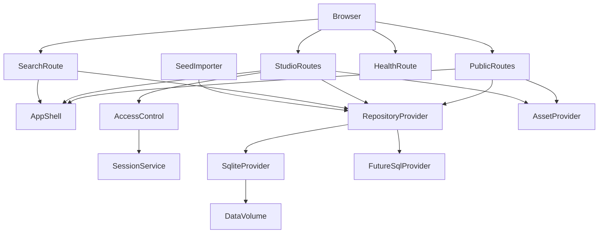
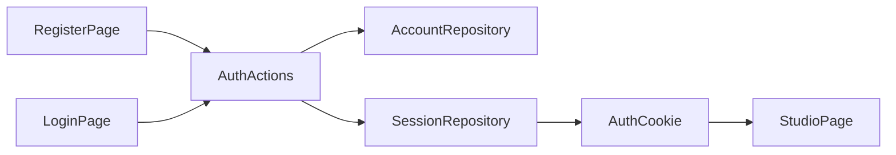
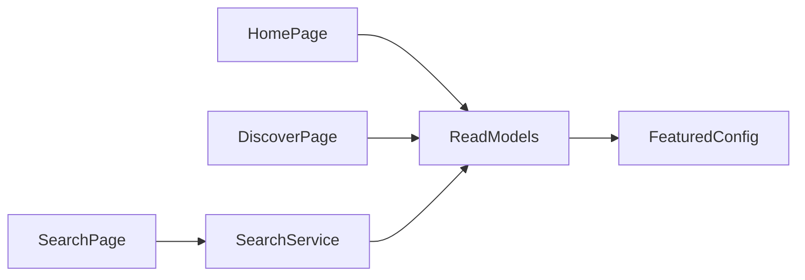
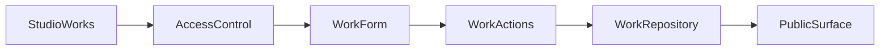
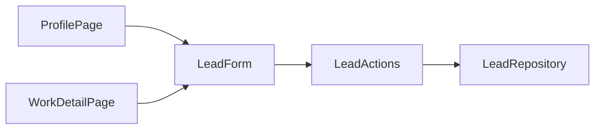

# 综合摄影平台重发布实现设计

- 状态: 已确认
- 主题: Hybrid Platform Relaunch
- 输入规格: `docs/specs/2026-04-09-hybrid-platform-relaunch-srs.md`

## 1. 概述

本设计面向“综合摄影平台重发布”的阶段 1 目标，核心任务不是推倒重做，而是在现有 `web` Next.js 单体之上完成一次生产化升级：

- 把 demo 级运行时收口为可 Docker 部署、可持久化、可验证的生产基线
- 把当前零散页面重构为统一的暗色杂志风产品壳层
- 把作品、创作者、互动、合作线索和基础搜索串成一个可上线的综合平台
- 为阶段 2 的运营后台、消息与支付保留扩展边界

## 2. 设计驱动因素

### 2.1 需求驱动

- `FR-001`: 需要真实账号与安全会话，不能继续依赖 demo 角色 cookie
- `FR-002`: 需要 Docker 云部署、健康检查和环境变量契约
- `FR-003`: 需要全站壳层和成熟视觉系统
- `FR-004`: 需要首页 / 发现 / 搜索构成持续浏览路径
- `FR-005`: 需要成熟的创作者主页和作品详情
- `FR-006`: 需要稳定的工作台资料维护与作品发布闭环
- `FR-007`: 需要可用的关注 / 评论 / 收藏互动
- `FR-008`: 需要基础搜索
- `FR-009`: 需要合作线索入口
- `FR-010`: 需要安全来源的初始内容和精选配置

### 2.2 非功能驱动

- `NFR-001`: 视觉层必须从 MVP 样机升级为成熟产品
- `NFR-003`: 项目必须能在 Docker + 云服务器环境中稳定运行
- `NFR-004`: 会话必须具备最小安全边界
- `NFR-005`: 数据访问要继续通过 repository 边界，避免页面层绑死到单一存储实现

### 2.3 当前技术上下文

- 当前实现位于 `web`，技术栈为 `Next.js 16 + React 19 + TypeScript + Tailwind v4 + Vitest`
- 当前数据核心仍由 `src/features/community/sqlite.ts` 驱动，默认落到 `web/.data/community.sqlite`
- 当前账号系统仍是 `startDemoSession()` + 角色 cookie
- 当前首页、发现页、创作者页、作品详情页与工作台已经存在可复用页面骨架

## 3. 候选方案

### 方案 A：继续使用 Next.js 单体，补齐生产运行时与设计系统

#### 如何工作

- 保留现有 App Router 结构与 feature 目录
- 继续使用 repository 边界承接资料、作品、互动和精选
- 引入环境变量契约、Docker 构建、健康检查、真实账号 / 会话
- 在页面层构建统一壳层与可复用视觉组件

#### 优点

- 最大化复用现有页面、测试与社区领域代码
- 与当前仓库结构最匹配
- 适合阶段 1 快速上线

#### 缺点

- 需要在现有 MVP 代码之上完成较大规模重构
- 若模块边界控制不好，容易继续残留 demo 逻辑

### 方案 B：新建前后端分离系统，旧站点逐步旁挂

#### 优点

- 结构最纯粹，未来扩展上限更高

#### 缺点

- 成本和迁移风险显著增加
- 不适合当前阶段 1 的速度与风险约束

### 方案 C：继续沿用 demo 运行时，只重做界面

#### 优点

- 改版见效快

#### 缺点

- 站点仍不具备真实上线能力
- 无法解决账号、安全会话、持久化和部署问题

### 推荐方案

推荐采用 **方案 A：继续使用 Next.js 单体，补齐生产运行时与设计系统**。

## 4. 选定方案与关键决策

### 4.1 总体决策

- **继续使用 `web` 作为唯一运行面。**
  公共页面、工作台页面和服务端读写入口继续留在同一 Next.js 应用中。

- **运行时升级为“容器优先、环境变量驱动”。**
  项目提供 Dockerfile、`.dockerignore`、健康检查与环境变量校验，明确生产启动路径。

- **引入“数据提供者 + 资源提供者”双边界。**
  repository 继续负责数据实体访问；资源提供者负责封面图与后续对象存储路径，避免页面层直连磁盘或裸 URL 约定。

- **阶段 1 采用“可落地的最小生产模型”。**
  账号、会话、作品、互动、合作线索和搜索必须可用；完整后台、消息与支付推迟到阶段 2。

### 4.2 运行时与部署策略

- 使用 Docker 运行 `next build` + `next start`
- 容器内默认监听单个 Node 进程，适配单实例云服务器
- 健康检查通过独立 route 输出运行状态
- 环境变量由统一模块校验，启动阶段即失败而不是在请求期报错
- 数据目录与上传目录允许挂载卷

### 4.3 数据与持久化策略

- 当前仓库已有 `CommunityRepositoryBundle`，阶段 1 继续复用其读取和写入契约
- 代码层新增 `DATABASE_PROVIDER` 概念，为后续托管 SQL 迁移保留入口
- 本轮实现先把 SQLite 从“隐式本地路径”升级为“环境变量驱动 + 可挂载卷的数据提供者”
- 生产目标默认预留托管 SQL 迁移路径，但不要求在当前迭代同时引入完整 ORM 和后台任务系统
- 新增账号、会话和合作线索持久化表，与现有作品 / 关注 / 评论表共存

### 4.4 身份与会话策略

- 弃用 `startDemoSession()` 的角色写 cookie 模式
- 账号采用 `email + password + primaryRole`
- 使用服务端生成的会话 token 建立安全 cookie
- `AccessControl` 继续作为统一权限边界，页面和 Server Actions 不直接依赖 cookie 原值

### 4.5 内容与资源策略

- 作品仍以 `coverAsset` 为公共字段，但其语义从“随意字符串”升级为“可公开访问的图片资源引用”
- 阶段 1 允许继续使用远程图片 URL 与安全种子图片，不强制先做完整上传服务
- 资源提供者需为后续对象存储 / CDN 接入保留边界

### 4.6 搜索策略

- 阶段 1 使用服务端基础搜索，不引入独立检索服务
- 搜索范围包括作品、创作者与合作内容
- 结果页采用统一卡片组件和稳定空态

### 4.7 合作线索策略

- 保留当前合作路径，但重做入口、文案与表单交互
- 合作线索在阶段 1 只要求可持久化和可回看，不扩展支付 / 履约状态机

## 5. 架构视图

## 6. 模块职责与边界

### 6.1 `config/env`

- 统一解析和校验环境变量
- 为数据库提供者、站点 URL、cookie 安全策略、数据路径与资源路径提供 canonical 配置入口

### 6.2 `features/auth`

- `accounts`: 账号创建、凭据校验、主身份管理
- `sessions`: 会话创建、销毁、查找、cookie 写入
- `access-control`: 将会话映射为页面和 Server Action 权限判断

### 6.3 `features/community`

- 继续作为创作者资料、作品、精选配置和公开读模型的主要边界
- 通过 provider 层隔离存储实现
- 不直接承担 cookie 会话逻辑

### 6.4 `features/social`

- 继续承接关注、评论和收藏类互动
- 依赖真实 `accountId`
- 不感知登录页面或 cookie 原始格式

### 6.5 `features/search`

- 聚合作品、创作者与合作内容的基础搜索结果
- 负责结果分组、空态和有限过滤

### 6.6 `features/shell`

- 提供顶栏、页脚、移动导航、页面容器、hero 模块、通用卡片与 section 容器
- 让首页、发现页、作品详情、创作者主页和工作台共享一致的视觉语言

### 6.7 `features/leads`

- 承接合作线索表单、持久化与回看模型
- 与阶段 2 的消息 / 订单系统解耦

## 7. 数据流与控制流

### 7.1 认证流

### 7.2 首页 / 发现 / 搜索浏览流

### 7.3 工作台与作品发布流

### 7.4 合作线索流

## 8. 接口与契约

### 8.1 环境变量契约

- `APP_BASE_URL`
- `DATABASE_PROVIDER`
- `SQLITE_DATABASE_PATH`
- `ASSET_BASE_URL`
- `SESSION_COOKIE_SECRET`
- `SESSION_COOKIE_SECURE`
- `HEALTHCHECK_ENABLED`

说明：

- 若缺少 `APP_BASE_URL` 或 `SESSION_COOKIE_SECRET`，应用启动应直接失败
- `DATABASE_PROVIDER` 默认允许 `sqlite`，为后续托管 SQL 迁移预留兼容入口

### 8.2 数据实体扩展

- `Account`
  - `id`
  - `email`
  - `passwordHash`
  - `primaryRole`
  - `createdAt`
- `Session`
  - `id`
  - `accountId`
  - `tokenHash`
  - `expiresAt`
  - `createdAt`
- `Lead`
  - `id`
  - `targetType`
  - `targetKey`
  - `senderName`
  - `senderEmail`
  - `message`
  - `createdAt`

### 8.3 页面读取契约

- 首页：
  - hero 区
  - 精选内容
  - 最新内容
  - 合作入口 teaser
- 发现页：
  - 精选
  - 最新
  - 关注中
  - 搜索入口
- 搜索页：
  - query
  - 结果集合
  - 空态与分组标题
- 创作者主页：
  - 创作者资料
  - 代表作品
  - 关注状态
  - 合作入口
- 作品详情页：
  - 作品主体
  - 作者摘要
  - 评论列表
  - 合作入口

## 9. 实现排序约束

1. 先建立环境变量契约、Docker 运行基线与健康检查
2. 再实现真实账号 / 会话与持久化账号模型
3. 再建立全站壳层、设计令牌与通用页面模块
4. 再重做首页、发现页与搜索
5. 再重做创作者主页、作品详情和工作台发布体验
6. 最后补齐安全种子数据、阶段 2 backlog 和上线说明

## 10. 测试策略

### 10.1 单元测试

- 环境变量校验
- 会话创建 / 销毁 / 非法 token 回退
- 搜索 service
- 合作线索表单校验

### 10.2 集成测试

- 注册 / 登录 / 登出
- 工作台保存资料、保存草稿、发布作品
- 关注 / 评论 / 收藏
- 搜索结果聚合
- 合作线索提交

### 10.3 页面 / 渲染测试

- 根布局与导航壳层
- 首页
- 发现页
- 搜索页
- 创作者主页
- 作品详情页
- 工作台资料页与作品页

### 10.4 运行时验证

- Docker 镜像构建
- 容器启动冒烟
- 健康检查
- SQLite 路径或数据卷存在性
- 初始内容导入验证

## 11. 风险与缓解

### 11.1 主要风险

- **风险：** 登录体系从 demo cookie 切到真实账号后，会影响大量受保护页面。  
  **缓解：** 保持 `AccessControl` 作为唯一权限边界，并用页面测试覆盖登录前后路径。

- **风险：** 视觉改版范围过大，容易把逻辑和样式混在一起。  
  **缓解：** 先建立 `features/shell` 和设计令牌，再逐页迁移。

- **风险：** 首发内容质量不足，界面即使重做也会显得空。  
  **缓解：** 提前准备授权图片 + 虚构资料的高质量种子内容。

- **风险：** 单实例 SQLite 仍有扩展上限。  
  **缓解：** 用 provider 边界隔离存储实现，后续切托管 SQL 时不触碰页面层。

## 12. 任务规划准备度

当前设计已经足以支撑阶段 1 的任务拆解，任务计划应围绕以下主轴展开：

- 运行时与账号安全基线
- 全站壳层与视觉系统
- 首页 / 发现 / 搜索
- 创作者与作品公开面
- 工作台发布与资料维护
- 种子内容与阶段 2 backlog

## 13. 阶段 1 交付边界与阶段 2 预留

### 13.1 阶段 1 已落地能力

- 生产运行时基线：Dockerfile、环境变量契约、健康检查、显式 SQLite 路径
- 真实身份模型：邮箱 / 密码注册登录、持久化会话、统一 `studio` 守卫
- 杂志风公共壳层：首页、发现、搜索、创作者主页、作品详情、工作台统一视觉
- 社区主线：发布、公开浏览、关注、评论、合作私信入口
- 安全种子内容：授权图片来源清单、虚构资料与首页可见的来源说明

### 13.2 阶段 2 明确保留能力

- 运营后台：精选编排、内容审核、账号治理、作品管理
- 消息与通知：线程式消息中心、系统通知、已读状态与聚合收件箱
- 商业交易：支付、订单、会员、权益与结算
- 商业协作：报价、排期审批、合同 / deliverable 流程
- 搜索深化：独立检索服务、更强排序、运营位与分析能力

### 13.3 发布约束

- 当前首发图片仍以第三方授权图片热链作为演示基线，正式商用前应迁移到对象存储 / CDN。
- 当前数据库 provider 边界已经预留，但仍默认落在 SQLite；切托管 SQL 需要在阶段 2 或后续运维任务中完成。
- 阶段 2 能力不得在阶段 1 发布说明中被表述为“已交付”或“默认可用”。
