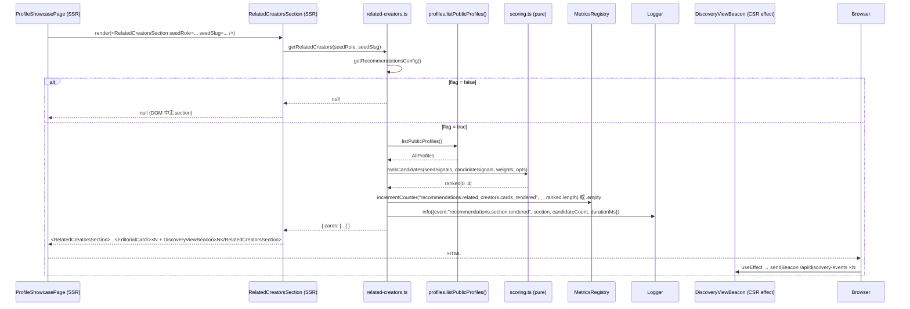

# Phase 2 — Discovery Intelligence V1 实现设计

- 状态: 已批准
- 批准记录: `docs/verification/design-approval-phase2-discovery-intelligence-v1.md`
- 主题: Phase 2 — Discovery Intelligence V1（规则化 Related Creators / Related Works）
- 已批准规格: `docs/specs/2026-04-19-discovery-intelligence-v1-srs.md`
- 关联增量: `docs/reviews/increment-phase2-discovery-intelligence-v1.md`
- 关联 spec review / approval: `docs/reviews/spec-review-phase2-discovery-intelligence-v1.md`、`docs/verification/spec-approval-phase2-discovery-intelligence-v1.md`

## 1. 概述

本设计在已批准规格基础上回答「如何实现」。整体形态是一个独立 feature 模块 `web/src/features/recommendations/`，由 **纯函数评分核心 (`scoring.ts`)** + **编排 / 候选获取层 (`related-creators.ts` / `related-works.ts`)** + **SSR section 组件 + DiscoveryViewBeacon 复用**构成；外部副作用（repository 读取、metrics 递增、event beacon 发射）严格控制在编排层与 React server component 边界。

设计目标：

- 评分逻辑是**纯函数 + 显式权重表**，可在 vitest 内被穷尽断言；规则口径变化只需调整权重常量与单测。
- 候选池**只读取一次** repository（FR-008 第 3 条）；不允许"为每张卡再回查 owner profile"。
- SSR 渲染失败安全降级（FR-008 第 4 条）：编排层 `try/catch` 内部异常，不让推荐模块拖垮整页。
- Feature flag (`RECOMMENDATIONS_RELATED_ENABLED`) 在 SSR 边界统一闭合：disabled → section 不渲染、不打事件、不计 metrics（FR-004）。
- Metrics 注册项与 §3.8 V1 已交付的 `MetricsRegistry` 抽象兼容（CON-005）；新增 4 个 counter 通过 `incrementCounter("recommendations.related_creators.cards_rendered")` 等键名递增，并由 `MetricsSnapshot` 顶层新增的 optional `recommendations` 命名空间出口（详见 §12 / §17）。
- 不引入任何运行时新依赖（CON-002）；不新增 SQL 表 / API 路由 / 外部服务（CON-001 / CON-004）。

## 2. 设计驱动因素

按风险与规格优先级排序：

1. **SSR 性能边界（FR-008 / NFR-001）**：决定 candidate fetch + sort 的最坏复杂度。错的话 30ms 预算爆掉。
2. **Feature flag 单点闭合（FR-004）**：必须确保 disabled 时**既不渲染 section、也不打事件、也不计 metrics**；如果三处分散判断，会出现"组件不渲染但 effect 仍然 fire"的漂移。
3. **`DiscoveryViewBeacon` 类型放宽 vs 新组件（FR-005）**：选择最小改动路径。
4. **权重不变量 (§8.3 SRS)**：必须把"同城 ≥ 同方向"、"同 owner > 同 owner 城市 ≥ 同 category"硬编码到权重常量并加单测，避免漂移。
5. **Metrics 注册键命名（CON-005）**：与已有 `business.<action>.<outcome>` 命名空间共存；不能伤害现有 snapshot schema。
6. **稳定 tie-breaker（FR-007）**：确定性排序在 vitest 内可重复；选 `updatedAt` desc → `targetKey` asc。
7. **SSR error containment（FR-008 第 4 条）**：把推荐模块异常完全隔离到 section 内部。

## 3. 需求覆盖与追溯

| 规格条目 | 主要承接模块 | 备注 |
|---|---|---|
| FR-001 Related Creators | `@/features/recommendations/related-creators.ts` + `@/features/recommendations/related-creators-section.tsx`；接入点 `@/features/showcase/profile-showcase-page.tsx` | SSR async server component，复用现有 `EditorialCard` 视觉。 |
| FR-002 Related Works | `@/features/recommendations/related-works.ts` + `@/features/recommendations/related-works-section.tsx`；接入点 `web/src/app/works/[workId]/page.tsx` | SSR async server component；位置在评论区上方。 |
| FR-003 纯函数打分 | `@/features/recommendations/scoring.ts` | 接受 seed signals + candidate signals + weights；返回 `{ score, breakdown }`；零 IO。 |
| FR-004 Feature Flag + 零回归 | `@/features/recommendations/config.ts`（薄包装 `getRecommendationsConfig()`），`@/features/recommendations/index.ts`；env 字段在 `web/src/config/env.ts` | 编排函数在 disabled 时直接返回 `{ section: null }`，组件 `null` 短路。 |
| FR-005 `related_card_view` 事件 | `@/features/community/types.ts` 类型扩展；`@/features/discovery/view-beacon.tsx` props 类型放宽；`web/src/app/api/discovery-events/route.ts` 本地 `DiscoveryEventRequestBody` 类型放宽（详见 §9.8） | 复用既有 sendBeacon → `/api/discovery-events` 链路；server schema 已是 `DiscoveryEventCreateInput`，但 route handler 自身硬编码了 `eventType: "work_view" \| "profile_view"`，必须同步放宽以满足 FR-005 验收 #5「TypeScript 类型层显式覆盖新值」。 |
| FR-006 `recommendations.*` Metrics | `@/features/observability/metrics.ts` 加性扩展 `MetricsSnapshot.recommendations` 顶层 optional 字段 + 既有 `incrementCounter` 接口 + `@/features/recommendations/metrics.ts` 薄封装常量 | 复用 `incrementCounter`，并把 4 个 counter 通过 snapshot 的新增 `recommendations` 顶层 optional 字段输出（详见 §12 与 §17）；该字段为纯加性，对现有 `/api/metrics` 消费者向后兼容。 |
| FR-007 候选上限 + 稳定排序 | `@/features/recommendations/scoring.ts` `rankCandidates(seed, candidates, weights, options)` | 在排序后 slice(0, 4)；tie-breaker 内置。 |
| FR-008 SSR 性能 / 安全降级 | `@/features/recommendations/{related-creators,related-works}.ts` | 单次 repository 读取；外层 try/catch 保护；soft-fail 时仍写 warn 日志。 |
| NFR-001 性能 | scoring + ranking | micro-benchmark 见 §13。 |
| NFR-002 隐私 | `related-card-view` 事件不引入新字段 | actorAccountId 复用既有。 |
| NFR-003 可观测性 | logger 调用点 | `event=recommendations.section.rendered` / `event=recommendations.section.failed`。 |
| NFR-004 可测试性 | scoring + 编排层 | 编排层接受可注入 `bundle` / `metrics` / `logger`。 |
| NFR-005 兼容性 | 不修改既有 server actions / route handlers | 仅新增模块 + 2 处 SSR 注入。 |

## 4. 架构模式选择

- **Pure-Function Core + Imperative Shell**：评分（纯）/ 候选获取（IO）/ 渲染（React）三层分离。便于单元测试、便于把规则升级（V2 ML）替换 core 而不动 shell。
- **Strategy via Weights Table**：权重以常量表驱动；调权只动 `signals.ts` 的常量，不动算法。
- **Null Object on Flag-Disabled**：disabled 时编排函数返回 `null` 而非 throw / undefined，组件层 `if (!result) return null` 一处闭合。
- **Capability Injection**：所有 SSR 入口（async server component）接受可选 `bundle` / `metrics` / `logger`，默认从 `getDefaultCommunityRepositoryBundle()` / `getMetricsRegistry()` / `getLogger()` 取实例。
- **Defensive SSR**：编排层 `try/catch` 包住 IO 与排序；catch 分支记录 warn + 返回稳定空态结果。

## 5. 候选方案总览

针对 §2 中风险最高的两项决策，列出候选方案：

### 5.1 SSR 性能 / 候选获取方式

- **方案 A — 单次 `listPublicProfiles()` / `listPublicWorks()` + 内存排序**
- **方案 B — 给 repository 增加 `listSimilarCandidates(seed, limit)` 方法，把过滤推到 SQL**
- **方案 C — 引入懒加载 / 客户端水合后请求 `/api/related?seed=…`**

### 5.2 `DiscoveryViewBeacon` 是否新建组件

- **方案 X — 放宽既有 `eventType` 类型，复用 beacon**
- **方案 Y — 新建 `RelatedCardBeacon` 组件，专门发 `related_card_view`**

## 6. 候选方案对比与 trade-offs

### 6.1 SSR 性能 / 候选获取

| 方案 | 核心思路 | 优点 | 主要代价 / 风险 | 适配性 | 可逆性 |
|---|---|---|---|---|---|
| A | 编排函数调用一次 `bundle.profiles.listPublicProfiles()` / `bundle.works.listPublicWorks()`，过滤 + 评分 + sort + slice(0,4) 全部在内存 | 不改 repository 契约（CON-001 / 既有 abstraction）；候选池规模 < 1000 / < 5000，O(N log N) 排序在 30ms 预算内完全有余；与单实例 sqlite + node:sqlite 当前形态一致 | 在更大规模时（10k+ profile）可能需要预聚合 / 索引；本增量假设 A-001 适用 | NFR-001 / FR-008 第 3 条满足；CON-001 / CON-005 满足 | 高 — 之后可下沉 SQL 而不动 SSR / scoring 层 |
| B | 给 repository 加 `listSimilarCandidates(role, city, focus)`；要求每个 repository 实现都新增方法 | 大规模性能更好 | 需修改既有 `CreatorProfileRepository` / `WorkRepository` 类型契约（CON-001 倾向"不新建表"，但本质上修改 abstraction 也增加 §3.1 PostgreSQL 实现成本）；规则迁移到 SQL 后单测覆盖更弱 | 与"先做规则化基线"的 ROADMAP §3.6 节奏冲突（「先评估，再下沉」）；不必要的提前优化 | 中 |
| C | SSR 不渲染 section，水合后客户端请求新 API 异步加载 | 不阻塞 SSR | 引入新 API 路由 / 二次请求；卡片首屏不可见伤害 SEO/无 JS 体验；与 §11.2 SRS「`RECOMMENDATIONS_RELATED_ENABLED=false` 时 DOM 不出现 section」语义混乱（disabled 与 loading 难以区分） | 违反 CON-004（不新建 API 路由） | 中 |

**选定**：方案 A。在本增量的候选池规模假设 A-001 下，单次内存排序最简、最便宜、最易测试，且未来下沉 SQL 不需要改 SSR / scoring 层。

### 6.2 `DiscoveryViewBeacon` 复用 vs 新组件

| 方案 | 核心思路 | 优点 | 主要代价 / 风险 | 适配性 | 可逆性 |
|---|---|---|---|---|---|
| X | 放宽 `DiscoveryViewBeaconProps['eventType']` 至完整 `DiscoveryEventType`，并把 dedupe key 也含 `eventType`（已是）；卡片组件内部为每张卡渲染一个 `<DiscoveryViewBeacon eventType="related_card_view" ... />` | 改动面最小（一处 type 放宽）；既有 sendBeacon / fetch fallback / sessionStorage dedupe 全部复用 | 一次 SSR 渲染 N 张卡 → N 个 beacon 组件；浏览器水合时 N 个 useEffect 各打 1 条 sendBeacon。N≤4，可接受 | FR-005 全部验收满足；CON-004 满足 | 高 |
| Y | 新增 `RelatedCardBeacon`，封装"批量发送一次 sendBeacon 列表"或"按 surface 聚合 N 卡为一次请求" | 客户端请求数从 N 降到 1 | 需新增 server schema / API 字段（"批量"语义需 `/api/discovery-events` 接受数组）；引入 CON-004 边界变化 | 违反 CON-004 不新建 API 改造 | 中 |

**选定**：方案 X。N ≤ 4 卡的事件请求量在隐私与性能上都可接受；保留 CON-004 不新建 API 的承诺。

## 7. 选定方案与关键决策

- **D-1**：候选获取 → 单次 `listPublicProfiles()` / `listPublicWorks()` + 内存排序（方案 A）。
- **D-2**：事件复用 → `DiscoveryViewBeacon` 类型放宽（方案 X），不新建组件，不改 server schema。
- **D-3**：评分函数为纯函数 `scoreCandidate(seedSignals, candidateSignals, weights)`，不读 IO；权重表 `RELATED_CREATORS_WEIGHTS` / `RELATED_WORKS_WEIGHTS` 在 `signals.ts` 硬编码并加 SRS §8.3 不变量单测。
- **D-4**：Feature flag 在 `web/src/config/env.ts` 新增 `recommendationsRelatedEnabled: boolean`（默认 `true`），由 `getRecommendationsConfig()` 暴露；编排层入口先检查 flag，false 直接 `return null`，section 组件 `if (!result) return null`。
- **D-5**：metrics 复用既有 `MetricsRegistry`，新增 4 个 counter 键名常量（`RECOMMENDATIONS_METRICS_KEYS`）；通过 `registry.incrementCounter(name, undefined, by)` 递增。`snapshot()` 输出在 `MetricsSnapshot` 上加性扩展一个 optional 顶层 `recommendations` 命名空间字段，按 `RECOMMENDATIONS_COUNTER_NAMES` 读取；不修改既有 `http` / `sqlite` / `business` / `gauges` / `labels` 字段（详见 §12 / ADR-3 / §17）。
- **D-6**：稳定 tie-breaker → `updatedAt` desc → `targetKey` asc；在 `scoring.ts` 内部 sort 比较器实现，不依赖外部库。
- **D-7**：SSR 安全降级 → 编排层 `try/catch` 包住 IO 与排序；catch 分支调用 `logger.warn({ event: "recommendations.section.failed", ... })`，并把空候选池记 `recommendations.related_*.empty` counter 递增 1，section 组件渲染稳定空态。
- **D-8**：`DiscoveryEventType` 增加 `"related_card_view"`；`view-beacon.tsx` 的 `eventType` 类型从 `Extract<DiscoveryEventType, "work_view" | "profile_view">` 放宽为完整 `DiscoveryEventType`；同步放宽 `web/src/app/api/discovery-events/route.ts` 中本地 `DiscoveryEventRequestBody.eventType` 类型至完整 `DiscoveryEventType`（不修改字段，只放宽枚举），下游 `recordDiscoveryEvent` 与 sqlite schema 不需要任何变更。

## 8. 架构视图

### 8.1 逻辑架构

```mermaid
flowchart TD
  subgraph Page[Public Page (SSR)]
    PP[ProfileShowcasePage / WorkDetailPage]
  end

  subgraph Recommendations[features/recommendations]
    RC[related-creators.ts]
    RW[related-works.ts]
    SC[scoring.ts (pure)]
    SG[signals.ts (weights)]
    CFG[config.ts (flag)]
    SECC[related-creators-section.tsx]
    SECW[related-works-section.tsx]
    MET[metrics.ts (key constants)]
  end

  subgraph Existing[既有横切层]
    BUNDLE[community RepositoryBundle]
    METRICS[observability MetricsRegistry]
    LOGGER[observability Logger]
    BEACON[discovery DiscoveryViewBeacon]
  end

  PP --> SECC
  PP --> SECW
  SECC --> RC
  SECW --> RW
  RC --> CFG
  RC --> BUNDLE
  RC --> SC
  RC --> METRICS
  RC --> LOGGER
  RW --> CFG
  RW --> BUNDLE
  RW --> SC
  RW --> METRICS
  RW --> LOGGER
  SC --> SG
  SECC --> BEACON
  SECW --> BEACON
  RC --> MET
  RW --> MET
```

### 8.2 数据流（创作者主页一次 SSR）



### 8.3 错误降级

```mermaid
flowchart TD
  Start[orchestrator entry] --> Flag{flag enabled?}
  Flag -- no --> Null[return null]
  Flag -- yes --> Try[try IO + score]
  Try -- success --> Result[return cards]
  Try -- exception --> Warn[logger.warn event=recommendations.section.failed]
  Warn --> Empty[increment recommendations.related_*.empty]
  Empty --> StableEmpty[return cards=[]] 
  StableEmpty --> SectionEmpty[Section renders 稳定空态文案]
```

## 9. 模块设计

### 9.1 `web/src/features/recommendations/types.ts`

```ts
import type {
  CommunityRole,
  CommunityWorkRecord,
  CreatorProfileRecord,
} from "@/features/community/types";

export type RecommendationSection =
  | "related_creators"
  | "related_works";

// 统一的稳定主键字段。creator 用 `${role}:${slug}`；work 用 workId。
// 由编排层在 mapping 阶段填入；scoring/排序层只读 `targetKey`。
export type CreatorSignals = {
  targetKey: string;     // `${role}:${slug}`
  role: CommunityRole;
  slug: string;
  city: string;
  shootingFocus: string;
  updatedAt: string;     // 经编排层缺省回退后总是非空字符串
};

export type WorkSignals = {
  targetKey: string;     // workId
  workId: string;
  ownerProfileId: string;
  ownerCity: string;
  ownerShootingFocus: string;
  category: string;
  updatedAt: string;     // 经编排层缺省回退后总是非空字符串
};

export type RankedCandidate<TSignals> = {
  candidate: TSignals;
  score: number;
  breakdown: Record<string, number>;
};

export type RelatedCreatorCard = {
  role: CommunityRole;
  slug: string;
  name: string;
  city: string;
  shootingFocus: string;
  heroAsset: string | undefined;
};

export type RelatedWorkCard = {
  workId: string;
  title: string;
  category: string;
  ownerName: string;
  ownerRole: CommunityRole;
  ownerSlug: string;
  coverAsset: string;
};

export type RelatedSectionResult<TCard> =
  | { kind: "rendered"; cards: TCard[] }
  | { kind: "empty"; reason: "no-candidates" | "soft-fail" };
```

### 9.2 `web/src/features/recommendations/signals.ts`

权重常量（满足 SRS §8.3 不变量）：

```ts
export const RELATED_CREATORS_WEIGHTS = {
  city: 0.6,
  shootingFocus: 0.4,
} as const;

export const RELATED_WORKS_WEIGHTS = {
  sameOwner: 0.55,
  ownerCity: 0.3,
  category: 0.15,
} as const;

export const CARDS_LIMIT = 4 as const;
```

不变量单测：`expect(RELATED_CREATORS_WEIGHTS.city).toBeGreaterThanOrEqual(RELATED_CREATORS_WEIGHTS.shootingFocus)`、`expect(RELATED_WORKS_WEIGHTS.sameOwner).toBeGreaterThan(RELATED_WORKS_WEIGHTS.ownerCity)`、`expect(RELATED_WORKS_WEIGHTS.ownerCity).toBeGreaterThanOrEqual(RELATED_WORKS_WEIGHTS.category)`。

### 9.3 `web/src/features/recommendations/scoring.ts`

```ts
export function scoreCreator(
  seed: CreatorSignals,
  candidate: CreatorSignals,
  weights = RELATED_CREATORS_WEIGHTS,
): { score: number; breakdown: Record<string, number> } { ... }

export function scoreWork(
  seed: WorkSignals,
  candidate: WorkSignals,
  weights = RELATED_WORKS_WEIGHTS,
): { score: number; breakdown: Record<string, number> } { ... }

export function rankCandidates<TSignals extends { targetKey: string; updatedAt: string }>(
  seed: TSignals,
  candidates: TSignals[],
  scoreFn: (s: TSignals, c: TSignals) => { score: number; breakdown: Record<string, number> },
  options?: { limit?: number; isSelf?: (c: TSignals) => boolean },
): RankedCandidate<TSignals>[] { ... }
```

`rankCandidates` 强制 `TSignals` 暴露 `targetKey: string`（统一稳定主键），消除"creator 用 `targetKey` / work 用 `workId`"的歧义；比较器直接 `cmpKeyAsc(a.candidate.targetKey, b.candidate.targetKey)`。

关键不变量：
- `score(seed, c)` ∈ `[0, 1]`；信号缺省（空字符串）贡献 0。
- 权重项对总分的贡献为 `weight_i * (signal_i 命中 ? 1 : 0)`；`score = sum(contrib_i)`。
- `weights` 总和 ≤ 1 即可保证 `score ≤ 1`（断言权重和 ≤ 1.0）。
- `rankCandidates` 内部排序：`(a, b) => b.score - a.score || cmpUpdatedAtDesc(a, b) || cmpKeyAsc(a, b)`。

### 9.4 `web/src/features/recommendations/related-creators.ts`

签名：

```ts
export async function getRelatedCreators(
  seed: { role: CommunityRole; slug: string },
  deps?: {
    bundle?: CommunityRepositoryBundle;
    metrics?: MetricsRegistry;
    logger?: Logger;
    flagEnabled?: boolean; // 测试注入
  },
): Promise<RelatedSectionResult<RelatedCreatorCard> | null>;
```

行为：
1. flag check：disabled → 返回 `null`（与 soft-fail 的 `kind: "empty"` 严格区分；`null` 表示"section 整体不渲染"）。
2. 读 `bundle.profiles.listPublicProfiles()` 一次。
3. 过滤同角色、过滤自身；映射为 `CreatorSignals`，其中 `updatedAt = record.updatedAt ?? record.publishedAt ?? ""`，`targetKey = ${role}:${slug}`（缺省回退保证 FR-007 tie-breaker 在数据缺失时仍稳定）。
4. 调 `rankCandidates(seed, candidates, scoreCreator, { limit: 4 })`。
5. 候选为空 → counter `recommendations.related_creators.empty` += 1，返回 `{ kind: "empty", reason: "no-candidates" }`。
6. 候选非空 → counter `recommendations.related_creators.cards_rendered` += `cards.length`，返回 `{ kind: "rendered", cards }`。
7. 异常：catch → logger.warn + counter `.empty` += 1 + 返回 `{ kind: "empty", reason: "soft-fail" }`。

### 9.5 `web/src/features/recommendations/related-works.ts`

类似 9.4，但：
- 读 `bundle.works.listPublicWorks()` + 一次 `bundle.profiles.listPublicProfiles()`（用于 `ownerProfileId → ownerCity / ownerShootingFocus` 映射；构建索引 Map<id, profile>，避免 N×repository 读放大，满足 FR-008 第 3 条「同一次 SSR 候选池只能被读取一次」）。
- 候选过滤：`status === "published"`、过滤自身 workId。
- 映射为 `WorkSignals`，其中 `updatedAt = record.updatedAt ?? record.publishedAt ?? ""`，`targetKey = workId`。
- counter 命名空间为 `recommendations.related_works.{cards_rendered,empty}`。

### 9.6 `web/src/features/recommendations/related-creators-section.tsx`

```tsx
export async function RelatedCreatorsSection({
  seed,
}: { seed: { role: CommunityRole; slug: string } }) {
  const result = await getRelatedCreators(seed);
  if (!result) return null; // flag disabled
  return (
    <section className="museum-panel museum-panel--soft p-6 md:p-8">
      <SectionHeading eyebrow="相关创作者" title="也看看这些创作者" />
      {result.kind === "empty" ? (
        <p className="mt-4 text-sm text-[color:var(--muted-strong)]">暂无更多相关创作者。</p>
      ) : (
        <div className="mt-6 grid gap-5 md:grid-cols-2 xl:grid-cols-4">
          {result.cards.map((card) => (
            <Fragment key={`${card.role}:${card.slug}`}>
              <EditorialCard
                href={`/${card.role}s/${card.slug}`}
                assetRef={card.heroAsset}
                visualLabel={card.shootingFocus || "创作者"}
                visualVariant="card"
                title={card.name}
                summary={card.city ? `${card.city}・${card.shootingFocus || "未填写方向"}` : "—"}
                titleTag="h3"
              />
              <DiscoveryViewBeacon
                eventType="related_card_view"
                targetType="profile"
                targetId={`${card.role}:${card.slug}`}
                targetProfileId={`${card.role}:${card.slug}`}
                surface="related_creators_section"
              />
            </Fragment>
          ))}
        </div>
      )}
    </section>
  );
}
```

### 9.7 `web/src/features/recommendations/related-works-section.tsx`

类似 9.6；使用 work 路径 `/works/${card.workId}`；`surface=related_works_section`。

### 9.8 接入点改动

- `web/src/features/showcase/profile-showcase-page.tsx`：在 `<header>`/`<section>` 之后（即文档主结构最末）新增 `<RelatedCreatorsSection seed={{ role: profile.role, slug: profile.slug }} />`。
- `web/src/app/works/[workId]/page.tsx`：在 `<section className="museum-panel p-6 md:p-8">`（评论 section）**之前**新增 `<RelatedWorksSection seed={{ workId: work.id }} />`。
- `web/src/features/community/types.ts`：`DiscoveryEventType` 联合追加 `"related_card_view"`。
- `web/src/features/discovery/view-beacon.tsx`：`eventType` 类型从 `Extract<...>` 改为 `DiscoveryEventType`。
- `web/src/app/api/discovery-events/route.ts`：本地 `DiscoveryEventRequestBody.eventType` 类型从 `"work_view" | "profile_view"` 放宽至完整 `DiscoveryEventType`（不修改字段集合，仅放宽枚举）。下游 `recordDiscoveryEvent` / `DiscoveryEventCreateInput` / sqlite schema 不需要任何变更。
- `web/src/config/env.ts`：新增 `recommendationsRelatedEnabled: boolean`（默认 `true`）；非法值降级 + warn。
- `web/src/features/observability/metrics.ts`：在 `MetricsSnapshot` 上新增 optional 顶层字段 `recommendations?: { related_creators: { cards_rendered: number; empty: number }; related_works: { cards_rendered: number; empty: number } }`；snapshot 时按 `RECOMMENDATIONS_COUNTER_NAMES` 读取 counter 输出。该扩展为纯加性，不影响现有 `http` / `sqlite` / `business` / `gauges` / `labels` 字段消费者。

### 9.9 配置薄包装 `web/src/features/recommendations/config.ts`

```ts
import { readEnvFlag } from "@/config/env";

export type RecommendationsConfig = {
  relatedEnabled: boolean;
};

export function readRecommendationsConfig(env = process.env): { config: RecommendationsConfig; warnings: ConfigWarning[] } { ... }
export function getRecommendationsConfig(): RecommendationsConfig { ... }
```

`web/src/config/env.ts` 中新增的解析逻辑沿用既有 `readObservabilityConfig` 的「非法值降级 + warn」风格。

## 10. UI 设计要点（hf-ui-design 输入）

> 本节由 `hf-ui-design` 与 `hf-design` 并行起草；UI surface 不引入任何全新视觉系统，沿用既有 editorial-dark 壳层（`features/shell` + `museum-*` utility classes）。

### 10.1 视觉层级

- 「相关创作者」/「相关作品」section 复用 `museum-panel museum-panel--soft p-6 md:p-8` 容器（与作品详情页"创作者语境"section 完全一致，不引入新视觉风格）。
- `SectionHeading` 复用既有组件，文案为「相关创作者 → 也看看这些创作者」/「相关作品 → 也看看这些作品」。
- 卡片复用 `EditorialCard`（已被首页发现 / 创作者主页使用），不新建卡片组件。
  - `visualVariant="card"`、`titleTag="h3"`、`summary` 形如 `"上海・人像"`。
  - 卡片 grid：`grid gap-5 md:grid-cols-2 xl:grid-cols-4`。

### 10.2 空态

- 空态文案放在 section 内：`<p className="mt-4 text-sm text-[color:var(--muted-strong)]">暂无更多相关创作者。</p>`（works 同形）。
- 空态不渲染卡片网格；保持 section 容器以保留视觉锚点。
- flag disabled 时 **section 整体不渲染**（DOM 中不出现 panel），与"空态"语义严格区分。

### 10.3 a11y / SEO

- section 使用语义化 `<section>`；`SectionHeading` 自带 `<h2>` 主标题。
- 卡片链接由 `EditorialCard href` 渲染为 `<Link>`，焦点链路自然继承。
- 卡片 `aria-label` 由 `EditorialCard` 既有逻辑承接（不强制额外 ARIA）。
- 不展示 `score` / `breakdown`（NFR-002 + SRS A-003）。

### 10.4 移动端

- `grid md:grid-cols-2 xl:grid-cols-4` → 移动端默认单列；不引入额外 breakpoint。

### 10.5 性能

- `EditorialCard` 默认 lazy 加载图片；section 在首屏下方，不需要 `imageLoading="eager"`。
- 不引入额外 client-side runtime；`DiscoveryViewBeacon` 已是仅 useEffect 的轻组件。

## 11. 不变量

- **I-1**：scoring 函数为纯函数（无 IO、无 Date.now()、无 Math.random()），同 `(seed, candidate, weights)` 多次调用结果完全一致。
- **I-2**：权重表在测试中受不变量保护（`weight(city) >= weight(shootingFocus)` 与 `weight(sameOwner) > weight(ownerCity) >= weight(category)`）；权重和 ≤ 1.0。
- **I-3**：编排层 `getRelatedCreators` / `getRelatedWorks` 在 flag disabled 时返回 `null`（不返回空对象 / 不抛错）；section 组件 `if (!result) return null` 一处闭合。
- **I-4**：`DiscoveryEventType` 的所有依赖代码（`view-beacon.tsx`、未来的 `events.ts` 处理函数）必须穷尽式覆盖新枚举（TypeScript exhaustive switch / discriminated union），不允许 `default` 兜底吞掉新值。
- **I-5**：候选池 repository 调用次数：每次 SSR ≤ 2（profiles + works）；不允许在循环内调用 repository。
- **I-6**：metrics 键名常量在 `web/src/features/recommendations/metrics.ts` 唯一定义；不在散落代码中拼字符串。
- **I-7**：candidate 过滤"是否为自身"由编排层负责；scoring 函数不感知"自身"（FR-003 第 4 条）。
- **I-8**：编排层 catch 分支必须同时记 warn log + 递增 `.empty` counter；不能只记 log。
- **I-9**：`related_card_view` beacon 的 `surface` 字符串在客户端硬编码为 `related_creators_section` / `related_works_section`，与 SRS §8.3 一致；不允许从 props 透传可变值。
- **I-10**：section 组件不接受 server-side `bundle` 参数透传（避免在客户端边界泄漏 sqlite 实例）；编排层从 `getDefaultCommunityRepositoryBundle()` 默认实例取值，测试通过显式传 deps 注入。
- **I-11**：flag disabled 时编排层 `null` 短路 ⟹ section 组件 `if (!result) return null` ⟹ DOM 中既无 panel 容器、也不挂载任何 `DiscoveryViewBeacon`（防 hydrate 漂移）。
- **I-12**：编排层 mapping 阶段 `updatedAt` 缺省回退口径必须为 `record.updatedAt ?? record.publishedAt ?? ""`；不允许直接使用 `record.updatedAt!` 或 `Date.now()` 兜底，确保 FR-007 tie-breaker 在数据缺失时仍可重复。

## 12. 与既有设计契约的兼容点

- **CON-005 兼容点 (Metrics)**：
  - 既有 `MetricsRegistry.snapshot()` 的 `MetricsSnapshot` 形状为 `{ http, sqlite, business, gauges?, labels? }`；`incrementCounter(name, ...)` 对任意字符串都接受并写入内部 `counters` map；`business` 命名空间只对 `business.<a>.<o>` 模式做特殊解析，不会与 `recommendations.*` 命名冲突。
  - **设计决策**：在 `MetricsSnapshot` 上**加性扩展**一个 optional 顶层字段 `recommendations?: { related_creators: { cards_rendered: number; empty: number }; related_works: { cards_rendered: number; empty: number } }`（与 `http` / `sqlite` 对称），由 snapshot 时按 `RECOMMENDATIONS_COUNTER_NAMES` 读取 counter 输出。这是**纯加性扩展**（添加 optional 字段，不删/不重命名既有字段），不影响 `/api/metrics` 现有消费者；同时在 §17 出口工件中显式列出 `metrics.ts` 与 `metrics.test.ts` 的修改。
  - 该扩展与 §3.8 V1 的「`/api/metrics` JSON 输出」契约兼容：现有消费者读 `http` / `sqlite` / `business` / `gauges` / `labels` 字段不受影响；新消费者可读 `recommendations` 字段，确保 FR-006 验收 #1「响应 JSON 中应至少包含 4 个 counter，初始值为 0」可被满足。
- **`DiscoveryEventRepository` 兼容点**：
  - `DiscoveryEventCreateInput` schema 已支持任意 `eventType` string + 必填的 `targetType` / `targetId` / `surface`；新枚举值不需要修改 sqlite schema 或 zod。
  - `events.ts` / `view-beacon.tsx` 类型联合扩展即可。
- **`/api/discovery-events` 兼容点**：
  - server-side handler 已是参数化 record；不需要新增字段；新事件可被 `listAll()` 一同返回。

## 13. 性能与基线证据

### 13.1 micro-benchmark

`scoring.test.ts` + `related-creators.bench.test.ts`：

- 构造 100 个同角色 fake creator candidates；调 `getRelatedCreators(seed, { bundle: fakeBundle })` 1000 次，断言 P95 ≤ 30ms。
- 构造 200 个 fake works + 50 个 fake profiles；调 `getRelatedWorks(seed, { bundle: fakeBundle })` 1000 次，断言 P95 ≤ 30ms。

### 13.2 SSR 整页 micro-benchmark（推荐）

- 在 vitest 内对 `getPublicProfilePageModel + getRelatedCreators` 链路 100 次顺序调用，断言 P95 ≤ NFR-001 / FR-008 的 30ms 预算（剔除首次 cold call）。
- 等价覆盖 `getPublicWorkPageModel + getRelatedWorks` 链路。
- 该项是 FR-008 验收 #1 / #2 的整页层级证据，不再标为可选。

## 14. 测试策略

### 14.1 Unit / Component

- `scoring.test.ts`：scoreCreator / scoreWork 全规则枚举、缺省字段、权重为 0、权重不变量。
- `signals.test.ts`：权重不变量断言。
- `related-creators.test.ts`：candidate 过滤（同角色 / 排除自身 / 排除 draft 不适用）、flag disabled 返回 null、flag enabled 空候选池返回 empty、IO 异常 soft-fail、metrics counter 递增、logger 写入、`updatedAt` 缺省回退到 `publishedAt ?? ""` 时排序仍稳定。
- `related-works.test.ts`：类似。
- `related-creators-section.test.tsx` / `related-works-section.test.tsx`：disabled 不渲染 DOM、enabled 空态文案、enabled 渲染 N 张卡 + N 个 beacon、a11y `<section>` + `<h2>`。
- `view-beacon.test.tsx`：原有测试 + 新增 `eventType="related_card_view"` 触发 sendBeacon 一次。
- `community/types.test.ts`：新枚举值在 `DiscoveryEventType` 中被识别。
- `env.test.ts`：`recommendationsRelatedEnabled` 默认 true、非法值降级 + warning。

### 14.2 Integration

- `app/photographers/[slug]/page.test.tsx`：当 fake bundle 含 ≥2 名摄影师时，section 出现；只 1 名时空态出现。
- `app/works/[workId]/page.test.tsx`：当 fake bundle 含 ≥2 篇 works 时，section 出现于评论之前。
- 二者均覆盖 `RECOMMENDATIONS_RELATED_ENABLED=false` 时 section 不渲染。

### 14.3 E2E（Playwright）

- 已存在的 e2e smoke 不需要扩展（推荐 section 是 SSR 渲染，可被 visual smoke 间接验证）；如有需要，新增一条 `expect(page.getByText("也看看这些创作者")).toBeVisible()` 即可。

### 14.4 性能

- vitest bench（§13.1）。
- 手动跑 `npm run verify` 后对比基线，无显著 build 时间退化。

## 15. 风险与回滚

| 风险 | 缓解 | 回滚 |
|---|---|---|
| 性能：候选池规模一旦超过 A-001 假设上限，O(N log N) 排序会逼近 30ms | 加 vitest bench；上量后启用更激进的预过滤（city == seed.city OR shootingFocus == seed.shootingFocus），仍是单次 repository 读 | 把 `RECOMMENDATIONS_RELATED_ENABLED=false` 立即关闭整能力 |
| Flag disabled 状态泄漏：如果 section 组件忘了 `if (!result) return null`，会渲染空 panel | 单测 `disabled → DOM 中无 panel`；视觉 review | 同上 flag |
| `DiscoveryEventType` 扩展导致下游穷尽式 switch 失败 | 单测 + TS strict | 回退新增枚举 + 把 `view-beacon.tsx` 类型恢复 Extract |
| Metrics 命名冲突：`recommendations.related_creators.cards_rendered` 误被 §3.8 业务 counter 解析路径吞掉 | snapshot 时按命名空间精确路由；单测覆盖 `recommendations` 顶层字段独立 | 改键名前缀（如 `reco.*`），仅一处改 |
| SSR error 把整页拖垮 | 编排层 `try/catch`；单测注入抛错的 fake bundle | 同上 flag |

## 16. ADR 摘要

- **ADR-1**：候选获取方式 → 单次 repository 内存排序（方案 A）。覆盖：FR-008 / NFR-001 / CON-001。后果：未来下沉 SQL 不影响 SSR / scoring 层。
- **ADR-2**：事件复用 → `DiscoveryViewBeacon` 类型放宽（方案 X）。覆盖：FR-005 / CON-004。后果：每张卡 1 个 beacon，N≤4，可接受。
- **ADR-3**：Metrics 扩展 → 在 `MetricsSnapshot` 增加 `recommendations` 顶层 optional 字段，纯加性。覆盖：FR-006 / CON-005。后果：`/api/metrics` 现有消费者不受影响，新消费者按命名空间消费。
- **ADR-4**：Feature flag 单点闭合 → 编排层返回 `null`，section `if (!result) return null` 一处闭合。覆盖：FR-004 / I-3。后果：避免"section 渲染但事件不打"的漂移。
- **ADR-5**：权重表硬编码 + 不变量单测。覆盖：SRS §8.3、FR-001 / FR-002 / FR-003。后果：未来权重调整需经过单元测试，不会偷偷改。

## 17. 出口工件

- 新增（src）：
  - `web/src/features/recommendations/types.ts`
  - `web/src/features/recommendations/signals.ts`
  - `web/src/features/recommendations/scoring.ts`
  - `web/src/features/recommendations/scoring.test.ts`
  - `web/src/features/recommendations/related-creators.ts`
  - `web/src/features/recommendations/related-creators.test.ts`
  - `web/src/features/recommendations/related-works.ts`
  - `web/src/features/recommendations/related-works.test.ts`
  - `web/src/features/recommendations/related-creators-section.tsx`
  - `web/src/features/recommendations/related-creators-section.test.tsx`
  - `web/src/features/recommendations/related-works-section.tsx`
  - `web/src/features/recommendations/related-works-section.test.tsx`
  - `web/src/features/recommendations/config.ts`
  - `web/src/features/recommendations/metrics.ts`
  - `web/src/features/recommendations/index.ts`
- 修改（src）：
  - `web/src/features/community/types.ts`（新增 `"related_card_view"`）
  - `web/src/features/discovery/view-beacon.tsx`（放宽 `eventType` 类型）
  - `web/src/app/api/discovery-events/route.ts`（本地 `DiscoveryEventRequestBody.eventType` 类型放宽至完整 `DiscoveryEventType`）
  - `web/src/features/observability/metrics.ts`（snapshot 增加 `recommendations` 命名空间）
  - `web/src/features/showcase/profile-showcase-page.tsx`（挂 RelatedCreatorsSection）
  - `web/src/app/works/[workId]/page.tsx`（挂 RelatedWorksSection）
  - `web/src/config/env.ts`（新增 `recommendationsRelatedEnabled`）
- 修改（tests / config 受影响）：
  - `web/src/features/discovery/view-beacon.test.tsx`（新增 case）
  - `web/src/features/observability/metrics.test.ts`（snapshot 字段断言）
  - `web/src/config/env.test.ts`（新增 flag 默认 + 非法值）
- finalize 阶段同步：`task-progress.md`、`RELEASE_NOTES.md`、`docs/ROADMAP.md` §3.6、`README.md`。
