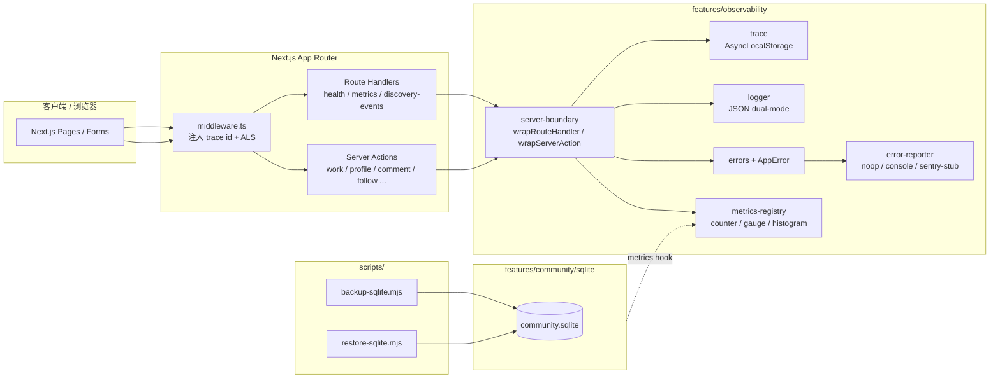
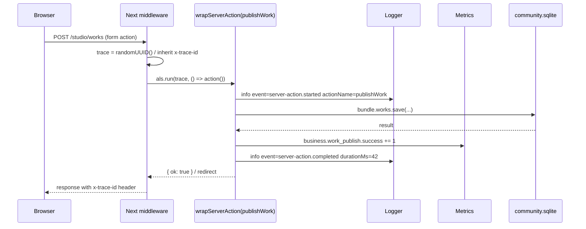
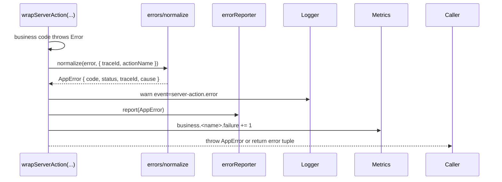
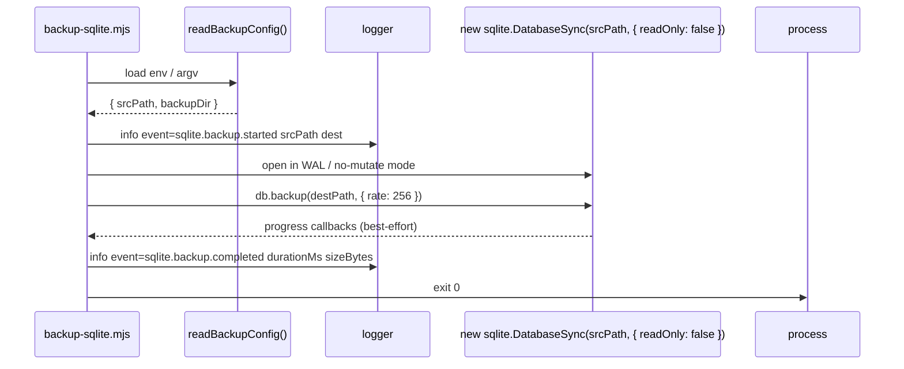

# Phase 2 — Observability & Ops V1 实现设计

- 状态: 草稿
- 主题: Phase 2 — Observability & Ops V1（可观测性与运维 V1）
- 已批准规格: `docs/specs/2026-04-19-observability-ops-v1-srs.md`
- 关联增量: `docs/reviews/increment-phase2-observability-ops-v1.md`
- 关联 spec review / approval: `docs/reviews/spec-review-phase2-observability-ops-v1.md`、`docs/verification/spec-approval-phase2-observability-ops-v1.md`

## 1. 概述

本设计在已批准规格基础上回答「如何实现」。整体形态是一组 **进程内、零运行时新依赖** 的横切能力（observability primitives）+ 边界封装（boundary adapters）+ 一个内部出口路由（`/api/metrics`）+ 两个独立 CLI 脚本（备份 / 恢复）+ `/api/health` 字段扩展。

设计目标：

- 在 server boundary 处「**单点接入**」logger / metrics / 错误归一化，而不在每个 server action 内部各写一遍模板代码。
- 所有可观测能力对未启用环境保持「可读降级」（NFR-004），不破坏阶段 1 已上线行为（FR-009 / CON-004）。
- 备份脚本零依赖，依赖 `node:sqlite` 内置的 `db.backup()` Online Backup API。
- 不引入运行时 npm 依赖（NFR-002 / CON-001），只允许新增 devDependencies。
- 全部能力以**可注入实例**对外暴露（NFR-005），便于 Vitest 不必 mock 全局即可断言。

## 2. 设计驱动因素

按规格优先级与风险驱动排序：

1. **Server boundary 单点接入**（FR-009 / CON-004）：风险最高，决定能否在不打穿业务行为的前提下完成 trace id 串联和 metrics 采样。决定整体形态。
2. **Trace id 在 Next.js App Router 中如何获得**（FR-001）：影响 logger / errorReporter / metrics 三处共享 trace id 的方式。
3. **`/api/metrics` 能否真的在 disabled 时 404**（FR-005 第 2 条 + CON-002）：与 Next.js route handler 的导出契约直接相关；若处理不当会变成 401。
4. **SQLite 在线备份不阻塞实例**（FR-007 + 验收探测口径）：需要选定 `db.backup()`、WAL checkpoint、文件 copy 三种路径之一。
5. **不引入新 runtime 依赖**（NFR-002）：排除 pino / winston / prom-client / sentry-sdk 等候选；自实现极简 logger / metrics。
6. **可注入与可测试**（NFR-005）：所有 primitives 需以工厂函数返回实例，避免「只有一个全局单例」导致测试相互污染。

## 3. 需求覆盖与追溯

| 规格条目 | 主要承接模块 | 备注 |
| --- | --- | --- |
| FR-001 Trace ID | `@/features/observability/trace`、Next.js middleware | 由 middleware 注入响应头；通过 `AsyncLocalStorage` 在请求生命周期共享。 |
| FR-002 Logger | `@/features/observability/logger` | 自实现 JSON / 文本 dual-mode logger；受控键集合在该模块内部硬编码。 |
| FR-003 AppError + 归一化 | `@/features/observability/errors`、`@/features/observability/server-boundary` | 提供 `AppError` 类与 `wrapServerAction` / `wrapRouteHandler` 高阶函数。 |
| FR-004 ErrorReporter | `@/features/observability/error-reporter` | 工厂 + `noop` / `console` 内置；`sentry` provider 占位但默认降级到 `noop`。 |
| FR-005 MetricsRegistry + `/api/metrics` | `@/features/observability/metrics`、`web/src/app/api/metrics/route.ts` | counter / gauge / histogram；route handler 用「条件导出」实现 disabled→404。 |
| FR-006 env 契约扩展 | `web/src/config/env.ts` | 新增 `ObservabilityConfig` / `BackupConfig`；与现有 `AppConfig` 平级合并。 |
| FR-007 backup / restore CLI | `web/scripts/backup-sqlite.mjs`、`web/scripts/restore-sqlite.mjs` | 调用 `node:sqlite` `db.backup()`；restore 走 atomic rename。 |
| FR-008 `/api/health` 字段扩展 | `web/src/app/api/health/route.ts` | 新增 `observability` / `backup` 命名空间；保留旧字段。 |
| FR-009 boundary 接入 | `@/features/observability/server-boundary` + 各 actions / route handlers 的 1 行包装 | 所有现有 server action 替换为 `wrapServerAction(name, fn)`；route handler 替换为 `wrapRouteHandler(handler)`。 |
| NFR-001 性能开销 | logger / metrics 内部使用 `node:perf_hooks.performance.now()`，避免 `Date.now()` 漂移；trace id 用 `crypto.randomUUID()`。 |
| NFR-002 无新 runtime 依赖 | 设计选项均限定为内置模块。 |
| NFR-003 安全边界 | logger 接受白名单键；error reporter `noop` 默认；token 仅在请求头比对，不写日志。 |
| NFR-004 启动鲁棒性 | env loader 在解析失败时降级 + warn，仅 `OBSERVABILITY_METRICS_ENABLED=true` 缺 token 时硬性中止。 |
| NFR-005 可测试性 | 所有 primitives 暴露 `createXxx({...})` 工厂；server boundary 接受可选注入参数。 |

## 4. 架构模式选择

- **Cross-Cutting Adapter / Decorator**：`wrapServerAction` 与 `wrapRouteHandler` 是 decorator 模式，把 trace / log / metrics / error-normalization 集中到一个边界，不污染业务核心。
- **Async Context Pattern**：用 Node.js 内置 `AsyncLocalStorage`（`node:async_hooks`）维护请求生命周期内的 trace id，避免显式参数传递。
- **Strategy + Null Object**：`ErrorReporter` 接口 + `noop` 实现是经典 Null Object 模式；`sentry` 占位也走该模式。
- **Registry Pattern**：`MetricsRegistry` 维护命名空间下的 counter / gauge / histogram，与 Prometheus client 设计对齐（虽然 V1 不用 Prom 文本格式）。
- **Atomic Rename for Restore**：备份恢复使用 POSIX rename 原子性。

## 5. 候选方案总览

针对 §2 中风险最高的两项决策，比较候选方案：

### 5.1 Trace ID + Boundary 接入方式

- **方案 A — `AsyncLocalStorage` + middleware 注入**
- **方案 B — 显式参数透传（trace id 作为函数参数贯穿所有 server action）**
- **方案 C — request-scoped DI 容器（如 awilix）**

### 5.2 SQLite 备份策略

- **方案 X — `node:sqlite` `db.backup()` Online Backup API**
- **方案 Y — 文件 copy + WAL checkpoint（`PRAGMA wal_checkpoint(TRUNCATE)` + `fs.copyFile`）**
- **方案 Z — 应用停服后冷 copy**

## 6. 候选方案对比与 trade-offs

### 6.1 Trace ID + Boundary 接入

| 方案 | 核心思路 | 优点 | 主要代价 / 风险 | NFR / 约束适配 | 可逆性 |
| --- | --- | --- | --- | --- | --- |
| A | middleware 生成 trace id → `AsyncLocalStorage` 维护 → boundary decorator 自动取用 | 业务代码完全不感知；trace id 自动贯穿 logger / error / metrics；与 Next.js App Router 原生兼容（middleware + Edge runtime 在 Node runtime 下均可用 ALS） | `AsyncLocalStorage` 在某些边缘场景（嵌套 `setImmediate` 与第三方库）可能丢失上下文，但本项目 server action 均为 async/await 链，风险很低 | NFR-001（开销极低，`AsyncLocalStorage.run()` 单次约 ~1μs）、NFR-005（容易在测试里手动 `als.run()` 注入 trace id） | 高（封装在 `@/features/observability/trace`，未来切到 `cls-hooked` / OpenTelemetry context 不影响业务） |
| B | trace id 通过参数显式传递到所有 server action | 完全无魔法，调试直观 | 必须修改所有现存 server action 签名（>20 个），打穿 CON-004（"现有 UI 与 server action 的对外行为契约不允许在本增量中变更"）；且 client → server action 调用链没有自然透传 trace id 的位置 | 严重违反 CON-004；NFR-001 也会因为大量参数传递而退化 | 低 |
| C | 引入 awilix 或自实现 request-scoped DI | 测试隔离最好 | 引入运行时复杂度；很可能需要新依赖（违反 NFR-002 / CON-001）；与 Next.js App Router 当前 ergonomics 反向 | 违反 NFR-002 / CON-001 | 中 |

**选定**：方案 A。可逆性最高、对 CON-004 / NFR-002 / NFR-005 全部满足。

### 6.2 SQLite 备份策略

| 方案 | 核心思路 | 优点 | 主要代价 / 风险 | NFR / 约束适配 | 可逆性 |
| --- | --- | --- | --- | --- | --- |
| X | `node:sqlite` 提供的 `db.backup(destPath, { rate, progress })` Online Backup API | Node 22+ 内置（无新依赖）；可在写入中产出一致快照；自带分页备份不长时间持锁；`rate` 控制每步页数，能满足 FR-007 验收（`/api/health` 1Hz 探测、不连续 2 秒不可用） | API 是较新的 Node 22 内置能力，需在设计阶段验证当前运行时支持（README 已声明 Node 22+） | NFR-002（无新依赖）、NFR-001（备份在独立脚本进程内运行，不影响主应用）、FR-007 全部验收 | 高 |
| Y | `PRAGMA wal_checkpoint(TRUNCATE)` + `fs.copyFile` | 实现简单，纯文件 IO | 在并发写入时可能产出不一致快照，违反 FR-007 第 1 条「重新打开应能正常读取所有现有表结构」；并且 `wal_checkpoint(TRUNCATE)` 会短暂阻塞写入，可能命中 FR-007 第 2 条「不超过 2 秒不可用窗口」边界 | NFR-002 满足；FR-007 风险较高 | 高 |
| Z | 应用停服 + 冷 copy | 最简单、最安全 | 必须停服，FR-007 第 2 条隐含「在线备份」语义无法满足 | 部分违反 FR-007 第 2 条 | 高 |

**选定**：方案 X，回退路径 → 方案 Y（若 Node 22 内置 `db.backup()` 在当前部署环境实测不稳定时，按 ASM-002 在 hf-design 阶段调整设计为方案 Y，而无需回到 hf-specify）。

## 7. 选定方案与关键决策

- **D-1**：使用 `AsyncLocalStorage` + Next.js middleware 维护 trace id（方案 A）。
- **D-2**：使用 `node:sqlite` `db.backup()` 作为主备份路径，方案 Y 作为 fallback ADR。
- **D-3**：自实现极简 logger / metrics / errorReporter，**不**引入 pino / winston / prom-client / sentry SDK（NFR-002）。
- **D-4**：`/api/metrics` 在 `OBSERVABILITY_METRICS_ENABLED=false` 时通过 **route handler 动态返回 404**（不通过条件导出 module，避免冷启动时序耦合）；同时在响应头不带任何能力指纹。
- **D-5**：所有现存 server action / route handler 在「**最薄包装层**」接入观测；不重写业务函数本身。具体形态：原 server action 文件保留，在 export 处包一层 `wrapServerAction("work-actions/publishWork", publishWork)`。
- **D-6**：env 解析失败默认走「降级 + warn 启动日志」，仅 `OBSERVABILITY_METRICS_ENABLED=true` 缺 token 时硬性中止启动（FR-006 第 2 条）。

ADR 摘要详见 §16。

## 8. 架构视图

### 8.1 逻辑架构



### 8.2 关键交互（成功 server action）



### 8.3 失败路径



## 9. 模块职责与边界

| 模块 | 路径 | 职责 | 不允许做 |
| --- | --- | --- | --- |
| `observability/trace` | `web/src/features/observability/trace.ts` | 维护 `AsyncLocalStorage<TraceContext>`；提供 `runWithTrace(traceId, fn)`、`getCurrentTraceId()`；trace id 字符集校验 | 不直接读写 logger / metrics |
| `observability/logger` | `web/src/features/observability/logger.ts` | JSON / 文本 dual-mode logger；level 过滤；受控键白名单；单条 8 KiB 截断；从 `getCurrentTraceId()` 自动注入 traceId | 不依赖外部 npm 依赖；不直接发起网络请求 |
| `observability/errors` | `web/src/features/observability/errors.ts` | `AppError` 类；`normalizeError(error, ctx)`；不暴露内部栈到 HTTP response body | 不上报错误（由 reporter 负责） |
| `observability/error-reporter` | `web/src/features/observability/error-reporter.ts` | `ErrorReporter` 接口；`createNoopReporter()`、`createConsoleReporter()`；`createSentryStubReporter()`（占位 + 强制降级到 noop） | 不直接持有 logger 实例（通过参数注入） |
| `observability/metrics` | `web/src/features/observability/metrics.ts` | `MetricsRegistry`：counter / gauge / histogram；`http` / `sqlite` / `business` 三大命名空间；快照序列化为 JSON | 不直接挂任何 HTTP 出口（出口在 route handler 层） |
| `observability/server-boundary` | `web/src/features/observability/server-boundary.ts` | `wrapRouteHandler(name, handler)`、`wrapServerAction(name, action)`；统一接入 trace / log / metrics / 错误归一化 | 不替业务做参数校验、权限检查（沿用现有 guards） |
| `observability/init` | `web/src/features/observability/init.ts` | 启动时根据 `ObservabilityConfig` 装配 logger / reporter / metrics；提供 `getObservability()` 单例 + `resetObservabilityForTesting()` | 不在模块顶层做 IO；初始化只做 in-memory 装配 |
| `config/env`（扩展） | `web/src/config/env.ts` | 增加 `ObservabilityConfig` / `BackupConfig`；保持 `AppConfig` 单源解析 | 不在 env 解析时启动 logger（避免循环） |
| `app/api/metrics/route` | `web/src/app/api/metrics/route.ts` | 受控 JSON 出口；disabled→404、unauth→401、ok→200 | 不返回任何与业务实体相关的具体 id 或邮箱 |
| `app/api/health/route`（扩展） | `web/src/app/api/health/route.ts` | 维持现有响应；附加 `observability` / `backup` 命名空间 | 不依赖磁盘扫描结果导致响应阻塞 > 500ms |
| `app/middleware`（新建） | `web/src/middleware.ts` | 在请求进入时生成 / 继承 trace id 并 als.run；写 `x-trace-id` 响应头 | 不做鉴权 / 路由重写 |
| `scripts/backup-sqlite.mjs` | `web/scripts/backup-sqlite.mjs` | CLI；`db.backup()` 主路径 + 文件名 `community-YYYYMMDDHHmmss.sqlite`；自身用 logger 输出结构化 log；失败退出码非零 | 不在脚本里启动 Next.js / app context |
| `scripts/restore-sqlite.mjs` | `web/scripts/restore-sqlite.mjs` | CLI；接受备份文件路径；atomic rename（`fs.copyFile` + `fs.rename`）替换当前 db；失败退出码非零 | 不在 db 仍被打开时写入 |

## 10. 数据流、控制流与关键交互

### 10.1 启动序列

1. Next.js 启动 → middleware 模块加载。
2. 第一次 server boundary 调用触发 `getObservability()` 装配 logger / reporter / metrics（lazy-init，避免在测试套件里污染）。
3. 装配过程读取 `ObservabilityConfig`；解析失败时降级 + warn；唯一 hard-stop 路径是 `OBSERVABILITY_METRICS_ENABLED=true` 缺 token。
4. `/api/health` 总是可读；`backup.lastBackupAt` 通过对 `SQLITE_BACKUP_DIR` 的最近 mtime 扫描得到，扫描结果在请求维度短缓存（5s），避免 1Hz 探测期间反复 readdir。

### 10.2 SQLite 备份脚本运行序列



### 10.3 `/api/metrics` 控制流

```mermaid
flowchart TD
  REQ[GET /api/metrics] --> CK1{OBSERVABILITY_METRICS_ENABLED?}
  CK1 -- false --> R404[Response 404 / 'not found']
  CK1 -- true --> CK2{Authorization == Bearer TOKEN?}
  CK2 -- no --> R401[Response 401 / 'unauthorized']
  CK2 -- yes --> SNAP[registry.snapshot()]
  SNAP --> R200[Response 200 JSON]
```

## 11. 接口、契约与关键不变量

### 11.1 TypeScript 类型契约（节选；最终以代码 PR 为准）

```ts
// observability/trace.ts
export type TraceContext = { traceId: string; source: 'inherited' | 'generated' };
export function runWithTrace<T>(traceId: string, fn: () => T | Promise<T>): T | Promise<T>;
export function getCurrentTraceId(): string | undefined;
export function isValidTraceId(value: string): boolean; // /^[A-Za-z0-9_-]{8,128}$/

// observability/logger.ts
export type LogLevel = 'debug' | 'info' | 'warn' | 'error';
export type AllowedContextKey =
  | 'traceId' | 'module' | 'event' | 'actionName' | 'route' | 'method' | 'status'
  | 'durationMs' | 'code' | 'errorClass' | 'userIdHash' | 'role'
  | 'workId' | 'creatorId' | 'postId' | 'threadId'
  | 'slowQueryMs' | 'queryName' | 'backupFile' | 'scriptName';
export interface Logger {
  debug(event: string, ctx?: Partial<Record<AllowedContextKey, unknown>>): void;
  info(event: string, ctx?: Partial<Record<AllowedContextKey, unknown>>): void;
  warn(event: string, ctx?: Partial<Record<AllowedContextKey, unknown>> & { error?: unknown }): void;
  error(event: string, ctx: { error: unknown } & Partial<Record<AllowedContextKey, unknown>>): void;
}

// observability/errors.ts
export interface AppErrorOptions { code?: string; message?: string; status?: number; cause?: unknown; }
export class AppError extends Error {
  readonly code: string;
  readonly status: number;
  readonly traceId?: string;
  readonly cause?: unknown;
  constructor(opts?: AppErrorOptions);
}
export function normalizeError(error: unknown, ctx: { actionName?: string; route?: string }): AppError;

// observability/error-reporter.ts
export interface ErrorReporter { report(error: AppError): void; }

// observability/metrics.ts
export interface MetricsRegistry {
  incrementCounter(name: string, labels?: Record<string, string>): void;
  setGauge(name: string, value: number, labels?: Record<string, string>): void;
  observeHistogram(name: string, value: number, labels?: Record<string, string>): void;
  snapshot(): MetricsSnapshot;
}
export type MetricsSnapshot = {
  http: { requests_total: number; errors_total: number; request_duration_ms: HistogramSnapshot };
  sqlite: { queries_total: number; errors_total: number; slow_queries: number; query_duration_ms: HistogramSnapshot };
  business: Record<string, { success: number; failure: number }>;
};

// observability/server-boundary.ts
export function wrapRouteHandler<H extends (req: Request, ...rest: unknown[]) => Promise<Response>>(
  name: string,
  handler: H,
): H;
export function wrapServerAction<F extends (...args: unknown[]) => unknown>(
  name: string,
  action: F,
): F;
```

### 11.2 关键不变量

- I-1：`/api/metrics` 在 disabled 时**绝不**返回 401 / 200；只能 404。
- I-2：`AppError.message` 不允许包含原始栈或文件路径；`cause` 仅在 server-side 日志中出现，不进入 HTTP body。
- I-3：trace id 字符集 `/^[A-Za-z0-9_-]{8,128}$/`；不满足时 regenerate。
- I-4：单条 log 体积 ≤ 8 KiB；超过则截断 `error.stack`、`context` 多余键，并附 `truncated=true`。
- I-5：`OBSERVABILITY_METRICS_TOKEN` 与 `SENTRY_DSN` 绝不出现在任何 log / metrics / health 响应。
- I-6：`/api/health` 字段格式向后兼容，新增字段位于独立命名空间 `observability` / `backup`。

## 12. 非功能需求与约束落地

| NFR / CON | 落地点 | 验证方式 |
| --- | --- | --- |
| NFR-001（5ms P95 净增） | logger 走同步 stdout（不 await）；metrics 用纯内存 Map；trace id 用 `crypto.randomUUID()`（V4，纯算法，无 syscall） | regression-gate 阶段按规格验收第 2 条「基线采集协议」执行 |
| NFR-002（无新 runtime 依赖） | `web/package.json` diff 检查；CI 阶段加一次 `node -e` assert | code-review 阶段 + 完成门禁 |
| NFR-003（安全边界） | logger 白名单键 + I-5 不变量；reporter 默认 `noop` | bug-patterns / code-review 阶段抽样审计日志输出 |
| NFR-004（启动鲁棒性） | `readObservabilityConfig()` 内部 try/catch 降级 + warn；唯一 hard-stop 走 explicit throw | spec-T<X> 测试用例显式覆盖 |
| NFR-005（可测试性） | 提供 `createInMemoryLogger()`、`createInMemoryReporter()`、`resetObservabilityForTesting()` | hf-test-driven-dev 每个相关任务在 fail-first 阶段使用 |
| CON-001 / CON-002 / CON-003 / CON-004 / CON-005 | §11 不变量 + §9 模块边界 | code-review / traceability-review |

## 13. 测试与验证策略

### 13.1 最薄端到端验证路径（Walking Skeleton）

`hf-test-driven-dev` 的第一项实现任务（建议是 T1，详见 §15）：

1. 新增 `middleware.ts` + `observability/trace.ts` + `observability/logger.ts` 极简版本，使现有 `/api/health` 请求**带回 `x-trace-id` 头部**且终端出现一条 `event=http.request.completed` 的 JSON 日志。
2. 通过此一条 vitest 测试 + 一条手工 `curl` 验证可证明 trace id 链路成立。

### 13.2 测试层次

- **单元 / 组件级 (Vitest)**
  - `trace.test.ts`：trace id 字符集、继承规则、ALS 隔离。
  - `logger.test.ts`：level 过滤、白名单键截断、JSON 模式正确性。
  - `errors.test.ts`：原生 Error → AppError 归一化、cause 保留、HTTP body 不含栈。
  - `error-reporter.test.ts`：noop 不外联、console 输出四字段、sentry-stub 降级 + warn。
  - `metrics.test.ts`：counter / gauge / histogram 行为、snapshot JSON 结构稳定。
  - `server-boundary.test.ts`：wrap server action 在成功 / 失败路径下的日志 / 计数器变化、trace id 注入、error normalization 调用 reporter。
  - `env.test.ts`：补 observability / backup 字段的解析、降级、hard-stop。
- **集成 / API 级 (Vitest + 内存 Request)**
  - `app/api/health/route.test.ts`（扩展现有）：新字段断言、未启用 metrics 时 `metricsEnabled=false`。
  - `app/api/metrics/route.test.ts`（新建）：disabled→404、unauth→401、ok→200 + payload schema。
- **现有业务回归（Vitest + 各 server action 测试）**
  - 现有 `work-actions.test.ts` / `profile-editor.test.ts` / `follow-action.test.ts` 等不允许出现新失败；通过 `wrapServerAction` 包装后行为应完全一致。
- **Playwright e2e**
  - 复用现有 e2e；新增不阻塞，但增加一项：访问首页，断言响应头存在 `x-trace-id`（仅作为 smoke）。
- **CLI 脚本**
  - 使用临时 sqlite 文件测试 `backup-sqlite.mjs` / `restore-sqlite.mjs` 的 in-process 行为；不依赖真实 cron。

### 13.3 性能验证（NFR-001）

详见规格 §7 NFR-001 验收第 2 条「基线采集协议」。`hf-regression-gate` 阶段执行；记录在 `docs/verification/regression-T<X>.md`。

## 14. 失败模式与韧性策略

| 关键路径 | 失败模式 | 缓解 |
| --- | --- | --- |
| middleware 注入 trace id | middleware 因任何异常 throw 导致整个请求 503 | middleware 内部 try/catch；trace id 注入失败时退化为不写 header，请求继续；记录一条 warn |
| `wrapServerAction` 包装的业务 throw | 业务 throw 被吞导致回归 | normalize 后**继续向上抛**（保留原行为），仅在边界处「记一笔」并归一化；redirect / form action 的现有语义不变 |
| logger 写 stdout 阻塞 | 巨型对象导致单条 log > 8 KiB 触发慢写 | I-4 截断；超大 stack 直接截尾 |
| `node:sqlite` `db.backup()` API 不可用 | Node 22 边缘版本未导出该 API | 备份脚本自检：若 `typeof db.backup !== 'function'`，按 ADR-2 fallback 切到 PRAGMA wal_checkpoint + fs.copyFile，并在 log 中标记 `event=sqlite.backup.fallback` |
| `restore` 在 db 仍被打开时执行 | 文件 rename 在 Linux 上仍可生效，但旧进程持有的 fd 仍指向旧 inode；新进程才看到新文件 | 文档要求停服后执行；脚本启动时检测 `lsof` 不可行（不引入新依赖），改为 readlink 检查 + `--force` 显式覆盖标志 |
| `/api/metrics` token 泄漏 | logger 误把 Authorization 头入日志 | logger 白名单 + 集成测试断言响应日志中不含 Authorization 字串 |
| ErrorReporter 内部 throw | reporter 故障导致请求失败 | reporter 调用包裹在 try/catch；reporter 内部异常仅 console.error，不冒泡 |
| AsyncLocalStorage 上下文丢失 | 第三方库使用 `setImmediate` 跳出 ALS | 仅依赖 async/await 链；项目无第三方库使用裸 `setImmediate`；丢失时 `getCurrentTraceId()` 返回 `undefined`，logger 用 `traceId='unknown'` 兜底 |

## 15. 任务规划准备度

进入 `hf-tasks` 时，下列边界、接口与风险均已稳定：

- §9 模块清单与文件落点已唯一确定。
- §11 类型契约已唯一确定（实现可微调字段名，但不改变结构）。
- §10 控制流（启动 / 备份 / `/api/metrics`）已锁定。
- §12 NFR / CON 落地点已逐项映射。
- §13 测试层次清晰，可直接拆为「先写测试 → 再写实现」的 fail-first 任务。
- §14 失败模式已给出缓解，不留给任务阶段补脑。

预计任务划分（仅作 task planner 输入参考，**不**在本设计中拆任务清单）：

- T46 trace + logger Walking Skeleton（middleware + `/api/health` x-trace-id 验证）
- T47 errors + error-reporter
- T48 metrics + `/api/metrics` route handler
- T49 server-boundary + 改造现有 server actions / route handlers 接入
- T50 env 扩展 + `/api/health` 字段扩展
- T51 backup / restore CLI + `/api/health.backup` 字段联动

## 16. 关键决策记录（ADR 摘要）

### ADR-1 trace id 通过 AsyncLocalStorage 跨 server boundary
- 上下文：需要 trace id 在 logger / errors / metrics 三处共用而不污染业务签名。
- 决策：使用 Node 内置 `AsyncLocalStorage` + Next.js middleware 注入。
- 后果：业务无感；测试可手动 `als.run()`；与未来 OpenTelemetry context 兼容。
- 可逆性：高（封装在 `observability/trace`，可整体替换为 `cls-hooked` / OTel context API）。

### ADR-2 SQLite 在线备份首选 `node:sqlite` `db.backup()`，回退 `PRAGMA wal_checkpoint(TRUNCATE) + fs.copyFile`
- 上下文：FR-007 要求在线备份不阻塞实例；不允许引入新 npm 依赖。
- 决策：主路径 `db.backup()`；脚本启动自检不可用 → 自动 fallback。
- 后果：备份脚本两条路径一份代码；日志能区分 `event=sqlite.backup.completed` vs `event=sqlite.backup.fallback`。
- 可逆性：高（仅影响脚本内部）。

### ADR-3 自实现极简 logger / metrics / errorReporter
- 上下文：NFR-002 / CON-001 禁止新 runtime 依赖；本增量需求规模适配自实现。
- 决策：自写 < 500 LOC 的 logger / metrics / errorReporter。
- 后果：不依赖外部生态成熟度；未来切换到 pino / OpenTelemetry / Sentry 时按接口替换 implementation 即可。
- 可逆性：高（接口在 `observability/*`，业务只依赖接口）。

### ADR-4 `/api/metrics` 在 disabled 时返回 404 由 route handler 内部判断
- 上下文：CON-002 要求 disabled 时不暴露能力指纹。
- 决策：route handler 内首条判断 → 直接 `Response.json({ error: 'not_found' }, { status: 404 })`；不通过条件 `export` 玩 module-level 技巧。
- 后果：与 enabled 但 unauthenticated 的 401 形态视觉接近，但状态码与 body 区分；测试容易覆盖。
- 可逆性：高。

### ADR-5 server boundary 接入采用「最薄包装」而非业务函数改写
- 上下文：CON-004 不允许变更现有对外行为；FR-009 要求所有 server action / route handler 接入。
- 决策：在 server action 文件 `export` 处用 `wrapServerAction("module/name", original)` 包装；route handler 在 `route.ts` `export const GET = wrapRouteHandler("name", handler)`。
- 后果：业务核心 0 修改；接入工作量集中在 boundary 层；测试容易覆盖（只需断言 wrapper 行为，不重测业务）。
- 可逆性：高（完全可一键摘除）。

## 17. 明确排除与延后项

- 不引入 OpenTelemetry / Prometheus 客户端 / Sentry SDK；接口预留兼容路径但本增量不打包。
- 不做 dashboard / alert / 告警通道；只产出可读 JSON。
- 不做日志远端归档（Loki / OpenSearch / SLS）；仅 stdout。
- 不引入 cron / 自动备份调度；仅提供脚本。
- 不在本增量内实现 audit log（与 §3.2 运营后台一起做）。
- 不修改任何现有 schema、路由、UI 组件外观。

## 18. 风险与开放问题

### 阻塞性
- 无（所有阻塞问题已通过规格 §10 假设和本设计 §7 决策关闭）。

### 非阻塞
- ADR-2 fallback 路径仅在脚本启动自检 `db.backup` 不可用时生效；当前 Node 22 内置该方法，但若部署在某个不预期的 patch 版本上，需 regression-gate 阶段额外加一次手工执行验证（已写入 §13.3 与 §14）。
- `wrapServerAction` 对 Next.js 的 form action 是否需要保留 `bind`-style `this` 上下文：将在 T49 实现时通过测试覆盖，必要时使用 `Function.prototype.call` 透传。
- `/api/health` 的 `backup.lastBackupAt` 是否需要在生产模式下做 lock 保护（避免备份脚本 mtime 在写入中被读到）：当前选择 5s 短缓存 + best-effort，文档化「该字段是 best-effort 提示而非强一致状态」。
