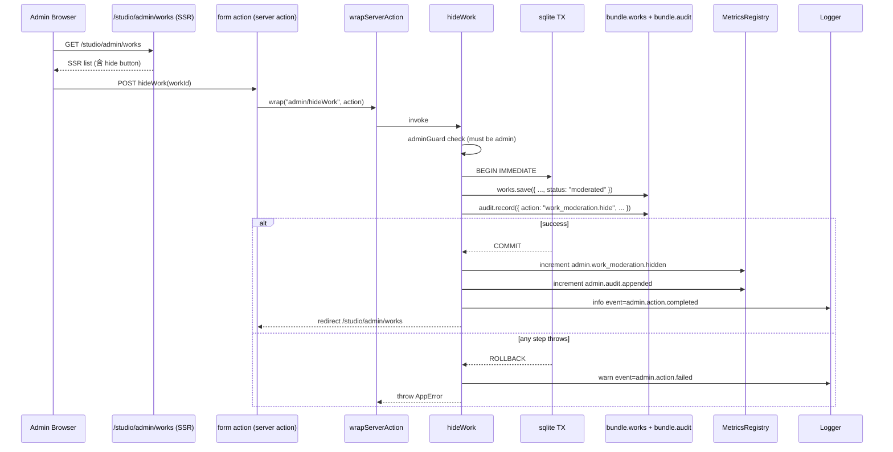
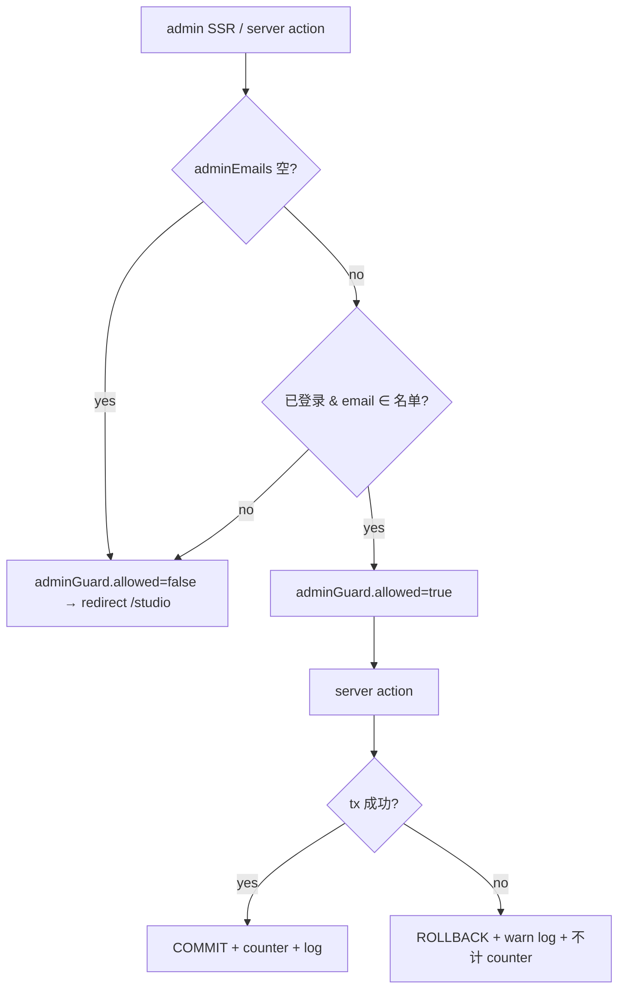

# Phase 2 — Ops Back Office V1 实现设计

- 状态: 已批准
- 批准记录: `docs/verification/design-approval-phase2-ops-backoffice-v1.md`
- 主题: Phase 2 — Ops Back Office V1（运营 / 审核后台 V1）
- 已批准规格: `docs/specs/2026-04-19-ops-backoffice-v1-srs.md`
- 关联增量: `docs/reviews/increment-phase2-ops-backoffice-v1.md`
- 关联 spec review / approval: `docs/reviews/spec-review-phase2-ops-backoffice-v1.md`、`docs/verification/spec-approval-phase2-ops-backoffice-v1.md`

## 1. 概述

整体形态是一个独立 feature 模块 `web/src/features/admin/`，由 **认证侧扩展（admin policy + guard）** + **后台 SSR 段（`/studio/admin/**`）** + **管理动作 server action** + **审计日志 repository + table** + **公开 read model 屏蔽 moderated** + **metrics 加性扩展** 构成。所有写动作走 `wrapServerAction` 接入 §3.8 V1 横切；UI 全部沿用既有 `museum-*` editorial-dark 壳层。

设计目标：

- admin 入口默认隐藏：`ADMIN_ACCOUNT_EMAILS` 为空时任何账号都不是 admin，admin 后台 DOM 不渲染（fail-closed）。
- 写动作 + 审计 = 最小事务边界：在 sqlite 同进程内通过显式 `BEGIN IMMEDIATE / COMMIT / ROLLBACK` 把"业务写"+"audit append"包成一个事务，确保 §8.3 不变量（要么都成功，要么都不成功）。
- 公开 read model 把 `moderated` 与 `draft` **同形** 屏蔽：单点 filter 在 `getPublicWorkRecords`（既有函数），SQLite repository 的 `listPublicWorks` 也加 `WHERE status='published'`，避免任何 surface 漏掉。
- 不修改任何已交付 server action / route handler / 推荐模块的业务行为；仅新增 admin server action + 公开 read model 一处过滤。
- 所有 admin server action 接受 deps 注入（`session` / `bundle` / `metrics` / `auditLog` / `logger`），便于 vitest 不依赖 sqlite 的情况下覆盖。

## 2. 设计驱动因素

按风险与规格优先级排序：

1. **Admin 邮箱 ↔ session 之间如何对齐**（FR-001）：`SessionContext` 当前不含 `email`；admin 判定必须能拿到当前账号的 email。
2. **写 + 审计的最小事务边界**（SRS §8.3 不变量、FR-005 异常路径）：sqlite 多 SQL 写之间宕机仍可能不一致；本 V1 必须显式选择策略并写入 ADR。
3. **`moderated` 屏蔽是否覆盖所有公开消费路径**（FR-006）：如果漏掉某个 surface（例如 `listAllForOwner` 把 moderated 也丢给公开 page），就违反 FR-006；必须在 read model 单点闭合。
4. **`/studio/admin/**` route 的 guard 是否服务端 redirect 而非客户端 hydration 后才检查**（NFR-002 安全）：否则 admin 数据可能在重定向前闪现；guard 必须在 SSR 入口的同步阶段执行。
5. **Metrics 加性扩展是否破坏既有 `/api/metrics` 消费者**（CON-004）：参考 §3.6 V1 / §3.8 V1 已建立的 `MetricsSnapshot.<namespace>` optional 字段模式。
6. **`SessionContext` 形状变化对既有调用方的影响**（NFR-005 兼容性）：必须确保新增 `email` 字段是 optional 或附在 `authenticated` 分支上，而不是破坏 `guest`。

## 3. 需求覆盖与追溯

| 规格条目 | 主要承接模块 | 备注 |
|---|---|---|
| FR-001 Admin Capability + Guard | `features/auth/{types,access-control,admin-emails}.ts` | `createAdminCapabilityPolicy(session, adminEmails) → AdminCapabilityPolicy`、`createAdminGuard(session, capability) → AdminGuard`；纯函数。 |
| FR-002 `/studio/admin` Dashboard + 导航 | `app/studio/admin/page.tsx`、`app/studio/page.tsx`（admin 入口卡） | 入口卡仅在 `adminCapability.isAdmin === true` 时渲染。 |
| FR-003 Curation 维护 | `features/admin/curation-actions.ts` + `app/studio/admin/curation/page.tsx` + `community/sqlite.ts` 写能力 + `community/test-support.ts` | 三个 server action：`upsertCuratedSlot` / `removeCuratedSlot` / `reorderCuratedSlot`。 |
| FR-004 作品违规处置 | `features/admin/work-moderation-actions.ts` + `app/studio/admin/works/page.tsx` + `WorkRepository.listAllForAdmin / save` | 两个 server action：`hideWork` / `restoreWork`；走 `save` 路径覆盖 status；按 `(draft|published|moderated)` 状态机校验。 |
| FR-005 Audit Log | `features/admin/audit-log.ts` + `community/sqlite.ts` `audit_log` 表 + `app/studio/admin/audit/page.tsx` | 由 admin server action 内部强制 record；不允许 admin 路径外的代码 record（非 hard 约束，由 code review 守住）。 |
| FR-006 屏蔽 moderated | `community/contracts.ts > getPublicWorkRecords`（已 filter `published`，与 `moderated` 自动相容）+ `community/sqlite.ts.listPublicWorks` 显式 `WHERE status='published'` + `public-read-model.ts` 不需改 + 推荐模块（自动复用 `listPublicWorks`） | 单点 filter；`listAllForAdmin` 是唯一保留全 status 的读路径。 |
| FR-007 env 契约扩展 | `config/env.ts > readAdminAccountEmails / getAdminAccountEmails` | 沿用既有 `readObservabilityConfig` / `readRecommendationsConfig` 风格。 |
| FR-008 admin metrics 命名空间 | `observability/metrics.ts` `MetricsSnapshot.admin` 加性 + `features/admin/metrics.ts` 键名常量 + helper | 与 §3.6 V1 `recommendations` 命名空间扩展模式严格同形。 |
| NFR-001 性能 | `WorkRepository.listAllForAdmin` 单次 SELECT + audit 单次 SELECT + 100 条 LIMIT | bench 留给 increment 级 regression-gate（不强制每任务 perf 测试）。 |
| NFR-002 安全 | guard SSR 同步执行；admin email 不进 logger 白名单；env fail-closed | logger 受控键集合不变（不加 `actorEmail`）。 |
| NFR-003 可观测性 | `wrapServerAction("admin/<actionName>", fn)` 接入 §3.8 V1 横切 | `event=admin.action.completed` / `failed`。 |
| NFR-004 可测试性 | 全部 admin server action 接受 deps 注入 | `features/admin/test-support.ts` 提供 `createAdminTestDeps`。 |
| NFR-005 兼容性 | `SessionContext` 仅在 `authenticated` 分支增加 optional `email` | `guest` 分支不变；既有调用方 typecheck 通过。 |

## 4. 架构模式选择

- **Capability + Guard pattern**（与既有 `CreatorCapabilityPolicy` / `StudioGuard` 同形）：admin policy 是纯函数，路由层用 redirect 兜底。
- **Single-Point Filter**：`moderated` 的公开屏蔽集中在 `getPublicWorkRecords` + `listPublicWorks`；上层任何 surface 都不需要单独判定。
- **Atomic Write + Audit**：admin server action 内部使用 `database.exec("BEGIN IMMEDIATE")` ... `COMMIT` / `ROLLBACK` 把业务写 + audit 写包成一个 sqlite 事务（详见 ADR-2）。
- **Additive Metrics Namespace**：与 §3.6 V1 `recommendations` 完全同形（snapshot 顶层 optional 字段 + 4..6 个预注册 counter）。
- **Capability Injection**：admin server action 接受 `{ session, bundle, metrics, auditLog, logger }`；默认从 `getDefaultCommunityRepositoryBundle` / `getObservability()` 取实例。

## 5. 候选方案总览

针对 §2 中风险最高的两项决策，列出候选方案。

### 5.1 写 + 审计的事务边界（FR-005 + §8.3）

- 方案 A — sqlite 显式事务（`BEGIN IMMEDIATE` / `COMMIT` / `ROLLBACK`）。
- 方案 B — 串行调用，事后由"启动期一致性扫描"做反向修复。
- 方案 C — 引入仅在 admin 路径使用的双写日志文件，独立于 sqlite。

### 5.2 admin email ↔ session 对齐（FR-001 + NFR-002 + NFR-005）

- 方案 X — 扩展 `AuthenticatedSessionContext` 增加 `email` 字段；`resolveAuthSession` JOIN `auth_accounts.email`。
- 方案 Y — 不动 `SessionContext`；admin policy 在判定时 lazily fetch `auth_accounts.email by accountId`。
- 方案 Z — admin 名单按 `accountId` 而非 email；env 直接配置 account id。

## 6. 候选方案对比与 trade-offs

### 6.1 写 + 审计的事务边界

| 方案 | 核心思路 | 优点 | 主要代价 / 风险 | 适配性 | 可逆性 |
|---|---|---|---|---|---|
| A | 在 admin server action 内部把业务写 + audit append 包在一个 `BEGIN IMMEDIATE / COMMIT / ROLLBACK` 中（同一 `DatabaseSync` 实例） | 满足 §8.3 严格一致性；sqlite 内置支持，无新依赖；与 §3.8 V1 backup 路径相容（备份只读快照不被锁住） | 需要 `CommunityRepositoryBundle` 暴露"事务句柄"或在 admin 路径内直接持有 `DatabaseSync` 引用；in-memory bundle 实现需模拟事务语义 | NFR-005 / CON-001 / CON-002 满足；与既有 sqlite 模块风格一致 | 高 |
| B | 串行调用 + 启动期一致性扫描 | 实现简单 | 失败窗口可能让 audit 与业务状态发散；扫描脚本本身又要新增；违反 §8.3 严格不变量 | 不满足 §8.3 | 中 |
| C | 双写日志文件（append-only） | 便于离线归档 | 引入第二种存储 + 同步问题；fsync 失败窗口仍存在；CON-001 受影响 | 违反 CON-001 | 低 |

**选定**：方案 A。在 sqlite 同进程内显式事务是 §8.3 不变量的最直接闭合方式；in-memory bundle 通过简化的 "commit on success / rollback on error" 闭包模拟（详见 §9.5）。

### 6.2 admin email ↔ session 对齐

| 方案 | 核心思路 | 优点 | 主要代价 / 风险 | 适配性 | 可逆性 |
|---|---|---|---|---|---|
| X | 扩展 `AuthenticatedSessionContext` 增加 `email`；`resolveAuthSession` JOIN `auth_accounts.email`；既有 `guest` 分支不变 | 一处取得，所有 capability / guard 都直接读；无每次判定的额外 SQL | 修改既有 `SessionContext` 类型，所有解构 `{ status, primaryRole }` 的代码需要 typecheck 验证；既有 `resolveSessionContext(sessionRole)` 测试 helper 也需补 email 字段 | NFR-005 在测试中可验证；与既有 capability pattern 形态一致 | 高 |
| Y | admin policy 在判定时根据 `accountId` 去 sqlite fetch email | 不动 `SessionContext` | 每次 admin 判定都触发一次 sqlite 查询；NFR-001 受微弱影响；判定函数从纯函数变成 IO，违反 §3 表 FR-001「纯函数」 | 违反 FR-001 「纯函数」 | 中 |
| Z | admin 名单按 accountId 配置 | 不需要 email 字段 | account id 由系统生成（hex），运维难以维护、不可读；与 SRS FR-007「邮箱白名单」直接冲突 | 违反 FR-007 | 低 |

**选定**：方案 X。把 `email` 提升到 session 级别一次取齐，admin policy 保持纯函数，且既有所有调用方对 `SessionContext` 的解构都能向后兼容（只读字段，不改 `guest` 分支）。

## 7. 选定方案与关键决策

- **D-1**：admin 写 + audit 走同一 sqlite 事务（方案 A）。
- **D-2**：`AuthenticatedSessionContext` 增加 `email: string`；`resolveAuthSession` JOIN `auth_accounts.email`（方案 X）。
- **D-3**：admin 名单解析在 `config/env.ts` 沿用 `readObservabilityConfig` / `readRecommendationsConfig` 风格；缺省 / 非法 ⇒ 名单为空 + warning，不阻塞启动。
- **D-4**：`CommunityWorkStatus` 联合追加 `"moderated"`；公开 read model 单点 filter（`getPublicWorkRecords` 已 filter `published`，`listPublicWorks` 显式 `WHERE status='published'`）；`listAllForAdmin` 是唯一保留全 status 的读路径。
- **D-5**：`MetricsSnapshot.admin` 加性扩展；6 个 counter 在 `createMetricsRegistry` 启动时预注册为 0；与 §3.6 V1 `recommendations` 命名空间形态严格同形。
- **D-6**：admin server action 全部经 `wrapServerAction("admin/<actionName>", fn)` 包装；`event=admin.action.completed` / `failed` 写结构化日志（不把 `actorEmail` 进 log 字段）。
- **D-7**：`/studio/admin/**` 全部走 SSR async server component；guard 在组件入口同步执行 `redirect`，避免任何 admin 数据在 redirect 前进入 DOM。
- **D-8**：`AuditLogRepository` 读写均经 `bundle.audit`；in-memory bundle 实现新增 `audit` 字段；既有 `bundle` 类型扩展是加性。

ADR 摘要详见 §16。

## 8. 架构视图

### 8.1 逻辑架构

```mermaid
flowchart TD
  subgraph AdminUI[/studio/admin/**]
    Dash[/studio/admin]
    Cura[/studio/admin/curation]
    Works[/studio/admin/works]
    Audit[/studio/admin/audit]
  end

  subgraph AdminFeature[features/admin]
    Guard[admin-policy.ts<br/>createAdminCapabilityPolicy<br/>createAdminGuard]
    CurAct[curation-actions.ts<br/>upsertCuratedSlot/removeCuratedSlot/reorderCuratedSlot]
    WorkAct[work-moderation-actions.ts<br/>hideWork/restoreWork]
    AuditMod[audit-log.ts<br/>recordAuditEntry/listLatestAuditEntries]
    AdminMetrics[metrics.ts<br/>RECOMMENDATIONS-style key constants]
  end

  subgraph Auth[features/auth]
    Sess[SessionContext + email]
    Access[access-control.ts<br/>+adminCapability/+adminGuard]
  end

  subgraph Community[features/community]
    Bundle[CommunityRepositoryBundle<br/>+audit + curation writes + works.listAllForAdmin]
    Sqlite[sqlite.ts<br/>+audit_log table + tx helper]
    PublicRM[public-read-model.ts<br/>moderated filtered via getPublicWorkRecords]
  end

  subgraph Observability[features/observability]
    Metrics[MetricsRegistry<br/>+admin namespace]
    Logger[Logger]
    Boundary[wrapServerAction]
  end

  Dash --> Guard
  Cura --> Guard
  Works --> Guard
  Audit --> Guard
  Cura --> CurAct
  Works --> WorkAct
  Audit --> AuditMod
  CurAct --> AuditMod
  WorkAct --> AuditMod
  CurAct --> Bundle
  WorkAct --> Bundle
  AuditMod --> Bundle
  Bundle --> Sqlite
  Sqlite --> PublicRM
  Guard --> Access
  Access --> Sess
  CurAct --> Boundary
  WorkAct --> Boundary
  Boundary --> Logger
  Boundary --> Metrics
  CurAct --> AdminMetrics
  WorkAct --> AdminMetrics
  AuditMod --> AdminMetrics
  AdminMetrics --> Metrics
```

### 8.2 数据流（一次 `hideWork` 调用）



### 8.3 错误降级 / fail-closed



## 9. 模块设计

### 9.1 `features/auth` 扩展

```ts
// features/auth/types.ts
export type AuthenticatedSessionContext = {
  status: "authenticated";
  isAuthenticated: true;
  accountId: SessionAccountId;
  primaryRole: AuthRole;
  email: string; // NEW: lowercase, mirrors auth_accounts.email
};

export type AdminCapabilityPolicy = {
  isAdmin: boolean;
  email: string | null; // matched lowercase admin email or null
};

export type AdminGuard = {
  allowed: boolean;
  redirectTo: "/login" | "/studio" | null;
  reason: "allowed" | "unauthenticated" | "not_admin";
};

// AccessControl gains:
//   adminCapability: AdminCapabilityPolicy;
//   adminGuard: AdminGuard;
```

```ts
// features/auth/access-control.ts (additions)
export function createAdminCapabilityPolicy(
  session: SessionContext,
  adminEmails: ReadonlySet<string>,
): AdminCapabilityPolicy {
  if (session.status !== "authenticated") {
    return { isAdmin: false, email: null };
  }
  const lower = session.email.toLowerCase();
  return adminEmails.has(lower)
    ? { isAdmin: true, email: lower }
    : { isAdmin: false, email: null };
}

export function createAdminGuard(
  session: SessionContext,
  capability: AdminCapabilityPolicy,
): AdminGuard {
  if (session.status !== "authenticated") {
    return { allowed: false, redirectTo: "/login", reason: "unauthenticated" };
  }
  if (!capability.isAdmin) {
    return { allowed: false, redirectTo: "/studio", reason: "not_admin" };
  }
  return { allowed: true, redirectTo: null, reason: "allowed" };
}
```

`getRequestAccessControl()` 在内部读 `getAdminAccountEmails()` 并把 `adminCapability` / `adminGuard` 一并填入返回值。

### 9.2 `features/auth/auth-store.ts` 扩展

`AuthSession` 增加 `email`；`resolveAuthSession` 的 JOIN 增加 `auth_accounts.email`；`createAuthenticatedSessionContext` 接受 `email` 入参（已有调用方需要更新；详见 §11 修改清单）。

```ts
// AuthSession gains email; resolveAuthSession SELECT auth_accounts.email
```

### 9.3 `config/env.ts` 扩展

```ts
export type AdminAccountsConfig = {
  emails: ReadonlySet<string>;
};

export type AdminAccountsConfigResult = {
  config: AdminAccountsConfig;
  warnings: ConfigWarning[];
};

export function readAdminAccountsConfig(env = process.env): AdminAccountsConfigResult {
  const raw = env.ADMIN_ACCOUNT_EMAILS?.trim();
  if (!raw) return { config: { emails: new Set() }, warnings: [] };

  const warnings: ConfigWarning[] = [];
  const valid = new Set<string>();
  for (const piece of raw.split(",")) {
    const candidate = piece.trim().toLowerCase();
    if (!candidate) continue;
    if (!candidate.includes("@") || candidate.startsWith("@") || candidate.endsWith("@")) {
      warnings.push({
        slug: "admin-account-email-invalid",
        message: `ADMIN_ACCOUNT_EMAILS contains invalid email "${piece.trim()}"; dropped.`,
      });
      continue;
    }
    valid.add(candidate);
  }
  return { config: { emails: valid }, warnings };
}

export function getAdminAccountEmails(): ReadonlySet<string> {
  return readAdminAccountsConfig().config.emails;
}
```

### 9.4 `features/community/types.ts` 扩展

```ts
export type CommunityWorkStatus = "draft" | "published" | "moderated";

export type WorkRepository = {
  // existing methods
  listAllForAdmin(): Promise<CommunityWorkRecord[]>; // NEW
  // others unchanged
};

export type CurationConfigRepository = {
  listSlotsBySurface(surface: CommunitySurface): Promise<CuratedSlotRecord[]>;
  upsertSlot(slot: CuratedSlotRecord): Promise<CuratedSlotRecord>; // NEW
  removeSlot(key: { surface: CommunitySurface; sectionKind: CommunitySectionKind; targetKey: string }): Promise<void>; // NEW
  reorderSlot(key: { surface: CommunitySurface; sectionKind: CommunitySectionKind; targetKey: string; order: number }): Promise<CuratedSlotRecord | null>; // NEW
};

export type AuditAction =
  | "curation.upsert"
  | "curation.remove"
  | "curation.reorder"
  | "work_moderation.hide"
  | "work_moderation.restore";

export type AuditTargetKind = "curation_slot" | "work";

export type AuditLogEntry = {
  id: string;
  createdAt: string;
  actorAccountId: string;
  actorEmail: string;
  action: AuditAction;
  targetKind: AuditTargetKind;
  targetId: string;
  note?: string;
};

export type AuditLogCreateInput = Omit<AuditLogEntry, "id" | "createdAt"> &
  Partial<Pick<AuditLogEntry, "id" | "createdAt">>;

export type AuditLogRepository = {
  record(input: AuditLogCreateInput): Promise<AuditLogEntry>;
  listLatest(limit: number): Promise<AuditLogEntry[]>;
};

export type CommunityRepositoryBundle = {
  // existing fields
  audit: AuditLogRepository; // NEW
};
```

### 9.5 `features/community/sqlite.ts` 扩展

#### 9.5.1 schema

```sql
CREATE TABLE IF NOT EXISTS audit_log (
  id TEXT PRIMARY KEY,
  created_at TEXT NOT NULL,
  actor_account_id TEXT NOT NULL,
  actor_email TEXT NOT NULL,
  action TEXT NOT NULL,
  target_kind TEXT NOT NULL,
  target_id TEXT NOT NULL,
  note TEXT
);
CREATE INDEX IF NOT EXISTS idx_audit_log_created_at_desc ON audit_log(created_at DESC, id DESC);
```

`works.status` 当前是 `TEXT NOT NULL`，无 CHECK 约束，自动兼容 `"moderated"` 值；不需要迁移。

#### 9.5.2 `bundle.works.listAllForAdmin()` 实现

```sql
SELECT * FROM works
ORDER BY datetime(updated_at) DESC NULLS LAST, id ASC
```

#### 9.5.3 `bundle.curation.upsertSlot/removeSlot/reorderSlot`

```ts
upsertSlot:
  INSERT INTO curated_slots (surface, section_kind, target_type, target_key, order_index)
  VALUES (?, ?, ?, ?, ?)
  ON CONFLICT(surface, section_kind, target_key) DO UPDATE SET
    target_type = excluded.target_type,
    order_index = excluded.order_index;
  // returns the row.

removeSlot:
  DELETE FROM curated_slots WHERE surface = ? AND section_kind = ? AND target_key = ?;

reorderSlot:
  UPDATE curated_slots SET order_index = ? WHERE surface = ? AND section_kind = ? AND target_key = ?;
  if rowcount === 0 → return null;
  else → return SELECT row.
```

#### 9.5.4 `bundle.audit.record/listLatest`

```sql
INSERT INTO audit_log (id, created_at, actor_account_id, actor_email, action, target_kind, target_id, note)
VALUES (?, ?, ?, ?, ?, ?, ?, ?);

SELECT * FROM audit_log
ORDER BY created_at DESC, id DESC
LIMIT ?;
```

#### 9.5.5 事务句柄

`SqliteCommunityRepositoryBundle` 增加：

```ts
export type SqliteCommunityRepositoryBundle = CommunityRepositoryBundle & {
  databasePath: string;
  close(): void;
  /** Run callback inside a single sqlite transaction; auto BEGIN/COMMIT/ROLLBACK. */
  withTransaction<T>(fn: () => Promise<T> | T): Promise<T>;
};
```

实现：

```ts
async withTransaction(fn) {
  database.exec("BEGIN IMMEDIATE");
  try {
    const result = await fn();
    database.exec("COMMIT");
    return result;
  } catch (e) {
    try { database.exec("ROLLBACK"); } catch { /* ignore */ }
    throw e;
  }
}
```

In-memory test bundle 提供等价 noop 包裹（不模拟事务回滚；测试通过 `bundle.audit` 与 `bundle.works.save` 单独 spy 验证调用顺序，事务行为留给 sqlite 集成层）。

### 9.6 `features/admin` 模块

```ts
// features/admin/index.ts — barrel export

// features/admin/audit-log.ts — re-exports + helpers
export { type AuditLogEntry, type AuditAction, type AuditTargetKind } from "@/features/community/types";

// features/admin/metrics.ts — counter key constants + helpers (与 §3.6 V1 同形)
export const ADMIN_COUNTER_NAMES = {
  curationAdded: "admin.curation.added",
  curationRemoved: "admin.curation.removed",
  curationReordered: "admin.curation.reordered",
  workModerationHidden: "admin.work_moderation.hidden",
  workModerationRestored: "admin.work_moderation.restored",
  auditAppended: "admin.audit.appended",
} as const;

// features/admin/curation-actions.ts — 'use server'
export async function upsertCuratedSlotAction(formData: FormData) { ... }
export async function removeCuratedSlotAction(formData: FormData) { ... }
export async function reorderCuratedSlotAction(formData: FormData) { ... }

// features/admin/work-moderation-actions.ts — 'use server'
export async function hideWorkAction(workId: string) { ... }
export async function restoreWorkAction(workId: string) { ... }
```

server action 内部模式：

```ts
async function runAdminAction<T>(opts: {
  actionName: string;
  bundle?: CommunityRepositoryBundle;
  metrics?: MetricsRegistry;
  logger?: Logger;
  session?: SessionContext;
  adminEmails?: ReadonlySet<string>;
  fn: (ctx: AdminActionContext) => Promise<T>;
}): Promise<T> {
  const session = opts.session ?? await getSessionContext();
  const adminEmails = opts.adminEmails ?? getAdminAccountEmails();
  const capability = createAdminCapabilityPolicy(session, adminEmails);
  if (!capability.isAdmin || !capability.email) {
    throw new AppError({ code: "forbidden_admin_only", message: "Admin only.", status: 403 });
  }
  const bundle = opts.bundle ?? getDefaultCommunityRepositoryBundle();
  const metrics = opts.metrics ?? getObservability().metrics;
  const logger = opts.logger ?? getObservability().logger;

  const startedAt = performance.now();
  try {
    const result = await withBundleTransaction(bundle, () =>
      opts.fn({ session, capability, bundle, metrics, logger })
    );
    logger.info("admin.action.completed", {
      module: "admin",
      actionName: opts.actionName,
      durationMs: Math.round(performance.now() - startedAt),
    });
    return result;
  } catch (error) {
    logger.warn("admin.action.failed", {
      module: "admin",
      actionName: opts.actionName,
      error,
    });
    throw error;
  }
}
```

`withBundleTransaction` 优先调用 `bundle.withTransaction?.(...)`；如果 bundle 不实现（in-memory），fallback 为直接执行 `fn`。

### 9.7 SSR 页面

- `app/studio/admin/page.tsx`：dashboard，三张入口卡 + admin email 显示。
- `app/studio/admin/curation/page.tsx`：列出 `home` / `discover` 两段；每段一个表格 + 「添加 slot」表单 + 每行「删除」/ 「重排」按钮（form action 绑定到对应 server action）。
- `app/studio/admin/works/page.tsx`：作品列表，按 `updatedAt desc`；每行 status 标签 + 处置按钮。
- `app/studio/admin/audit/page.tsx`：最新 100 条 audit 记录列表。

每个页面入口：

```tsx
export default async function AdminXxxPage() {
  const access = await getRequestAccessControl();
  if (!access.adminGuard.allowed) {
    redirect(access.adminGuard.redirectTo ?? "/login");
  }
  // ... fetch + render
}
```

### 9.8 `app/studio/page.tsx` 扩展

在既有四张卡片网格末尾，根据 `adminCapability.isAdmin` 条件渲染第五张「进入运营后台 → /studio/admin」入口卡。非 admin 不渲染（不暴露存在）。

### 9.8.1 Owner-side `/studio/works` 适配 moderated（FR-004 #6 闭环）

SRS FR-004 #6 要求：`moderated` 作品对 owner 仍可见，但**不**提供"自助恢复"入口；运营隐藏的作品由运营恢复。当前 `web/src/app/studio/works/page.tsx` 与 `web/src/features/community/work-editor.ts` 把所有非 `draft` 作品都视为「已发布」并提供 `revert_to_draft` / `publish` 按钮，会让 owner 直接把 `moderated` 改回 `published`，违反 ADR-5 与 FR-004 #6。

落地点：

1. `web/src/app/studio/works/page.tsx`：
   - status 文案从二态（`published ? "已发布" : "草稿"`）扩展为三态映射：`draft → "草稿"`、`published → "已发布"`、`moderated → "已隐藏（运营处置）"`，沿用既有 `museum-tag` 视觉。
   - 对 `moderated` 作品的渲染条件：**抑制** `publish` / `revert_to_draft` / `save_draft` 三类按钮（仅显示只读视图 + 一行说明 "已被运营隐藏，请联系管理员申请恢复"）；保留作品的标题 / 分类 / 描述 / 封面只读展示，便于 owner 自查；不提供 owner-side 编辑表单提交入口。
   - 对 `published` / `draft` 作品的按钮渲染逻辑保持现状不变。

2. `web/src/features/community/work-editor.ts`：
   - `resolveNextVisibility(currentWork, intent)`：当 `currentWork?.status === "moderated"` 且 `intent` 为任一值时，**直接 throw** `AppError({ code: "moderated_work_owner_locked", status: 403 })`；编辑链路在 owner 路径上完全不可写，与 admin 的 `restoreWork`（`moderated → published`）解耦。`saveCreatorWorkForRole` 调用方（既有 `work-actions.ts`）通过 `wrapServerAction` 把该错误归一化为表单错误回流到 `/studio/works?error=moderated_work_owner_locked`。
   - 不修改 `intent="save_draft" + currentWork?.status === "published"` 的现状（已批准；不被 moderated 影响）。

3. `web/src/app/studio/works/page.test.tsx`：补两条断言：
   - moderated 作品行：status 标签为「已隐藏」+ DOM 中无 publish / revert_to_draft / save_draft 按钮 + 显示申诉提示文案。
   - moderated 作品上若 owner 强行 POST `intent=publish`（构造表单），server action 应抛 `moderated_work_owner_locked`、不写 sqlite。

4. 与 admin restore 路径解耦：`features/admin/work-moderation-actions.ts > restoreWorkAction` 直接调用 `bundle.works.save({ ..., status: "published", publishedAt: existingWork.publishedAt ?? new Date().toISOString() })`，不经 `saveCreatorWorkForRole`，避免与 owner-side lock 互相绑死。

### 9.9 公开 read model 屏蔽 moderated

- `features/community/contracts.ts > getPublicWorkRecords`：现有实现已 `filter(work => work.status === "published")`，对 `moderated` 自动屏蔽，无需修改。
- `features/community/sqlite.ts > listPublicWorks`：现有实现需 confirm `WHERE status = 'published'`；如未严格此 WHERE，本任务补 WHERE。
- `features/community/public-read-model.ts > getPublicWorkPageModel`：现有 `if (!work || !isPublishedWork(work)) return null` 已 fail-closed 对 moderated。
- `features/community/public-read-model.ts > toPublicProfile.showcaseItems`：现有 `works.filter(isPublishedWork)` 已 fail-closed。
- 推荐模块（`features/recommendations/related-works.ts`）：现有 `bundle.works.listPublicWorks()` 已自动屏蔽。

→ 单点闭合 ✅，本增量在测试阶段补 explicit moderated 用例覆盖既有 read model。

### 9.10 `features/observability/metrics.ts` 扩展

与 §3.6 V1 完全同形：

```ts
// New types
export type AdminSnapshot = {
  curation: { added: number; removed: number; reordered: number };
  work_moderation: { hidden: number; restored: number };
  audit: { appended: number };
};

// MetricsSnapshot.admin: AdminSnapshot;  (不为 optional；预注册全 0)

const ADMIN_COUNTER_NAMES = [
  "admin.curation.added",
  "admin.curation.removed",
  "admin.curation.reordered",
  "admin.work_moderation.hidden",
  "admin.work_moderation.restored",
  "admin.audit.appended",
] as const;
// startup: counters.set(name, 0) for each
// snapshot: emit admin field by reading these 6 counters
```

## 10. UI 设计要点（hf-ui-design 输入）

> 沿用既有 editorial-dark 壳层（`features/shell` + `museum-*` utility classes）。本增量不引入新视觉系统、不引入新设计 token。

### 10.1 视觉层级与组件

- 所有 admin 页面顶部使用 `PageHero` (`tone="utility"`) → 渲染 `<h1>`；面包屑用一行 `museum-label`（inline 文本，无独立组件），文案：`运营后台 / <子页名>`。
- `/studio/admin` dashboard：`grid gap-5 md:grid-cols-2 xl:grid-cols-3` 三张入口卡（沿用 `museum-card`，与既有 `/studio` dashboard 模板完全相同）+ 顶部 `museum-panel museum-panel--soft` 一行展示「当前 admin 邮箱：<email>」+「admin 名单大小：N」。
- `/studio/admin/curation`：上下两段（Home / Discover），每段一个 `museum-panel museum-panel--soft p-6 md:p-8` 容器：
  - `SectionHeading eyebrow="精选位编排" title="<surface>"` → `<h2>`；表格列 header 用 `<th scope="col">`。
  - 表格语义：`<table className="museum-data-table w-full">` + `<thead>` + `<tbody>`；每行（`<tr>`）使用 hairline border + 沿用既有 `museum-stat` 风格化的 padding/typography（**不**把 `museum-stat` 的卡片化容器直接当 `<tr>`，避免破坏 table 语义）。
  - 行内操作（删除 / 重排）走 inline `<form>` + `<button type="submit" className="museum-button-secondary">`；不引入 JS。
  - 表单字段用 `<select>` 限定枚举（surface / sectionKind / targetType），`<input type="number" min="0">` 写 `order_index`，`<input type="text">` 写 `targetKey`（前端不做客户端校验，依赖 server action 校验 + URL `?error=` 回流）。
- `/studio/admin/works`：单一 `museum-panel museum-panel--soft p-6 md:p-8` 表格；`<thead>` 含 title / owner / status / 最近更新 / 操作；按 `updatedAt desc` 排序；处置按钮根据 status 渲染（详见状态矩阵 §10.2）。
- `/studio/admin/audit`：单一 panel；audit 单条**列表型**（非 table）使用 `museum-stat` 卡片化容器（与 works/curation 的 table 形态显式区分，按用途选 layout）；每张含：`museum-label` 时间戳 + 操作描述（`{action}` 中文化映射）+ 目标对象（`{targetKind}:{targetId}`）+ `actorEmail`。

### 10.2 状态矩阵

四个 admin 页面 × 状态：

| Page | Loading | Empty | Happy | Invalid | Error | Partial |
|---|---|---|---|---|---|---|
| `/studio/admin` (dashboard) | n/a（SSR；浏览器原生导航 spinner） | n/a | 三张入口卡 + admin 邮箱 + 名单大小 | n/a | redirect 已在 SSR 入口拦截 | admin 邮箱解析失败 ⇒ 走 fail-closed redirect，不在本页显示 |
| `/studio/admin/curation` | n/a | 「该 surface 暂无精选 slot，使用下方表单添加」 | 表格 + 添加表单 | URL `?error=invalid_curation_input` ⇒ 表头 alert 条 | URL `?error=storage_failed` ⇒ alert 条 + 表格仍渲染 | 某 slot 的 `targetKey` 解析不到 display name ⇒ 该行显示「目标不存在 / 已下架」+ 仍允许删除 / 重排 |
| `/studio/admin/works` | n/a | 「全库暂无作品」（`works.length === 0`）/「全库仅有草稿，本页面无可处置作品」（`works.every(w => w.status === "draft")`） | 表格按 `updatedAt desc` 渲染；published → 「隐藏」按钮；moderated → 「恢复」按钮；draft → 无处置按钮 | URL `?error=invalid_work_status_transition` ⇒ alert | URL `?error=work_not_found` ⇒ alert | n/a |
| `/studio/admin/audit` | n/a | 「暂无审计记录」 | 最新 100 条卡片列表 | n/a | n/a | n/a |

通用规则：
- `loading`：所有 admin 页面纯 SSR + form action + redirect，`loading` 由浏览器原生导航 spinner 接管；不引入客户端 pending 态、不引入 React Suspense / `loading.tsx`。
- `error` / `invalid`：走 §10.4 错误码协议；alert 条不替换页面主体内容。
- `empty`：始终渲染 `<section>` 容器（保留视觉锚点） + 一行说明文案 + 不渲染表格 / 列表。

### 10.3 a11y 落地表（WCAG 2.2 AA）

| 维度 | 落地方式 |
|---|---|
| Heading 层级 | 每页 `PageHero` 渲染 `<h1>`；每个 `<section>` 内 `SectionHeading` 渲染 `<h2>`；表格 `<th>` 与卡片标题不再上升为独立 heading（属于内容元素）。无跳级。 |
| Focus 可见 | 全部交互控件（`<button>` / `<select>` / `<input>` / `<a>`）继承既有 `globals.css` 中 `:focus-visible` 4px ring，不在 admin 页面局部覆盖 outline。 |
| 目标大小 ≥ 24×24 | 所有 form action 按钮使用 `museum-button-secondary` / `museum-button-primary`，已 ≥ 40×40；`<select>` / `<input>` 高度沿用既有 `museum-input` 风格 ≥ 40px。 |
| 错误反馈 | URL `?error=<code>` 触发的 alert 条使用 `<div role="alert" aria-live="polite">`，浏览器进入页面时屏幕阅读器朗读一次；alert 不夺取焦点（避免每次 redirect 后焦点跳转破坏键盘流）。 |
| Status 标签非颜色依赖 | 三种 status 共用同一个 `museum-tag` 视觉，靠**中文文本**区分（草稿 / 已发布 / 已隐藏），符合 WCAG 1.4.1（非仅颜色）。 |
| 二次确认 | hide / restore 是重要可恢复动作（WCAG 3.3.4 提及"重要 / 不可逆"才强制确认）：本 V1 hide → moderated **可被 admin restore 还原**，restore → published 同样可逆，因此**不强制**二次确认；通过 audit log + `?error=` 错误回流 + URL 可分享性提供 forward-fix 通道。在 §10.4 alert 文案中显式写「操作已落审计；如需撤销，使用 [恢复 / 隐藏] 按钮反向操作」。 |
| Skip link | admin 页面沿用既有 layout 的 skip link（不在本增量新增）。 |
| Table 语义 | `<table>` + `<thead>` + `<tbody>` + `<th scope="col">` + 每个 `<table>` 配 `<caption className="sr-only">` 描述用途（如「Home surface 精选位列表」）。 |
| Reduced motion | admin 页面不引入新动效（无 transition / 无入场动画）；沿用既有 `prefers-reduced-motion` 策略，无需新增降级。 |

### 10.4 错误反馈与错误码字典

- 协议：所有 admin server action 失败时通过 `redirect` 回到来源列表 + URL `?error=<AppError.code>`；列表 SSR 入口读 `searchParams.error`，匹配下表后渲染 `<div role="alert" aria-live="polite">` alert 条；不携带 admin / 业务数据，仅携带 code。
- 命名空间：参数名固定为 `error`（与 §3.8 V1 在 logger / metrics 中已使用的 `code` 字段对应）；不引入 `?adminError=` / `?errorAction=` 多参数，简化前端入口。
- 错误条不消失（属 SSR 渲染产物）；用户刷新即清空（页面 URL 干净）。
- alert 条放在 `PageHero` 与主表格 / 列表之间，不抢占主体布局。

错误码 → 中文文案映射（V1 完整字典；表外的 code 走默认「操作失败，请稍后重试」）：

| `AppError.code` | 中文文案 | 触发场景 |
|---|---|---|
| `invalid_curation_input` | 输入字段不合法（surface / sectionKind / targetType / order）；操作未生效。 | FR-003 admin curation 写动作 |
| `forbidden_admin_only` | 当前账号没有管理员权限；操作未生效。 | FR-001 / FR-002 任意 admin server action（理论上 SSR 已 redirect，仅作 defense in depth）|
| `invalid_work_status_transition` | 该作品当前状态不允许此操作；操作未生效。 | FR-004 admin hide / restore 对 draft 作品 |
| `work_not_found` | 未找到对应作品；操作未生效。 | FR-004 admin hide / restore 不存在的 workId |
| `moderated_work_owner_locked` | 该作品已被运营隐藏；如需恢复，请联系管理员。 | §9.8.1 owner 在 `/studio/works` 强行 publish moderated 作品（设计层 fail-closed）|
| `storage_failed` | 数据写入失败；请稍后重试。 | sqlite 异常被 `wrapServerAction` 兜底归一化（默认 fallback）|

### 10.5 移动端

- 表格 wrapper：每个 `<table>` 外包一层 `<div className="museum-data-table-scroll overflow-x-auto">`，避免在窄 viewport 撑出 body 横滚。
- 列宽策略：title / 操作列 wrap，updatedAt / id 列 `whitespace-nowrap`；为关键列在 CSS 中设最小宽度（如 title `min-w-[12rem]`，updatedAt `min-w-[10rem]`，操作 `min-w-[8rem]`）。
- 断点：≥ `md`（≥ 768px）使用桌面排版；< `md` 表格走横向滚动 + 添加表单（curation）字段从单行 stack 为多行 `flex flex-col gap-3`。
- 不引入响应式 stack-as-card 表格变体（V1 留作 §3.2 V2 / 后续 audit 列表如需更复杂导航再决定）。

### 10.6 SEO / `noindex`

- 所有 admin 路由通过 `metadata.robots = { index: false, follow: false }` 显式 `noindex,nofollow`；这是深度防御（SSR redirect 已确保未授权身份永远拿不到 admin 内容），但显式声明几乎零成本，避免任何爬虫意外抓取。
- admin 路由不出现在 sitemap（V1 未维护 sitemap，后续如生成需排除 `/studio/admin/**`）。

### 10.7 非 admin 用户视图（与 FR-002 对齐）

- 非 admin 已登录用户访问任意 `/studio/admin/**` → 服务端 redirect 到 `/studio`，DOM 不渲染任何 admin 内容（与 §9.7 / §11 I-8 一致）。
- guest 访问 → redirect 到 `/login`。
- 非 admin 用户在 `/studio` 主页 DOM 中**不**渲染「进入运营后台」入口卡（与 §9.8 / FR-002 #5 一致）；不暴露 admin 后台存在。

### 10.8 UI 决策候选与 ADR（U7 修订）

| UI ADR | 候选 | 选定 | 理由与可逆性 |
|---|---|---|---|
| **UI-ADR-1** Status 标签视觉 | (a) 三种 status 共用 `museum-tag` 文本区分（无新色）；(b) 引入 `museum-tag--warning` 类（红色 / 警示色）；(c) 引入 status icon prefix | (a) | 不引入新视觉 token，符合 CON-003；非颜色依赖（WCAG 1.4.1）；后续如需视觉强提醒可在专门 slice 升级（可逆性高）。 |
| **UI-ADR-2** 错误反馈通道 | (a) URL `?error=<code>` + SSR alert 条；(b) cookie/flash + SSR alert 条；(c) 客户端 toast portal | (a) | 全 SSR 链路，无客户端状态；URL 可分享 / 可刷新清空；不引入 toast 框架。代价：刷新需手动；权衡 V1 admin 用户主动操作场景下可接受。 |
| **UI-ADR-3** 移动端表格策略 | (a) 横向 `overflow-x-auto`；(b) 响应式 stack-as-card；(c) 列优先级隐藏 | (a) | 实现成本最低，不引入新组件 / utility；admin 用户在桌面访问为主；后续如有审计 100 行 + 移动深度使用诉求可升级为 (b)，可逆性高。 |
| **UI-ADR-4** 写动作 loading 反馈 | (a) 浏览器原生导航 spinner；(b) 客户端 React.useTransition；(c) `loading.tsx` Suspense boundary | (a) | 与 §3.8 V1 + form action + redirect 链路一致；不引入客户端 hydration 路径；admin 操作即时落库 + redirect，sub-second 完成；浏览器原生 spinner 已足够。 |
| **UI-ADR-5** Audit 列表分页 | (a) 不分页，固定最近 100 条；(b) URL `?page=` 分页；(c) 无限滚动 | (a) | V1 audit 体积假设 ≤ 10k/月（SRS A-002），最近 100 条已覆盖正常运维查询；不分页让 SSR + 单 SELECT 闭合；后续如需历史检索（按日期 / actor / target 过滤）单独 slice。 |

## 11. 不变量

- **I-1**：`AdminCapabilityPolicy` / `AdminGuard` 是纯函数（无 IO、无 Date.now / Math.random）。
- **I-2**：admin 名单为空时 `adminGuard.allowed === false`（fail-closed）。
- **I-3**：admin server action 的 `runAdminAction` 在内部 admin 校验失败时立即抛 `AppError`，不进入业务写 / audit append。
- **I-4**：每条 admin 写动作 = 业务写 + audit append，二者在同一 sqlite 事务中（`withTransaction`）。
- **I-5**：`audit_log.id` 由 server action 生成（`randomUUID`）；测试可注入。
- **I-6**：admin metrics 键名常量在 `features/admin/metrics.ts` + `observability/metrics.ts` 唯一定义；不允许散落字符串。
- **I-7**：`actorEmail` 永远 lowercase，与 admin 名单匹配的同一字符串；`AuthenticatedSessionContext.email` 同样 lowercase（由 `auth_accounts` 写入时已归一化）。
- **I-8**：`/studio/admin/**` SSR 入口必须在同步阶段执行 `redirect`（async server component 第一条 await 之前）；不允许 admin 数据先 fetch 再 redirect。
- **I-9**：公开 read model 对 `moderated` 与 `draft` 同形屏蔽；`listAllForAdmin` 是唯一全 status 读路径，仅由 admin SSR / admin server action 消费。
- **I-10**：`MetricsSnapshot.admin` 顶层字段始终存在（`createMetricsRegistry` 启动时预注册全 0）；不允许某次 admin 写动作之后才"出现"。
- **I-11**：`SessionContext.guest` 分支不变（无 email 字段）；`SessionContext.authenticated` 增加 `email`，所有现有解构必须 typecheck 验证不破坏调用方。
- **I-12**：`getRequestAccessControl()` 输出包含 `adminCapability` + `adminGuard` 两个新字段；既有 `studioGuard` / `creatorCapability` / `session` 字段不变。
- **I-13**：同一 `(surface, sectionKind)` 内允许多个 `curated_slots.order_index` 重复；公开渲染层一律按 `(order_index ASC, sectionKind ASC, targetKey ASC)` 三层稳定排序（与 SRS §8.3 不变量同步）；`upsertSlot` / `reorderSlot` 不强制 `order_index` 唯一性。
- **I-14**：owner-side `/studio/works` 编辑链路对 `currentWork?.status === "moderated"` 完全 fail-closed —— `resolveNextVisibility` 抛 `AppError("moderated_work_owner_locked", 403)`，不允许 owner 把 moderated 转 published / draft / 任何其他状态；只有 admin `restoreWork` 才能让 moderated → published。

## 12. 与既有设计契约的兼容点

- **§3.6 V1 兼容**：推荐模块 `getRelatedWorks` 仍调用 `bundle.works.listPublicWorks()`，自动屏蔽 moderated；推荐模块测试不需要修改，但本增量在 `T59 work moderation` 测试中补一条「moderated 不进入推荐候选池」断言。
- **§3.8 V1 兼容**：`MetricsSnapshot.admin` 加性扩展，与既有 `http` / `sqlite` / `business` / `recommendations` / `gauges` / `labels` 字段不冲突；`/api/metrics` 现有消费者向后兼容；`wrapServerAction` 直接复用，不修改其实现。
- **`AuthenticatedSessionContext.email` 兼容**：所有解构 session 的调用点（`session.tsx`、各 server action、各 page）都基于 `session.status === "authenticated"` 分支取 `accountId` / `primaryRole`；新增 `email` 字段不影响这些调用方，但需要 `createAuthenticatedSessionContext` / `resolveSessionContext` 测试 helper 同步补 `email` 字段（详见 §17 修改清单）。
- **`bundle.audit` 兼容（in-memory 行为契约统一）**：现有所有非 admin 代码路径不消费 `bundle.audit`；in-memory bundle **必须实现真实的 `record` / `listLatest`**（维护内部 array 数组并按 `created_at desc, id desc` 返回最新 N 条），否则 FR-005 测试不能在 in-memory 路径断言"hide → audit append → audit list 反映新条目"。`withTransaction` 在 in-memory bundle 是 noop（直接执行回调；不模拟回滚；测试通过 spy 验证业务写 + audit 写的调用顺序，事务原子性留给 sqlite 集成测试）。
- **Double-log 设计意图（NFR-003）**：admin server action 同时被 `wrapServerAction("admin/<actionName>", fn)` 与 `runAdminAction` 包裹，每次调用会产生两条结构化日志：外层 `event=server-action.completed` / `.error`（来自 §3.8 V1）+ 内层 `event=admin.action.completed` / `.failed`。这是显式选择而非冗余 —— 外层覆盖通用 server-action 计时与 boundary 行为（NFR-003 in §3.8 V1），内层携带 admin 特定字段（`actionName` 限定为 admin/<...>，便于按 module 过滤 admin 操作的运维视图），二者目的不同。每条 log 体积均在 §3.8 V1 8 KiB 单 record 上限内，不引入存储压力。

## 13. 性能与基线证据

### 13.1 admin 列表 micro-bench（推荐，非阻塞）

留给 increment-level regression-gate：在 in-memory bundle 中构造 500 个 works + 200 个 audit + 50 个 slot，模拟 1000 次 `/studio/admin/works` SSR + audit list SSR，断言 P95 ≤ 80ms（NFR-001）。

### 13.2 现有性能基线不退化

- `/api/health` / `/api/metrics` 性能不受本增量影响（只新增 metrics 字段）。
- 推荐模块 `getRelatedWorks` 性能不变（候选池过滤逻辑未变）。

## 14. 测试策略

### 14.1 Unit / Component

- `auth/access-control.test.ts`：admin policy / guard 三态（guest / non-admin / admin）+ 名单为空。
- `config/env.test.ts`：`readAdminAccountsConfig` 默认 / CSV 解析 / 大小写 / 非法片段降级。
- `community/sqlite.test.ts`：audit_log schema + insert/list；`listAllForAdmin` 含 moderated；curation upsert / remove / reorder；`withTransaction` 成功/失败回滚。
- `community/public-read-model.test.ts`：`moderated` 作品在所有公开读路径（`getPublicWorkPageModel`、`toPublicProfile.showcaseItems`、`listPublicWorks`）均被屏蔽。
- `admin/audit-log.test.ts`：`AuditLogRepository` 写读 + ordering。
- `admin/curation-actions.test.ts`：3 个 server action 主路径 + 非法 surface / sectionKind / targetType / 不存在 targetKey 仍 upsert + 同条目 upsert as update + counter / audit / logger 调用形态。
- `admin/work-moderation-actions.test.ts`：hide / restore happy path + draft 转换被拒 + 不存在 workId + counter / audit / logger 调用 + tx rollback（业务写抛错时 audit 不应写）。
- `observability/metrics.test.ts`：`MetricsSnapshot.admin` 在零状态全 0；增量后正确写入 6 个 counter 之一；既有 `http` / `sqlite` / `business` / `recommendations` 字段不被影响。

### 14.2 Integration

- `app/studio/admin/page.test.tsx`：guest → redirect /login；非 admin → redirect /studio；admin → render dashboard + 三张入口卡。
- `app/studio/admin/curation/page.test.tsx`：admin → 渲染列表 + 表单。
- `app/studio/admin/works/page.test.tsx`：admin → 渲染所有作品 + 处置按钮按 status 区分。
- `app/studio/admin/audit/page.test.tsx`：admin → 渲染最新 100 条。
- `app/studio/page.test.tsx`：admin → 显示「进入运营后台」入口卡；非 admin → 不显示。

### 14.3 E2E

V1 不强制 E2E；既有 Playwright 套件不变。

## 15. 风险与回滚

| 风险 | 缓解 | 回滚 |
|---|---|---|
| `SessionContext.email` 变更打穿 typecheck | 一次性更新所有 `createAuthenticatedSessionContext` 调用 + 测试 helper | 回退类型 + 让 admin policy fallback 到 `accountId` 形态（损失运维可读性） |
| 事务行为在 in-memory bundle 与 sqlite 不一致 | `withTransaction` 在 in-memory bundle 是 noop 包裹；测试通过 spy 验证调用顺序而非事务隔离 | 把 admin server action 改为 sqlite-only 路径，in-memory 测试不覆盖 tx 一致性（损失测试覆盖） |
| 公开 read model 漏掉 moderated 屏蔽 | 单点过滤（`getPublicWorkRecords` 已 filter `published`）+ `T59 work moderation` 集成测试覆盖所有公开 surface | 立即回退 `CommunityWorkStatus` 联合到不含 `moderated`，admin hide 操作改为 status="draft"（重新出现"创作者状态被运营改写"问题） |
| admin email 与 audit_email 不一致 | `runAdminAction` 内部由 `capability.email`（lowercase + 名单匹配）写入 `audit_log.actor_email`，不接受外部 email 输入 | n/a |
| `ADMIN_ACCOUNT_EMAILS` 错配导致整公司无法 admin | 每次启动写 warn 日志列出当前生效名单（不写邮箱原文，写 `count + sample-prefix-mask`）+ `/api/health` 增加 `admin.enabled` 计数（V2 决定，本 V1 不做） | 回退 env 配置 |

## 16. ADR 摘要

- **ADR-1**：admin 名单仅由 env 注入；admin 是 `primary_role` 上的叠加能力，不引入独立 role 表。覆盖：FR-001 / FR-007 / NFR-002。后果：未来如需要 RBAC，需要专门 slice 重构 capability 模型。
- **ADR-2**：admin 写 + audit append 走同一 sqlite 事务（`withTransaction` 包裹 `BEGIN IMMEDIATE / COMMIT / ROLLBACK`）。覆盖：FR-005 / §8.3。后果：bundle 类型签名增加 `withTransaction`；in-memory bundle 提供 noop 等价。
- **ADR-3**：`MetricsSnapshot.admin` 顶层加性扩展（与 §3.6 V1 `recommendations` 命名空间形态严格同形）。覆盖：FR-008 / CON-004。后果：`/api/metrics` 现有消费者向后兼容。
- **ADR-4**：`AuthenticatedSessionContext` 新增 `email: string`；`resolveAuthSession` JOIN `auth_accounts.email`。覆盖：FR-001 + NFR-005。后果：所有 `createAuthenticatedSessionContext` 调用方需更新，测试 helper 同步。
- **ADR-5**：公开 read model 对 `moderated` 与 `draft` 同形屏蔽；`listAllForAdmin` 是唯一全 status 读路径。覆盖：FR-006。后果：未来如要让创作者自助看到「为什么我的作品被隐藏」，需要单独的 `listForOwnerIncludingModerated` 能力（A-003 已声明 V1 不做）。

- **ADR-6**：CON 锚点显式归集（响应 design review F-5）：
  - **CON-001**（仅扩展现有 community repo + 新 `audit_log` 表）：ADR-1 / ADR-2 / ADR-5。
  - **CON-002**（无新 runtime npm 依赖）：所有 ADR；具体落地为 sqlite 事务 + 自实现 metrics namespace + 自实现 admin policy（不引入 RBAC 库 / IAM SDK / table 组件库）。
  - **CON-003**（UI 仅 `/studio/admin/**` + `/studio` 一处入口卡）：UI-ADR-1..3（status 标签 / 错误反馈 / 移动端表格全部沿用既有 token；不动 shell 组件契约）。
  - **CON-004**（metrics 走 `MetricsSnapshot.admin` 命名空间）：ADR-3。
  - **CON-005**（admin 写动作仅经 server action，不开放新 REST 端点）：UI-ADR-2 / UI-ADR-4（form action + URL `?error=` + 浏览器原生 spinner，全链路 server action / SSR）；§9.6 `runAdminAction` 的入参签名亦无 REST handler。
  - **CON-006**（admin 操作即时生效，不引入二次审批 / 双人复核）：§10.3 a11y 表「二次确认」一行说明 hide / restore 可逆，故 V1 不强制二次确认；UI-ADR-2 错误回流通道亦体现「即时 + 可见结果 + 可立即反向操作」。

> ADR-6 不为本增量新增技术决策，仅把已分散在各处的 CON 闭合点归集成可冷读的一段，便于 traceability-review。

## 17. 出口工件

新增：
- `web/src/features/admin/audit-log.ts` + `audit-log.test.ts`
- `web/src/features/admin/curation-actions.ts` + `curation-actions.test.ts`
- `web/src/features/admin/work-moderation-actions.ts` + `work-moderation-actions.test.ts`
- `web/src/features/admin/metrics.ts`
- `web/src/features/admin/admin-policy.ts`（包装 `createAdminCapabilityPolicy` / `createAdminGuard` 的 barrel re-export）
- `web/src/features/admin/runtime.ts`（`runAdminAction` helper + `withBundleTransaction`）
- `web/src/features/admin/test-support.ts`（`createAdminTestDeps` / fake admin session）
- `web/src/features/admin/index.ts`
- `web/src/app/studio/admin/page.tsx` + `page.test.tsx`
- `web/src/app/studio/admin/curation/page.tsx` + `page.test.tsx`
- `web/src/app/studio/admin/works/page.tsx` + `page.test.tsx`
- `web/src/app/studio/admin/audit/page.tsx` + `page.test.tsx`

修改：
- `web/src/config/env.ts` + `env.test.ts`（`readAdminAccountsConfig` / `getAdminAccountEmails`）
- `web/src/features/auth/types.ts`（`AuthenticatedSessionContext.email`、`AdminCapabilityPolicy`、`AdminGuard`、`AccessControl` 增字段）
- `web/src/features/auth/session.ts`（`createAuthenticatedSessionContext(email)`、`resolveSessionContext` helper 同步）
- `web/src/features/auth/auth-store.ts`（`AuthSession.email`、`resolveAuthSession` JOIN email）
- `web/src/features/auth/access-control.ts` + `access-control.test.ts`（admin policy / guard）
- `web/src/features/auth/actions.test.ts`（如有 mock session 构造，需要补 email；by typecheck 引导）
- `web/src/features/community/types.ts`（`CommunityWorkStatus`、`WorkRepository.listAllForAdmin`、`CurationConfigRepository` writes、`AuditLogRepository`、`CommunityRepositoryBundle.audit`）
- `web/src/features/community/sqlite.ts` + `sqlite.test.ts`（schema 增加 `audit_log` + index；`listAllForAdmin`；curation 写能力；`withTransaction`；`AuditLogRepository` 实现）
- `web/src/features/community/test-support.ts`（in-memory bundle 增加 `audit` + `withTransaction` noop + curation 写能力）
- `web/src/features/community/contracts.ts` + `contracts.test.ts`（`getPublicWorkRecords` 现已 filter published；补 moderated case）
- `web/src/features/community/public-read-model.ts` + `public-read-model.test.ts`（补 moderated 屏蔽 case；实现不需变）
- `web/src/features/observability/metrics.ts` + `metrics.test.ts`（`MetricsSnapshot.admin` 加性扩展）
- `web/src/app/studio/page.tsx` + `page.test.tsx`（admin 入口卡 + admin 用户断言）
- `web/src/app/studio/works/page.tsx` + `page.test.tsx`（owner-side moderated 三态文案 + 抑制处置按钮 + `?error=moderated_work_owner_locked` 显示；FR-004 #6 闭环）
- `web/src/features/community/work-editor.ts` + `work-editor.test.ts`（`resolveNextVisibility` 对 `currentWork.status === "moderated"` throw `AppError("moderated_work_owner_locked", 403)`；§9.8.1 + I-14）
- finalize 阶段同步：`task-progress.md`、`RELEASE_NOTES.md`、`docs/ROADMAP.md` §3.2、`README.md`。
