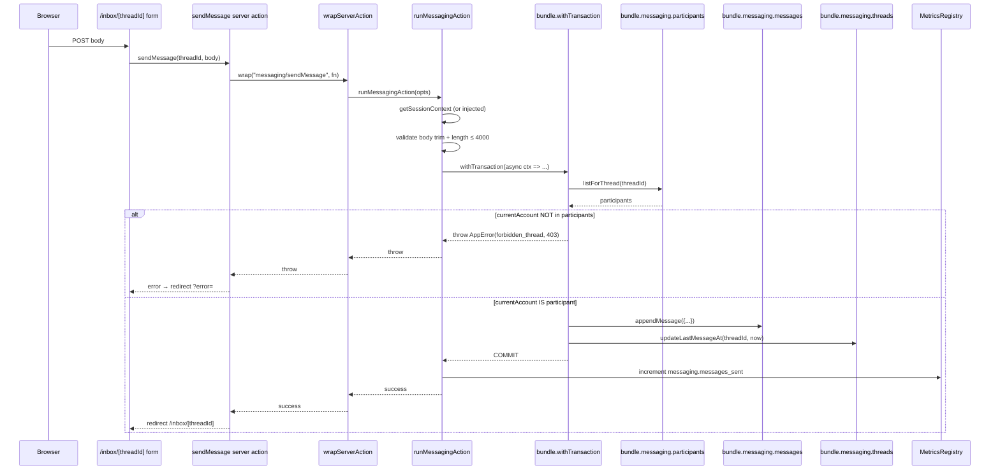
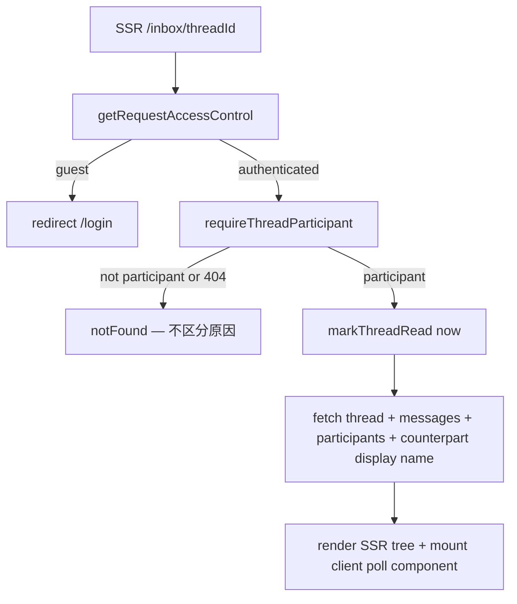

# Phase 2 — Threaded Messaging V1 实现设计

- 状态: 已批准
- 批准记录: `docs/verification/design-approval-phase2-threaded-messaging-v1.md`
- 主题: Phase 2 — Threaded Messaging V1（线程式消息中心 V1）
- 已批准规格: `docs/specs/2026-04-19-threaded-messaging-v1-srs.md`
- 关联增量: `docs/reviews/increment-phase2-threaded-messaging-v1.md`
- 关联 spec review / approval: `docs/reviews/spec-review-phase2-threaded-messaging-v1.md`、`docs/verification/spec-approval-phase2-threaded-messaging-v1.md`

## 1. 概述

整体形态是一个独立 feature 模块 `web/src/features/messaging/`，由 **3 表 sqlite schema + 3 repository + 3 server actions + 2 SSR 路由 + 1 客户端轮询组件 + read-only 系统通知 adapter** 构成。所有写动作走 `wrapServerAction("messaging/...", fn)` 接入 §3.8 V1 横切；所有 SSR 入口走 `getRequestAccessControl()` + 同步 redirect / notFound。`MetricsSnapshot.messaging` 必填字段（启动预注册全 0），与 §3.6 V1 / §3.2 V1 namespace 模式严格同形。

> **关键 ID 空间假设（design-review 关键修订）**：本仓库 Phase 1 的 `creator_profiles` 表与 `auth_accounts` 表**没有 account_id ↔ profile id 的直接列**（前者 PK = `${role}:${slug}`，由 seed / studio 动作产生；后者 PK = `account:<hex>:<role>`，由 `registerAuthAccount` 产生）。Phase 1 默认使用"role 共享 sample profile"的简化映射（`getStudioProfileSlugForRole`），即所有摄影师注册账号都共享 `photographer:sample-photographer`。**本 V1 messaging 选择把 thread participant 的身份键定为 `creator_profiles.id`**（即 `${role}:${slug}` 字符串），而不是 `auth_accounts.id`。理由：(a) 整个 community 域所有公开实体都已经按 profile id 寻址（works 的 owner、followers、comments 均如此）；(b) profile id 在 Phase 1 实际上是用户的"对外身份"，accountId 是登录态私有标识，更适合留给 §3.1 PostgreSQL 迁移后再引入"account → profile" 严格 1:1；(c) 当前 Phase 1 同 role 多账号共享 profile 的事实下，按 accountId 寻址会让"同一摄影师不同设备登录"被识别成两个不同人。**整个 §9 / §10 / §11 / §14 中 `recipientAccountId` / `accountId` 字面量在本 V1 等价于 "profile id (`${role}:${slug}`)"**；相关接口签名、SQL 字段、tests fixture 全部按此口径理解。该假设在 §10.A-007 显式记录；§3.1 迁移后可平滑替换为真实 account_id（schema 列 + UNIQUE INDEX 冗余）。

设计目标：

- thread / message 数据**仅参与人本人可读**；server-side 入口必须先 `participants.listForThread(threadId)` 校验当前 accountId 在内才放行（NFR-002 / FR-006 / FR-008）。
- `(unordered pair, contextRef)` 元组的 direct thread 唯一性由 `bundle.withTransaction` 包裹的 read-then-write 保证（A-006）；不引入 sqlite UNIQUE INDEX（contextRef 可空 + unordered pair 难以表达）。
- 未读计数走 SQL 聚合 `COUNT WHERE created_at > last_read_at AND author_account_id <> currentAccountId`，不引入 N+1。
- 系统通知 V1 read-only 派生（不持久化）：从既有 `discovery_events` (`follow` / `external_handoff_click`) + `work_comments`（authorAccountId ≠ work owner）实时聚合最近 50 条；不新建表。
- admin 后台严格不接触 messaging 数据（CON-007）；admin 模块导入 `bundle` 时不消费 `bundle.messaging` 字段。
- 客户端 30s 轮询走 client component + `router.refresh()`，不引入 fetch / SWR / WebSocket / 第三方依赖。

## 2. 设计驱动因素

按风险与规格优先级排序：

1. **隐私边界 + thread 枚举防御（NFR-002 / FR-006 / FR-008）**：决定 SSR 入口的 4 步顺序（spec FR-006 已锁），决定 `forbidden_thread` vs `notFound()` 的统一返回，决定 admin 模块的导入边界。错的话会泄漏 thread 是否存在。
2. **unordered pair dedupe（FR-002）**：决定 `findDirectThreadByContext` SQL 形态与 `MessageThreadRepository` 接口签名。错的话会插出双向重复 thread。
3. **未读计数性能（NFR-001 / FR-005）**：决定 `/inbox` 列表 SQL 是 1 个 JOIN 还是 N+1。错的话 P95 会爆掉 120ms 预算。
4. **`startContactThreadAction` 迁移零回归（FR-007 / NFR-005）**：调用方签名 `(role, slug, sourceType, sourceId)` 不能动；guest 路径行为完全保持。
5. **30s 客户端轮询的客户端组件边界**：必须是 `'use client'` boundary，但只触发 `router.refresh()`，不直接持有 thread 数据；既不引入 hydration 风险，也不与 server component 数据耦合。
6. **MetricsSnapshot.messaging 加性扩展（CON-004）**：与 §3.6 V1 `recommendations` / §3.2 V1 `admin` namespace 严格同形，不破坏既有消费者。

## 3. 需求覆盖与追溯

| 规格条目 | 主要承接模块 | 备注 |
|---|---|---|
| FR-001 三表 schema + 3 repository | `community/sqlite.ts` 新增 schema + `MessageThreadRepository` / `MessageRepository` / `ParticipantRepository` impl + in-memory `community/test-support.ts` 等价 | 索引 `idx_messages_thread_created_at`、`idx_thread_participants_account`、`idx_threads_last_message_at_desc` 与 §6.2 SQL 形态匹配 |
| FR-002 createOrFindDirectThread | `messaging/thread-actions.ts > createOrFindDirectThread` + `messaging/thread-resolver.ts > resolveOrCreateUnorderedDirectThread` 纯函数协调器 | unordered pair dedupe SQL 见 §6.1；事务 by `bundle.withTransaction` |
| FR-003 sendMessage | `messaging/thread-actions.ts > sendMessage` | participant 校验 + body trim + 长度 + tx (write message + update last_message_at) |
| FR-004 markThreadRead | `messaging/thread-actions.ts > markThreadRead` | participant 校验 + UPDATE `last_read_at = now` |
| FR-005 /inbox 列表 + 未读 + 系统通知 | `app/inbox/page.tsx` + `messaging/inbox-model.ts` + `messaging/system-notifications.ts` | 单 SELECT thread + COUNT 未读聚合；系统通知 read-only 派生（discovery_events + work_comments）|
| FR-006 /inbox/[threadId] 详情 + 30s 轮询 | `app/inbox/[threadId]/page.tsx` + `app/inbox/[threadId]/poll-client.tsx` | SSR 入口 4 步执行顺序硬编码；client component 仅 `router.refresh()` |
| FR-007 startContactThreadAction 迁移 | `contact/actions.ts` 改为调用 `createOrFindDirectThread` | 签名不变；旧 cookie 读写代码全部删除 |
| FR-008 messaging.* metrics + 隐私边界 | `messaging/metrics.ts` + `observability/metrics.ts` `MetricsSnapshot.messaging` 加性扩展 + admin 模块严格不导入 `bundle.messaging` | 4 counter 预注册全 0；与 `recommendations` / `admin` namespace 同形 |
| NFR-001 性能 | 单 SQL 聚合未读 + 索引 + tx 边界 | bench 留 increment-level regression-gate |
| NFR-002 隐私 | participants 校验前置；admin 不接触 | code review + traceability-review 验证 |
| NFR-003 logger 受控键扩展 | `observability/logger.ts > AllowedContextKey` 增加 `threadId` / `recipientAccountId` | T64 cross-cutting skeleton 落 |
| NFR-004 deps 注入 | 所有 server action 接受 `{ session, bundle, metrics, logger }` 注入 | 沿用 §3.2 V1 admin runAdminAction 模式（但 messaging 无需 admin guard，故不用 runAdminAction，独立 helper） |
| NFR-005 既有 contact / page 行为不变 | startContactThreadAction 签名稳定 + 公开页面联系按钮 0 改 | 既有 contact tests 不漂移 + bind 调用形态保留 |

## 4. 架构模式选择

- **Capability + Guard pattern（复用）**：SSR 入口走 `getRequestAccessControl()`；新增 `requireThreadParticipant(threadId, accountId)` 共享守卫函数。
- **Single-Source-of-Truth Filter**：未读计数集中在 `messaging/inbox-model.ts > listInboxThreadsForAccount`，UI 不重算。
- **Read-Only Adapter for System Notifications**：`messaging/system-notifications.ts` 按既有 `discovery_events` + `work_comments` 实时聚合，不引入新表 / 不引入新写路径。
- **Atomic Write via withTransaction**：`createOrFindDirectThread` / `sendMessage` 都在 `bundle.withTransaction` 内 read + write，沿用 §3.2 V1 ADR-2。
- **Additive Metrics Namespace**：与 §3.6 V1 `recommendations` / §3.2 V1 `admin` 顶层 optional 字段模式严格同形。
- **Client-Refresh Polling**：单一 `'use client'` 组件 `useEffect(() => setInterval(() => router.refresh(), 30_000), [])`，不持有 thread 数据，仅触发 SSR re-fetch。

## 5. 候选方案总览

针对 §2 中风险最高的两项决策，列出候选方案：

### 5.1 Unordered pair dedupe SQL 形态

- 方案 A — `participants` 双行 GROUP BY HAVING COUNT = 2：`SELECT thread_id FROM message_thread_participants WHERE account_id IN (?, ?) [AND ...] GROUP BY thread_id HAVING COUNT(DISTINCT account_id) = 2 INTERSECT SELECT id FROM message_threads WHERE context_ref IS ? OR context_ref = ?`
- 方案 B — `participants_pair` 物化列：在 `message_threads` 添加 `participant_pair_key (TEXT NOT NULL)` 列存 `LEAST(a,b)+":"+GREATEST(a,b)`，`UNIQUE INDEX (participant_pair_key, COALESCE(context_ref,''))`
- 方案 C — 单进程 in-process Map dedupe（不查 sqlite）

### 5.2 系统通知 read-only 派生 vs 持久化

- 方案 X — read-only adapter（V1 选定）
- 方案 Y — 新增 `system_notifications` 表 + 异步 fan-out

## 6. 候选方案对比与 trade-offs

### 6.1 Unordered pair dedupe SQL 形态

| 方案 | 核心思路 | 优点 | 主要代价 / 风险 | 适配性 | 可逆性 |
|---|---|---|---|---|---|
| A | participants GROUP BY HAVING；contextRef 走 (`IS NULL OR = ?`) 二元 OR | 不修改 schema；依赖现有 `idx_thread_participants_account`；SQL 一次返回 candidate thread_id 列表 + 应用层过滤 contextRef + thread.kind | SQL 可读性中等；需要在 `messaging/thread-resolver.ts` 测试覆盖：双向 / 同 contextRef / null contextRef / kind=direct 四种 case | CON-001 / NFR-001 满足；A-006 单进程 sqlite 顺序写假设兜底 | 高 — 未来 §3.1 PostgreSQL 迁移时可加 `participant_pair_key` 物化列 + UNIQUE INDEX |
| B | 物化 `participant_pair_key` 列 + UNIQUE INDEX | 数据库层硬约束 dedup；查询单条 SELECT | schema 多一列；contextRef 可空导致 UNIQUE INDEX 必须 `COALESCE(context_ref, '')` 形态，sqlite 部分版本不支持函数索引；未来迁移 §3.1 时仍需重建 | 引入复杂度但 V1 收益不足；A-006 + 方案 A 已能保证 V1 不重复 | 中 — schema 列一旦加上不易回退 |
| C | in-process Map dedupe | 无 SQL 开销 | 单进程 OK 但无持久化；进程重启后第一次 createOrFind 必查 sqlite；维护成本高于直接 SQL | 与 §3.1 多进程迁移直接冲突 | 低 |

**选定**：方案 A。SQL 一次性表达 unordered pair + contextRef + kind=direct 完整语义；与 `idx_thread_participants_account` 索引形态匹配；向 §3.1 PostgreSQL 迁移时可叠加方案 B 作为冗余而不必返工。

### 6.2 系统通知 V1 read-only 派生 vs 持久化

| 方案 | 核心思路 | 优点 | 主要代价 / 风险 | 适配性 | 可逆性 |
|---|---|---|---|---|---|
| X | `messaging/system-notifications.ts` 实时聚合 `discovery_events` + `work_comments` | 不新建表；数据源单一不会发散；V1 复杂度低 | 不能"标记某通知已读"（V2 才需要）；最近 50 条上限假设需要 ≥ 99% 用户场景下足够 | A-002 已显式确认 V1 不需要 ack 通知；NFR-001 单次 SSR 两条 SELECT，配合既有 `discovery_events.created_at` 索引足够 | 高 — V2 新建独立表时既有派生层可作为 fallback / 迁移基准 |
| Y | 新建 `system_notifications` 表 + 写动作侧 fan-out | 支持"已读 ack"/ 历史保留 | 三个事件源都需要在 server action 侧加 fan-out 逻辑；与 §3.2 V2 举报队列的归档 / TTL 策略叠加；V1 多 4–5 个文件改动 + schema | 与 ROADMAP §3.3 V1 范围明显偏大；spec §5 显式排除 | 中 |

**选定**：方案 X。V1 仅实时派生；V2 评估持久化（spec A-002）。

## 7. 选定方案与关键决策

- **D-1**：unordered pair dedupe 走 GROUP BY HAVING SQL（§6.1 方案 A）；in-memory bundle 等价为 `participants.filter(...).reduce(group_by_thread).filter(count===2)`。
- **D-2**：系统通知 V1 read-only 派生（§6.2 方案 X）。
- **D-3**：`messaging/thread-actions.ts` server actions 全部经 `wrapServerAction("messaging/...", fn)`（不经 admin `runAdminAction`，messaging 无 admin guard，独立 helper `runMessagingAction(opts)` 提供 session 校验 + tx 包裹 + log，与 admin runtime 同形但不混用）。
- **D-4**：SSR 入口顺序（FR-006 hard 约束）：(1) session 解析 → guest redirect；(2) `requireThreadParticipant(threadId, accountId)` → 不通过 notFound；(3) `markThreadRead`；(4) fetch + render。
- **D-5**：`MetricsSnapshot.messaging` 顶层**必填**字段（4 counter 启动预注册全 0），与 `recommendations` / `admin` namespace 同形 — 始终在 snapshot 输出中存在；既有 `http` / `sqlite` / `business` / `recommendations` / `admin` / `gauges` / `labels` 字段不变。
- **D-6**：`AllowedContextKey` 加 `threadId` / `recipientAccountId` 两个键（NFR-003 受控键扩展）；不允许 `messageBody` / `recipientEmail` / `displayName` 进入 logger context。
- **D-7**：`startContactThreadAction` 内部改写：解析 recipientAccountId → 调 `createOrFindDirectThread` → redirect `/inbox/[threadId]`；调用方 (`features/contact/actions.ts > startContactThreadAction.bind(null, role, slug, sourceType, sourceId)`) 签名零改。
- **D-8**：旧 `contactThreadsCookieName` cookie 不读不写不清；`parseContactThreads` / `serializeContactThreads` / `buildContactThread` / `upsertContactThread` 4 个 cookie 工具函数全部删除；`getInboxThreadsForRole` 函数名保留但内部委托给 `bundle.messaging.threads.listThreadsForAccount`。
- **D-9**：客户端 30s 轮询 = `'use client'` 组件 `<InboxThreadPoll />`（无 props 数据，仅 `useEffect` + `setInterval(() => router.refresh(), 30_000) + clearInterval cleanup`）；该组件仅 mount 在 `/inbox/[threadId]` SSR tree 末尾，不传入任何敏感数据。

ADR 摘要详见 §16。

## 8. 架构视图

### 8.1 逻辑架构

```mermaid
flowchart TD
  subgraph PublicEntries[公开页面联系按钮]
    Profile[/photographers/:slug + /models/:slug/]
    Work[/works/:workId/]
    Opp[/opportunities/:postId/]
  end

  subgraph ContactBridge[features/contact]
    SCT[startContactThreadAction]
  end

  subgraph Messaging[features/messaging]
    Resolver[thread-resolver.ts]
    ThreadActions[thread-actions.ts<br/>createOrFindDirectThread / sendMessage / markThreadRead]
    InboxModel[inbox-model.ts]
    SysNotif[system-notifications.ts]
    Runtime[runtime.ts<br/>runMessagingAction helper]
    Metrics[metrics.ts]
  end

  subgraph InboxUI[/inbox + /inbox/[threadId]]
    InboxList[/inbox]
    ThreadDetail[/inbox/:threadId]
    Poll[poll-client 'use client']
  end

  subgraph Bundle[CommunityRepositoryBundle]
    Threads[threads]
    Messages[messages]
    Participants[participants]
    Events[discovery]
    Comments[comments]
  end

  subgraph Cross[Cross-Cutting]
    WSA[wrapServerAction]
    AccessControl[getRequestAccessControl]
    MetricsReg[MetricsRegistry.messaging]
  end

  Profile --> SCT
  Work --> SCT
  Opp --> SCT
  SCT --> ThreadActions
  ThreadActions --> Runtime
  Runtime --> WSA
  Runtime --> Threads
  Runtime --> Messages
  Runtime --> Participants
  ThreadActions --> Resolver
  Resolver --> Threads
  Resolver --> Participants
  InboxList --> AccessControl
  InboxList --> InboxModel
  InboxModel --> Threads
  InboxModel --> Participants
  InboxList --> SysNotif
  SysNotif --> Events
  SysNotif --> Comments
  ThreadDetail --> AccessControl
  ThreadDetail --> Participants
  ThreadDetail --> Threads
  ThreadDetail --> Messages
  ThreadDetail --> ThreadActions
  ThreadDetail --> Poll
  ThreadActions --> MetricsReg
  InboxModel --> MetricsReg
  Metrics --> MetricsReg
```

### 8.2 关键时序：sendMessage



### 8.3 SSR /inbox/[threadId] 入口顺序（FR-006 硬约束）



## 9. 模块设计

### 9.1 `features/community/types.ts` 扩展

```ts
export type ThreadKind = "direct" | "system_notification";
export type MessageKind = "text";
export type ParticipantRole = "initiator" | "recipient";

export type MessageThreadRecord = {
  id: string;
  kind: ThreadKind;
  subject?: string;
  contextRef?: string;
  createdAt: string;
  lastMessageAt?: string;
};

export type MessageThreadParticipantRecord = {
  threadId: string;
  accountId: string;
  role: ParticipantRole;
  joinedAt: string;
  lastReadAt?: string;
};

export type MessageRecord = {
  id: string;
  threadId: string;
  authorAccountId: string | null;
  kind: MessageKind;
  body: string;
  createdAt: string;
};

export type CreateDirectThreadInput = {
  initiatorAccountId: string;
  recipientAccountId: string;
  contextRef?: string;
};

export type AppendMessageInput = {
  threadId: string;
  authorAccountId: string;
  body: string;
};

export type InboxThreadProjection = {
  thread: MessageThreadRecord;
  counterpartAccountId: string;
  unreadCount: number;
};

export interface MessageThreadRepository {
  createDirectThread(input: CreateDirectThreadInput): Promise<MessageThreadRecord>;
  /**
   * unordered pair dedupe: 等价于 spec FR-001 验收的
   * `findDirectThreadByContext(initiatorAccountId, recipientAccountId, contextRef?)`，
   * 命名改为 `ByUnorderedPair` 以显式表达 (A,B) 与 (B,A) 视为同一查询。
   */
  findDirectThreadByUnorderedPair(
    accountA: string,
    accountB: string,
    contextRef: string | undefined,
  ): Promise<MessageThreadRecord | null>;
  getThreadById(id: string): Promise<MessageThreadRecord | null>;
  updateLastMessageAt(threadId: string, ts: string): Promise<void>;
  listThreadsForAccount(accountId: string, limit: number): Promise<InboxThreadProjection[]>;
}

export interface MessageRepository {
  appendMessage(input: AppendMessageInput): Promise<MessageRecord>;
  listByThreadId(threadId: string, limit: number): Promise<MessageRecord[]>;
}

export interface ParticipantRepository {
  listForThread(threadId: string): Promise<MessageThreadParticipantRecord[]>;
  markRead(threadId: string, accountId: string, ts: string): Promise<void>;
  /**
   * Spec FR-001 validation point. Returns total unread count across
   * all threads where `accountId` is participant; excludes self-authored
   * messages (spec FR-005 unread SQL invariant).
   */
  getUnreadCountForAccount(accountId: string): Promise<number>;
}

export type MessagingRepositoryBundle = {
  threads: MessageThreadRepository;
  messages: MessageRepository;
  participants: ParticipantRepository;
};

// CommunityRepositoryBundle:
//   ... existing fields
//   messaging: MessagingRepositoryBundle;
```

### 9.2 `features/community/sqlite.ts` 扩展

#### 9.2.1 schema

```sql
CREATE TABLE IF NOT EXISTS message_threads (
  id TEXT PRIMARY KEY,
  kind TEXT NOT NULL,
  subject TEXT,
  context_ref TEXT,
  created_at TEXT NOT NULL,
  last_message_at TEXT
);
CREATE INDEX IF NOT EXISTS idx_threads_last_message_at_desc
  ON message_threads(last_message_at DESC, id DESC);

CREATE TABLE IF NOT EXISTS message_thread_participants (
  thread_id TEXT NOT NULL,
  account_id TEXT NOT NULL,
  role TEXT NOT NULL,
  joined_at TEXT NOT NULL,
  last_read_at TEXT,
  PRIMARY KEY (thread_id, account_id),
  FOREIGN KEY (thread_id) REFERENCES message_threads(id)
);
CREATE INDEX IF NOT EXISTS idx_thread_participants_account
  ON message_thread_participants(account_id, last_read_at);

CREATE TABLE IF NOT EXISTS messages (
  id TEXT PRIMARY KEY,
  thread_id TEXT NOT NULL,
  author_account_id TEXT,
  kind TEXT NOT NULL,
  body TEXT NOT NULL,
  created_at TEXT NOT NULL,
  FOREIGN KEY (thread_id) REFERENCES message_threads(id)
);
CREATE INDEX IF NOT EXISTS idx_messages_thread_created_at
  ON messages(thread_id, created_at ASC);
```

#### 9.2.2 unordered pair dedupe SQL

```sql
-- findDirectThreadByUnorderedPair(accountA, accountB, contextRef)
SELECT t.* FROM message_threads t
WHERE t.kind = 'direct'
  AND ((? IS NULL AND t.context_ref IS NULL) OR t.context_ref = ?)
  AND t.id IN (
    SELECT thread_id FROM message_thread_participants
    WHERE account_id IN (?, ?)
    GROUP BY thread_id
    HAVING COUNT(DISTINCT account_id) = 2
  )
LIMIT 1;
```

**Parameter binding contract**：`stmt.get(contextRef ?? null, contextRef ?? null, accountA, accountB)`。`node:sqlite` 的位置参数对 `undefined` 行为不稳定（部分版本会落库为字符串 `"undefined"` 或抛 `TypeError`），既有仓库（`audit_log.note ?? null`、`work.publishedAt ?? null`）已建立 `?? null` 显式归一惯例；本 SQL 严格遵守。in-memory bundle 等价（§9.3）使用 `(t.contextRef ?? null) !== (ctx ?? null)` 与 SQL 双 NULL 短路语义对齐。

#### 9.2.3 listForAccount + 未读聚合 SQL

```sql
SELECT
  t.id, t.kind, t.subject, t.context_ref, t.created_at, t.last_message_at,
  -- counterpart account id
  (SELECT p2.account_id FROM message_thread_participants p2
   WHERE p2.thread_id = t.id AND p2.account_id <> ?) AS counterpart_account_id,
  -- unread count: messages newer than current account's last_read_at AND not authored by current account
  (SELECT COUNT(*) FROM messages m
   WHERE m.thread_id = t.id
     AND m.author_account_id <> ?
     AND m.created_at > COALESCE(self.last_read_at, '')
  ) AS unread_count
FROM message_threads t
INNER JOIN message_thread_participants self
  ON self.thread_id = t.id AND self.account_id = ?
WHERE t.kind = 'direct'
ORDER BY COALESCE(t.last_message_at, t.created_at) DESC, t.id DESC
LIMIT ?;
```

### 9.3 `features/community/test-support.ts` 扩展

In-memory bundle 增加 `messaging` 字段：4 个数组（threads / participants / messages，不需要单独 system_notifications）；`findDirectByUnorderedPair` 实现：

```ts
findDirectByUnorderedPair(a, b, ctx) {
  const candidate = threads.find((t) => {
    if (t.kind !== "direct") return false;
    if ((t.contextRef ?? null) !== (ctx ?? null)) return false;
    const parts = participants.filter((p) => p.threadId === t.id);
    const accounts = new Set(parts.map((p) => p.accountId));
    return accounts.has(a) && accounts.has(b);
  });
  return candidate ?? null;
}
```

`listForAccount` in-memory 实现：filter threads where current account in participants → map 出 counterpart + unread count（同 SQL 语义：`m.author_account_id !== currentAccount && m.created_at > selfLastReadAt`）→ sort `COALESCE(last_message_at, created_at) DESC, id DESC` → slice(0, limit)。

### 9.4 `features/messaging/runtime.ts`

```ts
export type MessagingActionDeps = {
  session?: SessionContext;
  bundle?: CommunityRepositoryBundle;
  metrics?: MetricsRegistry;
  logger?: Logger;
};

export type MessagingActionContext = {
  session: AuthenticatedSessionContext;
  bundle: CommunityRepositoryBundle;
  metrics: MetricsRegistry;
  logger: Logger;
};

export async function runMessagingAction<T>(opts: {
  actionName: string;
  fn: (ctx: MessagingActionContext) => Promise<T>;
} & MessagingActionDeps): Promise<T> {
  const session = opts.session ?? (await loadDefaultSession());
  if (session.status !== "authenticated") {
    throw new AppError({ code: "unauthenticated", status: 401 });
  }
  const bundle = opts.bundle ?? (await loadDefaultBundle());
  const observability = opts.metrics || opts.logger ? null : getObservability();
  const metrics = opts.metrics ?? observability?.metrics ?? getObservability().metrics;
  const logger = opts.logger ?? observability?.logger ?? getObservability().logger;
  const startedAt = performance.now();
  try {
    const result = await bundleWithTransaction(bundle, () =>
      opts.fn({ session, bundle, metrics, logger }),
    );
    logger.info("messaging.action.completed", {
      module: "messaging",
      actionName: opts.actionName,
      durationMs: Math.round(performance.now() - startedAt),
    });
    return result;
  } catch (error) {
    logger.warn("messaging.action.failed", {
      module: "messaging",
      actionName: opts.actionName,
      error,
    });
    throw error;
  }
}
```

`bundleWithTransaction` 与 admin runtime 的实现完全相同（沿用 §3.2 V1 抽取的同名 helper；可考虑抽到 community 公共位置，但 V1 留为 messaging-local copy，避免跨 feature 锁）。

### 9.4.1 `features/messaging/identity.ts`（新增 helper）

```ts
import type { AuthenticatedSessionContext } from "@/features/auth/types";
import { getStudioProfileSlugForRole } from "@/features/showcase/sample-data";

/**
 * Phase 2 — Threaded Messaging V1 (§1 ID space assumption).
 *
 * Maps the calling session to the creator profile id that messaging
 * uses as the participant identity. In Phase 1 we don't yet have a
 * 1:1 account_id ↔ profile id link in `creator_profiles`; the same
 * primary role shares a single seed profile slug. After §3.1
 * PostgreSQL migration adds `creator_profiles.account_id`, this
 * helper becomes a single-line lookup.
 */
export function resolveCallerProfileId(
  session: AuthenticatedSessionContext,
): string {
  const slug = getStudioProfileSlugForRole(session.primaryRole);
  return `${session.primaryRole}:${slug}`;
}
```

### 9.5 `features/messaging/thread-actions.ts`

```ts
"use server";

export const createOrFindDirectThread = wrapServerAction(
  "messaging/createOrFindDirectThread",
  async (
    recipientAccountId: string,
    contextRef: string | undefined,
    deps?: MessagingActionDeps,
  ): Promise<{ threadId: string }> => {
    return runMessagingAction({
      actionName: "messaging/createOrFindDirectThread",
      ...(deps ?? {}),
      fn: async (ctx) => {
        // recipientAccountId 在本 V1 等价于 creator profile id
        // (`${role}:${slug}`)，详见 §1 关键 ID 空间假设。
        const initiatorProfileId = resolveCallerProfileId(ctx.session);
        if (recipientAccountId === initiatorProfileId) {
          throw new AppError({ code: "invalid_self_thread", status: 400 });
        }
        // recipient existence check (profile must exist in creator_profiles)
        const recipientProfile = await ctx.bundle.profiles.getById(recipientAccountId);
        if (!recipientProfile) {
          throw new AppError({ code: "recipient_not_found", status: 404 });
        }
        const existing = await ctx.bundle.messaging.threads.findDirectThreadByUnorderedPair(
          initiatorProfileId,
          recipientAccountId,
          contextRef,
        );
        if (existing) {
          return { threadId: existing.id };
        }
        const created = await ctx.bundle.messaging.threads.createDirectThread({
          initiatorAccountId: initiatorProfileId,
          recipientAccountId,
          contextRef,
        });
        incrementThreadsCreated(ctx.metrics);
        return { threadId: created.id };
      },
    });
  },
);

export const sendMessage = wrapServerAction(
  "messaging/sendMessage",
  async (threadId: string, body: string, deps?: MessagingActionDeps) => {
    const trimmed = body.trim();
    if (trimmed.length === 0) {
      throw new AppError({ code: "message_empty", status: 400 });
    }
    if (trimmed.length > 4000) {
      throw new AppError({ code: "message_too_long", status: 400 });
    }
    return runMessagingAction({
      actionName: "messaging/sendMessage",
      ...(deps ?? {}),
      fn: async (ctx) => {
        const callerProfileId = resolveCallerProfileId(ctx.session);
        const participants = await ctx.bundle.messaging.participants.listForThread(threadId);
        if (!participants.some((p) => p.accountId === callerProfileId)) {
          throw new AppError({ code: "forbidden_thread", status: 403 });
        }
        const now = new Date().toISOString();
        await ctx.bundle.messaging.messages.appendMessage({
          threadId,
          authorAccountId: callerProfileId,
          body: trimmed,
        });
        await ctx.bundle.messaging.threads.updateLastMessageAt(threadId, now);
        incrementMessagesSent(ctx.metrics);
      },
    });
  },
);

export const markThreadRead = wrapServerAction(
  "messaging/markThreadRead",
  async (threadId: string, deps?: MessagingActionDeps) => {
    return runMessagingAction({
      actionName: "messaging/markThreadRead",
      ...(deps ?? {}),
      fn: async (ctx) => {
        const callerProfileId = resolveCallerProfileId(ctx.session);
        const participants = await ctx.bundle.messaging.participants.listForThread(threadId);
        if (!participants.some((p) => p.accountId === callerProfileId)) {
          throw new AppError({ code: "forbidden_thread", status: 403 });
        }
        const now = new Date().toISOString();
        await ctx.bundle.messaging.participants.markRead(threadId, callerProfileId, now);
        incrementThreadsRead(ctx.metrics);
      },
    });
  },
);
```

Form-action wrappers `sendMessageForm(formData)` / `markThreadReadForm(formData)` 在同文件 `'use server'` 末尾导出，捕获 AppError 后 redirect `?error=<code>`。

### 9.6 `features/messaging/system-notifications.ts`

```ts
export type SystemNotificationKind = "follow" | "comment" | "external_handoff";

export type SystemNotificationProjection = {
  id: string;          // synthetic: `${kind}:${sourceId}:${createdAt}`
  kind: SystemNotificationKind;
  fromAccountId: string;
  fromDisplayName: string;
  href: string;
  createdAt: string;
};

export async function listSystemNotificationsForAccount(
  accountId: string,
  limit = 50,
  bundle: CommunityRepositoryBundle = getDefaultCommunityRepositoryBundle(),
): Promise<SystemNotificationProjection[]>;
```

实现：
- 入参 `accountId` 在本 V1 等价于 `creator profile id`（§1 假设 + §9.4.1 helper）。
- 单次 SELECT `discovery_events WHERE event_type IN ('follow','external_handoff_click') AND target_profile_id = ? ORDER BY created_at DESC LIMIT ?`（`target_profile_id` 形如 `photographer:slug`，与入参 profile id 直接相等匹配；V1 只支持 owner 是 photographer/model 的两类公开主页 owner 接收通知）。
- 单次 SELECT `work_comments INNER JOIN works ON works.id = work_comments.work_id WHERE works.owner_profile_id = ? AND work_comments.author_account_id <> ? ORDER BY work_comments.created_at DESC LIMIT ?`（owner_profile_id 同样是 `${role}:${slug}` 形态 → 与入参 profile id 直接匹配）。
- 应用层归并 + 二次排序 + slice(0, limit)。
- counter `messaging.system_notifications_listed += 1`。
- in-memory bundle 等价：`discovery_events` 数组 filter event_type ∈ {follow, external_handoff_click} && target_profile_id === accountId；`work_comments` 数组 join works 数组（`works.find(w => w.id === comment.workId)`）filter owner_profile_id === accountId && author_account_id !== accountId；二者归并按 createdAt desc + slice。

### 9.7 `features/messaging/inbox-model.ts`

```ts
export async function listInboxThreadsForAccount(
  accountId: string,
  limit = 100,
  bundle: CommunityRepositoryBundle = getDefaultCommunityRepositoryBundle(),
): Promise<InboxThreadProjection[]>;
```

直接委托给 `bundle.messaging.threads.listForAccount(accountId, limit)`。

### 9.8 `features/contact/actions.ts` 重写

```ts
async function startContactThreadActionImpl(
  recipientRole: AuthRole,
  recipientSlug: string,
  sourceType: ContactSourceType,
  sourceId: string,
) {
  const session = await getSessionContext();
  const targetProfileId = buildDiscoveryProfileTargetId(recipientRole, recipientSlug);

  if (session.status !== "authenticated") {
    await recordDiscoveryEvent({ eventType: "contact_start", actorAccountId: null,
      targetType: "profile", targetId: targetProfileId, targetProfileId,
      surface: `contact:${sourceType}`, query: "", success: false,
      failureReason: "unauthenticated" });
    redirect("/login");
    return;
  }

  const bundle = getDefaultCommunityRepositoryBundle();
  const recipient = await bundle.profiles.getByRoleAndSlug(recipientRole, recipientSlug);
  if (!recipient) {
    await recordDiscoveryEvent({ eventType: "contact_start", actorAccountId: session.accountId,
      targetType: "profile", targetId: targetProfileId, targetProfileId,
      surface: `contact:${sourceType}`, query: "", success: false,
      failureReason: "recipient_not_found" });
    redirect("/inbox?error=recipient_not_found");
    return;
  }

  const contextRef = sourceType === "work" ? `work:${sourceId}`
    : sourceType === "opportunity" ? `opportunity:${sourceId}`
    : `profile:${recipientRole}:${recipientSlug}`;

  try {
    // recipient.id is the creator profile id (`${role}:${slug}`),
    // matching messaging's V1 participant identity (§1 ID space).
    const { threadId } = await createOrFindDirectThread(recipient.id, contextRef);
    await recordDiscoveryEvent({ eventType: "contact_start", actorAccountId: session.accountId,
      targetType: "profile", targetId: targetProfileId, targetProfileId,
      surface: `contact:${sourceType}`, query: "", success: true });
    redirect(`/inbox/${threadId}`);
  } catch (error) {
    if (error instanceof AppError && error.code === "invalid_self_thread") {
      redirect("/inbox?error=invalid_self_thread");
    }
    throw error;
  }
}
```

`features/contact/state.ts` 中删除 `parseContactThreads` / `serializeContactThreads` / `buildContactThread` / `upsertContactThread` 与 `contactThreadsCookieName`；保留 `getInboxThreadsForRole(role)` 但实现改为：

```ts
export async function getInboxThreadsForRole(role: AuthRole) {
  const session = await getSessionContext();
  if (session.status !== "authenticated") return [];
  const bundle = getDefaultCommunityRepositoryBundle();
  const projections = await bundle.messaging.threads.listForAccount(session.accountId, 100);
  // returns the projection shape; old `ContactThread` type is dropped from public API.
  return projections;
}
```

签名变化：返回类型从 `ContactThread[]` 变为 `InboxThreadProjection[]`；唯一调用方是 `app/inbox/page.tsx`，本任务一并改写。

### 9.9 `app/inbox/page.tsx` 重写

SSR async server component。流程：
1. `await getSessionContext()` → guest `redirect("/login")`。
2. 解析 `searchParams.error` → ErrorAlert 渲染（错误码字典见 spec §8.3）。
3. `Promise.all([listInboxThreadsForAccount(session.accountId), listSystemNotificationsForAccount(session.accountId)])`。
4. 渲染上下两段：直接消息（thread 卡片 + 未读 badge + 链接 `/inbox/[threadId]`）+ 系统通知（卡片列表）。

### 9.10 `app/inbox/[threadId]/page.tsx` + `poll-client.tsx`

SSR `page.tsx` 严格按 §8.3 4 步顺序：
1. `getSessionContext` → guest redirect。
2. `requireThreadParticipant(threadId, callerProfileId)`（共享 helper 内部 `participants.listForThread` + 校验，`callerProfileId = resolveCallerProfileId(session)`）→ 不通过 `notFound()`。
3. `markThreadRead`（直接 `bundle.messaging.participants.markRead(threadId, callerProfileId, now)`，不走 server-action wrapper，因为已在 SSR 内部）；**为保持 NFR-003 横切对齐，仍主动写一条 `logger.info("messaging.action.completed", { module: "messaging", actionName: "messaging/markThreadRead.ssr", threadId })`**，但**不递增** `messaging.threads_read` counter（该 counter 仅统计客户端 form-action 触发的 markRead；SSR 入口 markRead 是页面访问的副作用，不应计入用户主动行为指标）。
4. fetch thread + messages + counterpart name → render。

> 抽出共享 entry helper：把上面 4 步封到 `features/messaging/inbox-thread-view.ts > loadInboxThreadView(threadId, session, deps?)`，由 page.tsx 单点调用。helper 返回 `{ thread, messages, participants, counterpart }` 或抛 `notFound()` / `redirect()`；未来错误边界 / Suspense 包裹不会破坏 4 步顺序（design-review minor F-3 修复）。

`poll-client.tsx`：

```tsx
"use client";
import { useEffect } from "react";
import { useRouter } from "next/navigation";
export function InboxThreadPoll({ intervalMs = 30_000 }: { intervalMs?: number }) {
  const router = useRouter();
  useEffect(() => {
    const id = setInterval(() => router.refresh(), intervalMs);
    return () => clearInterval(id);
  }, [router, intervalMs]);
  return null;
}
```

挂在 page 末尾；不持有 thread 数据，不传敏感 props。

### 9.11 `features/observability/metrics.ts` 扩展

```ts
export type MessagingSnapshot = {
  threads_created: number;
  messages_sent: number;
  threads_read: number;
  system_notifications_listed: number;
};

// MetricsSnapshot.messaging: MessagingSnapshot (顶层 optional 加性)

const MESSAGING_COUNTER_NAMES = [
  "messaging.threads_created",
  "messaging.messages_sent",
  "messaging.threads_read",
  "messaging.system_notifications_listed",
] as const;
// startup 预注册全 0；snapshot 输出 messaging field 与 admin / recommendations 同形。
```

### 9.12 `features/observability/logger.ts > AllowedContextKey` 扩展

新增 `threadId` / `recipientAccountId` 两个键；其他既有键不变。

## 10. UI 设计要点（hf-ui-design 输入）

> 沿用既有 editorial-dark 壳层（`features/shell` + `museum-*` utility classes）。本增量不引入新视觉系统。

### 10.1 视觉层级

- `/inbox`：`PageHero(eyebrow="收件箱", title=<roleCopy>消息, tone="utility")` + 顶部错误 alert（如有）+ 上下两段：
  - **直接消息段**：`SectionHeading(eyebrow="对话", title="消息")` + thread 卡片网格（`grid gap-5`）。每卡：对方 display name (h3) + 来源 context 标签（museum-tag，文案由 §10.4.1 helper 生成）+ 最近活动时间 + 未读 badge（仅 `unreadCount > 0` 时显示；视觉容器复用 `museum-tag` 与 context tag 同形，内含数字 + `<span class="sr-only">未读</span>`，不引入新 token）+ 跳转链接 `/inbox/[threadId]`（整卡可点）。
  - **系统通知段**：`SectionHeading(eyebrow="系统通知", title="最近活动")` + 列表（`<ul>/<li>` 复用 §3.2 V1 audit page 的 `museum-stat` 卡片样式）；每条：通知类型中文 label（museum-label）+ 通知文本（"X 关注了你"/ "X 评论了《Y》"/ "X 打开了你的外部主页"）+ 跳转 link + 时间戳 `<time>`。
- `/inbox/[threadId]`：`PageHero(eyebrow="对话", title=<对方 displayName>, supporting=<context 来源链接>)` + 顶部错误 alert（如有）+ 单 `museum-panel museum-panel--soft` 容器：
  - 消息时间线：垂直 list；每条 `museum-stat` 卡片含 author 标识（自己 vs 对方）+ body（pre-wrap）+ 时间戳。自己发的消息靠右对齐 / 对方靠左（V1 用 `text-align: end` + `ml-auto` flex 实现，无新 token）。
  - 发送表单：底部 `<form action={sendMessageForm}>` + `<textarea name="body" maxLength={4000}>` + 「发送」按钮（museum-button-primary）。
  - 客户端轮询组件 `<InboxThreadPoll />` 不渲染任何可见 DOM。

### 10.2 状态矩阵

| Page | Loading | Empty | Happy | Invalid | Error | Partial |
|---|---|---|---|---|---|---|
| `/inbox` | n/a（SSR + 浏览器原生导航 spinner；30s 客户端轮询 `router.refresh()` **无可见 loading 反馈**，是 V1 显式 trade-off，详见 UI-ADR-1） | 直接消息空：「暂无对话，去创作者主页发起联系」+ 链接 `/discover`；系统通知空：「暂无系统通知」 | 两段渲染 | URL `?error=recipient_not_found` / `?error=invalid_self_thread` / `?error=forbidden_thread`（来自 sendMessage 等 server action redirect 回 /inbox 的兜底 fallback）→ alert | n/a（公开错误极少） | 一段空 + 一段有 → 各自渲染各自空态 |
| `/inbox/[threadId]` | n/a（同上轮询说明） | thread 存在但无消息（V1 用户首次进 thread）→ 渲染 "暂无消息，发出第一句话开启对话" | 渲染消息时间线 + 表单 | URL `?error=message_empty` / `?error=message_too_long` → alert（form 不重写表单内容，浏览器自然重 GET 后清空） | URL `?error=storage_failed` → alert | n/a |

### 10.3 a11y 落地表

| 维度 | 落地方式 |
|---|---|
| Heading 层级 | PageHero h1；`SectionHeading` h2；卡片对方名 h3；消息时间线无新 heading（避免噪声）|
| Focus 可见 | 所有 `<a>` / `<button>` / `<textarea>` 继承既有 `:focus-visible` 4px ring，不局部覆盖 |
| 目标大小 | 「发送」/卡片整 link 区域 ≥ 40×40 |
| 错误反馈 | `<div role="alert" aria-live="polite">` 顶部 alert；不抢焦点 |
| Status 标签 | 未读 badge 文本承载（数字 + 中文「未读」可选 vs 仅数字；V1 数字 + 隐藏 `<span class="sr-only">未读</span>` 屏幕阅读器可读）|
| 时间戳 | `<time dateTime={iso}>` 包裹 |
| Textarea | `aria-label="消息正文"`；`maxlength=4000`；`<p class="sr-only">最多 4000 字</p>` 提示 |
| Skip link | 沿用既有 layout；不在本增量新增 |
| Reduced motion | 无新动画；轮询不带视觉过渡 |
| 二次确认 | 发送 / 标记已读 V1 不强制二次确认（操作可逆——已读不能撤销但无害；消息一旦发送 V1 不可撤回，但属于"重要可见"非"不可恢复"，与同行 IM 一致）|

### 10.4 错误码字典

Page-side `ERROR_COPY` 共享对象（与 §3.2 V1 admin error copy 同形），key 与 server action `AppError.code` 一一对应。**完整 7 条 code 内联表**（拷自 spec §8.3）：

| `code` | 中文 copy | 归属页面 / 表现形式 |
|---|---|---|
| `unauthenticated` | 请先登录后再发送消息。 | `/inbox` 与 `/inbox/[threadId]`：不会出现在 alert（guest 已 redirect /login）；保留在字典作为兜底 |
| `forbidden_thread` | 你没有访问该消息的权限。 | `/inbox`：alert 渲染（来自 sendMessage / markThreadRead form-action 在非 participant 路径的 fallback redirect）；`/inbox/[threadId]`：永不出现（统一走 `notFound()`） |
| `recipient_not_found` | 找不到该用户。 | `/inbox`：alert（来自 `startContactThreadAction` slug 不存在路径）|
| `invalid_self_thread` | 不能与自己开启对话。 | `/inbox`：alert |
| `message_empty` | 消息不能为空。 | `/inbox/[threadId]`：alert |
| `message_too_long` | 消息过长，请控制在 4000 字以内。 | `/inbox/[threadId]`：alert |
| `storage_failed` | 操作失败，请稍后重试。 | `/inbox` 与 `/inbox/[threadId]`：alert（默认兜底）|

未识别 code 走默认「操作失败，请稍后重试。」分支。

### 10.4.1 Context source link 映射

`/inbox/[threadId]` PageHero `supporting=<context 来源链接>` 文案与 href 由 `buildContextSourceLink(contextRef)` helper 生成（在 `features/messaging/context-link.ts`，纯函数）：

| `contextRef` 形态 | 人类可读 label | href |
|---|---|---|
| `work:<workId>` | 「来自作品 #<workId>」（design 阶段不强制 SELECT works.title 为副标题；V1 显式只显示 id 以避免额外 SELECT；V2 评估缓存 title） | `/works/<workId>` |
| `profile:<role>:<slug>` | 「来自<role 中文>主页 #<slug>」 | `/<role>s/<slug>`（photographer / model 复数） |
| `opportunity:<postId>` | 「来自合作诉求 #<postId>」 | `/opportunities/<postId>` |
| `undefined` / null | 「直接对话」 | （无 href，纯文本） |

helper 不查 sqlite，纯字符串模式匹配；in-memory test 直接覆盖三态 + null。

### 10.5 移动端

- 卡片网格 `grid gap-5`，移动端单列；桌面端无明显多列收益（thread 卡片本身宽度需要展示对方名 + context + 时间），保持单列。
- 消息时间线：自己 vs 对方对齐通过 `flex` + `ml-auto` 实现，移动端自然适配。
- 表单：textarea `min-h-[6rem]` + 「发送」按钮单独行。

### 10.6 SEO / `noindex`

- `/inbox` 与 `/inbox/[threadId]` 都设 `metadata.robots = { index: false, follow: false }`。私有内容不应被任何爬虫抓取。

### 10.7 UI ADR

| UI-ADR | 候选 | 选定 | 理由与可逆性 |
|---|---|---|---|
| **UI-ADR-1** 客户端轮询实现 | (a) `useEffect + setInterval + router.refresh()`；(b) SWR / React Query；(c) SSE | (a) | 不引入第三方 fetch / cache 框架；不引入服务端长连接；与 §3.8 V1 logger / metrics 横切完全无关；后续升级 SSE 时只需替换 `<InboxThreadPoll />` 一处。**显式 V1 trade-off**：30s 静默 `router.refresh()` 期间无任何视觉 loading 反馈（spinner / 进度条 / "正在更新…"提示），与 spec FR-006 + A-003 一致；V2 评估按需引入 visual indicator。 |
| **UI-ADR-2** 消息时间线左右对齐 | (a) `flex` + `ml-auto`；(b) grid 双列；(c) 表格 | (a) | 单 utility 一行实现；移动端不需要响应式重排；与 §3.6 V1 / §3.2 V1 「不引入新视觉 token」一致。 |
| **UI-ADR-3** 未读 badge | (a) 数字 + sr-only 中文；(b) 红色 dot；(c) bold 字体 | (a) | 非颜色依赖（WCAG 1.4.1）；屏幕阅读器友好；不需要新视觉 token。|
| **UI-ADR-4** 错误反馈通道 | (a) URL `?error=<code>` + SSR alert；(b) cookie flash；(c) toast portal | (a) | 与 §3.2 V1 完全同形；admin shell + ops back office 已建立的协议。|
| **UI-ADR-5** Page-level 错误 vs 表单内联错误 | (a) 顶部 alert（统一）；(b) 内联在 textarea 旁；(c) toast | (a) | V1 简化；V2 评估内联（如 message_too_long 在 textarea 旁实时显示 char count）。|

## 10.A 假设 / 不变量补充

- **A-007**：本 V1 messaging 的 thread participant 身份键 = `creator_profiles.id`（即 `${role}:${slug}`），不是 `auth_accounts.id`。已在 §1 关键 ID 空间假设、§9.4.1 helper、§9.5 / §9.6 / §9.8 控制流、§14 测试中显式落地。§3.1 PostgreSQL 迁移后需要：(a) 在 `creator_profiles` 增加 `account_id TEXT UNIQUE` 列；(b) `resolveCallerProfileId` 改为 SELECT account_id；(c) messaging schema 不动（参与人字段语义平滑过渡）。该假设是本设计 ↔ 既有 Phase 1 简化映射的桥接条款。

## 11. 不变量

- **I-1**：unordered pair dedupe 在单进程 sqlite 顺序写下保证不会插出重复 direct thread（与 spec A-006 对齐）。
- **I-2**：所有 messaging server actions 在写动作前必须先 `participants.listForThread` 校验当前 accountId 是 participant；不通过统一 `forbidden_thread`。
- **I-3**：`/inbox/[threadId]` SSR 入口顺序硬约束（spec FR-006）：guest redirect → participant guard → markRead → fetch → render；不允许 markRead 在 guard 之前。
- **I-4**：未读计数 SQL 必须含 `author_account_id <> currentAccount`（spec USER-INPUT 裁决）。
- **I-5**：`messages.body` / 对方 email / 对方 displayName **绝不**进入 logger context；NFR-002 / FR-008 硬约束。
- **I-6**：admin 模块（`features/admin/*` + `app/studio/admin/**`）严格不导入 `bundle.messaging`；admin server actions 不接触 thread / message 数据。
- **I-7**：`MetricsSnapshot.messaging` 顶层字段始终存在（启动预注册全 0）；不允许某次写动作之后才"出现"。
- **I-8**：`startContactThreadAction` 公开签名 `(role, slug, sourceType, sourceId)` 不变；调用方零修改；旧 cookie 不读不写不清。
- **I-9**：客户端 `<InboxThreadPoll />` 组件不持有任何 thread / message 数据，仅触发 `router.refresh()`；不通过 props / state 暴露敏感信息。
- **I-10**：`message_thread_participants.role` 字段为 audit / display 用途，**不**参与读写权限判定（权限仅由 "accountId 是否在 participants 中" 决定）。
- **I-11**：thread 不存在 vs 不是 participant 在所有错误响应中**不区分**（统一 `notFound()` 或 `forbidden_thread`），防止 thread id 枚举攻击。
- **I-12**：消息体长度上限 4000 字符在 spec / server action / textarea `maxlength` 三处一致；不允许某一层放宽。

## 12. 与既有设计契约的兼容点

- **§3.8 V1 兼容**：`MetricsSnapshot.messaging` 加性扩展，与既有 `http` / `sqlite` / `business` / `recommendations` / `admin` / `gauges` / `labels` 字段不冲突；`/api/metrics` 现有消费者向后兼容；`wrapServerAction` + `AllowedContextKey` 直接复用（仅扩展 2 个键）。
- **§3.2 V1 兼容**：`bundle.withTransaction` 既有实现复用；`SqliteCommunityRepositoryBundle` 类型签名加性扩展 `messaging` 字段不影响 admin 模块（admin 不读 messaging）。
- **§3.6 V1 兼容**：推荐模块不消费 messaging 数据，`getRelatedWorks` / `getRelatedCreators` 不变。
- **既有 `discovery_events` / `work_comments`**：read-only 派生（FR-005 系统通知段）只 SELECT，不改写；既有 `recordDiscoveryEvent` / `addWorkComment` 行为不变。
- **既有 `startContactThreadAction`**：FR-007 改写实现；公开签名 + bind 调用形态不变；既有 `events.test.ts` / public-page tests 不漂移。
- **`features/contact/state.ts` 公共导出收敛**：`ContactThread` / `ContactSourceType` 仍 export（被 `actions.ts` 与 page 层使用）；`parseContactThreads` / `serializeContactThreads` / `buildContactThread` / `upsertContactThread` / `contactThreadsCookieName` 删除；`getInboxThreadsForRole` 返回类型从 `ContactThread[]` 改为 `InboxThreadProjection[]`，`/inbox/page.tsx` 一并迁移（唯一调用方）。

## 13. 性能与基线证据

### 13.1 micro-bench（增量级 regression-gate 阶段）

- `bundle.messaging.threads.listForAccount(accountId, 100)` 在 500 thread + 200 messages 规模下 P95 ≤ 120ms。
- `listSystemNotificationsForAccount(accountId, 50)` 在 500 discovery_events + 200 work_comments 规模下 P95 ≤ 120ms。
- `bundle.messaging.messages.appendMessage` + `updateLastMessageAt` 在 tx 内 P95 ≤ 30ms。
- `markRead` P95 ≤ 30ms。

### 13.2 既有性能不退化

- `/api/health` / `/api/metrics` 响应时间不受影响（仅多 4 个 counter map 读 + JSON 序列化）。
- 推荐模块 `getRelatedWorks` / `getRelatedCreators` 不变。

## 14. 测试策略

### 14.1 Unit

- `community/sqlite.test.ts`（扩展）：3 表 schema + 索引存在；`createDirect` / `findDirectByUnorderedPair`（双向 dedupe / contextRef null vs not null）/ `appendMessage` / `updateLastMessageAt` / `markRead` / `listForAccount`（未读聚合 + 排除自身 + COALESCE 排序）；`bundle.withTransaction` 覆盖 sendMessage 失败时 `last_message_at` 不被更新。
- `community/test-support.ts`（扩展）：in-memory `messaging` 实现等价（same-shape input → same output as sqlite）。
- `messaging/thread-resolver.test.ts`：`resolveOrCreateUnorderedDirectThread` 纯函数（双向 / 同 contextRef / null contextRef / self → invalid）。
- `messaging/system-notifications.test.ts`：聚合 follow + comment + external_handoff_click，过滤 self-comment，时间倒序，limit 50。
- `messaging/runtime.test.ts`：`runMessagingAction` guest 抛 unauthenticated；fn throw 时 metrics 不递增；in-memory bundle 无 withTransaction 时 fallback 直接执行；成功时 logger.info `messaging.action.completed`。
- `messaging/thread-actions.test.ts`：3 个 server action × happy / forbidden / invalid input / tx atomicity；`createOrFindDirectThread` 重复同 contextRef 与反向 dedupe 路径；`sendMessage` body trim / 空 / 过长；`markThreadRead` 非 participant → forbidden。
- `messaging/metrics.test.ts`：4 helper 路由到正确 counter；MetricsSnapshot.messaging 零状态全 0。
- `observability/metrics.test.ts`：admin / recommendations / messaging 三 namespace 独立；既有字段不变。
- `observability/logger.test.ts`：`threadId` / `recipientAccountId` 进入 controlled key；`messageBody` / `recipientEmail` 被 drop。

### 14.2 Integration

- `app/inbox/page.test.tsx`：guest redirect；admin / 普通用户均渲染 thread + 系统通知（admin 用户不 access bundle.messaging.admin-flag，只看自己的 inbox）；空态文案；`?error=` alert。
- `app/inbox/[threadId]/page.test.tsx`：guest redirect；非 participant `notFound()`；participant 进入 → markRead 已写 → render；`?error=message_too_long` alert。
- `features/contact/actions.test.ts`：guest 路径 redirect /login + discovery_event failed/unauthenticated；recipient 不存在 → `?error=recipient_not_found`；happy 路径调 `createOrFindDirectThread` 后 redirect `/inbox/[threadId]`；既有公开页面联系按钮调用形态不变。

### 14.3 E2E

V1 不强制 E2E；既有 Playwright 套件不变。

### 14.4 性能

`messaging/perf.bench.test.ts`（同 §3.6 / §3.2 模式 RUN_PERF=1）：`listForAccount(500 threads)` + `listSystemNotificationsForAccount(700 events+comments)` 各 1000 次 P95 断言 ≤ 120ms。

## 15. 风险与回滚

| 风险 | 缓解 | 回滚 |
|---|---|---|
| unordered pair SQL 在边缘 sqlite 版本 GROUP BY HAVING DISTINCT 行为差异 | sqlite.test 显式覆盖；in-memory bundle 行为完全等价 | 退回到方案 B 物化 `participant_pair_key` 列 |
| `contact/state.ts` 删除 cookie 工具影响下游 import | TypeScript strict 严格模式 + `npm run typecheck` 在 T64 cross-cutting skeleton 一次性更新所有 import | 恢复函数 stub 抛 deprecation warning |
| 30s 客户端轮询触发 `router.refresh()` 在长时间打开 tab 上累积请求 | V1 无 tab visibility hook；浏览器 idle 时仍轮询；后续 V2 加 `document.visibilityState` 检查 | 增大 intervalMs 到 60s |
| `/inbox` 列表未读聚合在大数据量时 P95 退化 | T70 增量级 regression-gate micro-bench；如 P95 退化考虑给 `messages.created_at` + `thread_id` 复合索引 | 回退到 N+1 但加显式日志（暂不) |
| `startContactThreadAction` 迁移破坏既有 page tests（profile / work / opportunity 入口） | 既有 tests 主要 mock `startContactThreadAction` mock；签名不变 → mock 不变 | n/a |
| admin 模块意外导入 `bundle.messaging` | code review + traceability-review 显式核对 | 单测加 `expect(...).not.toContain("messaging")` 字符串扫描 admin 模块 |

## 16. ADR 摘要

- **ADR-1**：unordered pair dedupe SQL（GROUP BY HAVING）方案 A。覆盖 FR-001 / FR-002 / I-1。后果：未来 §3.1 PostgreSQL 迁移时可叠加物化列 + UNIQUE INDEX 作为冗余。
- **ADR-2**：系统通知 V1 read-only 派生（不持久化）。覆盖 FR-005 / spec A-002。后果：V2 持久化时既有派生层成为 fallback。
- **ADR-3**：`MetricsSnapshot.messaging` 顶层加性扩展。覆盖 FR-008 / CON-004 / I-7。后果：`/api/metrics` 现有消费者向后兼容。
- **ADR-4**：messaging 独立 `runMessagingAction` helper，与 admin `runAdminAction` 同形但不复用（admin 校验逻辑不需要在 messaging 出现）。覆盖 NFR-003 / NFR-004。后果：未来如需提取共享 helper 易做（接口已对齐）。
- **ADR-5**：客户端 30s 轮询走 `useEffect + setInterval + router.refresh()`（UI-ADR-1）。覆盖 FR-006 / spec A-003。后果：升级 SSE / WebSocket 时只替换一个 client component。
- **ADR-6**：CON 锚点显式归集：CON-001（仅扩展 community + 3 新 messaging 表）→ ADR-1；CON-002（无新 npm dep）→ 全部 ADR；CON-003（UI 仅 inbox 升级 + 详情页新建）→ UI-ADR-1..5；CON-004（messaging metrics namespace）→ ADR-3；CON-005（仅 server action）→ thread-actions.ts 模式；CON-006（消息 4000 字符 plain text）→ FR-003 + I-12；CON-007（admin 不接触 messaging）→ I-6 + code review。

## 17. 出口工件

新增（src）：
- `web/src/features/messaging/{types,messaging-repository,thread-resolver,system-notifications,inbox-model,inbox-thread-view,identity,context-link,thread-actions,runtime,metrics,index,test-support}.ts(.test.ts where applicable)`
- `web/src/features/messaging/perf.bench.test.ts`
- `web/src/app/inbox/[threadId]/{page,page.test}.tsx`
- `web/src/app/inbox/[threadId]/poll-client.tsx`

修改（src）：
- `web/src/features/community/types.ts`（messaging 接口加性扩展 + 类型；CommunityRepositoryBundle 加 messaging 字段）
- `web/src/features/community/sqlite.ts` + `sqlite.test.ts`（3 表 schema + 索引 + 3 repository impl）
- `web/src/features/community/test-support.ts`（in-memory messaging 实现）
- `web/src/features/contact/actions.ts` + `actions.test.ts`（迁移到 createOrFindDirectThread；保留签名）
- `web/src/features/contact/state.ts`（删除 cookie 工具；getInboxThreadsForRole 委托给 bundle.messaging）
- `web/src/features/observability/metrics.ts` + `metrics.test.ts`（messaging namespace 加性扩展）
- `web/src/features/observability/logger.ts`（AllowedContextKey 增加 threadId / recipientAccountId）
- `web/src/app/inbox/page.tsx` + `page.test.tsx`（升级为 thread + 系统通知两段；error alert）

finalize 阶段同步：`task-progress.md`、`RELEASE_NOTES.md`、`docs/ROADMAP.md` §3.3、`README.md`。
